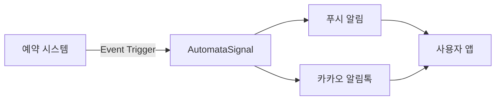

## 개요

SKS Dining 예약 시스템의 모든 알림을 AutomataSignal을 통해 통합 관리하기 위한 구현 문서입니다.
예약 관련 모든 이벤트에 대해 푸시 알림과 카카오 알림톡을 자동으로 발송합니다.

## 시스템 아키텍처



## 예약 알림 이벤트

### 1. 예약 확정 (`reservation.confirmed`)

#### 발송 조건
- **시점**: 예약이 확정 상태로 변경되는 즉시
- **대상**: 예약 당사자
- **채널**: 푸시, 카카오 알림톡

#### 알림톡 템플릿
```
안녕하세요,#{이름}고객님, LG전자 입니다.
SKS Dining 예약이 확정되었습니다.

[날짜]: #{연도}년 #{월}월 #{일}일
[시간]: #{시}시 #{분}분
[인원]:#{인원수}명
[타입]:#{홀/룸}
[예약유형]:#{다이닝/음료}

예약 내역은 LG전자 멤버십 앱에서도 확인 가능합니다.
예약해주셔서 감사합니다.

LG전자 멤버십 앱
->http://freed.onelink.me/vF8T/7bmtbibt?
deep_link_value=/index.html
```

#### 푸시 템플릿
```json
{
  "title": "예약이 확정되었습니다",
  "body": "SKS Dining #{예약일시} 예약이 확정되었습니다.",
  "data": {
    "type": "reservation",
    "action": "confirmed",
    "reservation_id": "#{예약번호}"
  }
}
```

#### SystemEvent 설정
```json
{
  "event_key": "reservation.confirmed",
  "name": "SKS Dining 예약 확정 알림",
  "data_schema": {
    "이름": "string",
    "연도": "string",
    "월": "string",
    "일": "string",
    "시": "string",
    "분": "string",
    "인원수": "string",
    "홀/룸": "string",
    "다이닝/음료": "string",
    "예약번호": "string"
  },
  "default_delay": 0,
  "channel_types": ["push", "kakao"]
}
```

---

### 2. [확정] SKS Dining 예약 전 안내 (D-1) (`reservation.reminder.d1`)

#### 발송 조건
- **시점**: 이용일 D-1 오전 10시
- **대상**: 예약 당사자
- **채널**: 푸시, 카카오 알림톡
- **템플릿 코드**: 11708

#### 알림톡 템플릿
```
안녕하세요,#{이름}고객님, LG전자 입니다.
SKS Dining에서 예약 #{일}일 전 최종 안내 드립니다.

[날짜]: #{연도}년 #{월}월 #{일}일
[시간]: #{시}시 #{분}분
[인원]:#{인원수}명
[타입]:#{홀/룸}
[예약유형]:#{다이닝/음료}

예약 내역은 LG전자 멤버십 앱에서도 확인 가능합니다.
예약해주셔서 감사합니다.

LG전자 멤버십 앱
->http://freed.onelink.me/vF8T/7bmtbibt?
deep_link_value=/index.html
```

#### 푸시 템플릿
```json
{
  "title": "내일 예약 알림",
  "body": "내일 #{예약시간} #{장소} 방문 예정입니다. 잊지 마세요!",
  "data": {
    "type": "reservation",
    "action": "reminder",
    "reservation_id": "#{예약번호}",
    "days_before": 1
  }
}
```

#### SystemEvent 설정
```json
{
  "event_key": "reservation.reminder.d1",
  "name": "SKS Dining 예약 전 안내",
  "template_code": "11708",
  "data_schema": {
    "이름": "string",
    "연도": "string",
    "월": "string",
    "일": "string",
    "시": "string",
    "분": "string",
    "인원수": "string",
    "홀/룸": "string",
    "다이닝/음료": "string"
  },
  "default_delay": 0,
  "channel_types": ["push", "kakao"]
}
```

---

### 3. [확정] SKS Dining 방문 당일 안내 (D-0) (`reservation.reminder.d0`)

#### 발송 조건
- **시점**: 이용일 당일 오전 10시
- **대상**: 예약 당사자
- **채널**: 푸시, 카카오 알림톡
- **템플릿 코드**: 11709

#### 알림톡 템플릿
```
안녕하세요,#{이름}고객님, LG전자 입니다.
오늘은 SKS Dining 방문 당일입니다.

[날짜]: #{연도}년 #{월}월 #{일}일
[시간]: #{시}시 #{분}분
[인원]:#{인원수}명
[타입]:#{홀/룸}
[예약유형]:#{다이닝/음료}

*쇼룸투어를 예약하신 고객님께서는 예약 시간 부터 30분 간 쇼룸투어가 진행되며, 이후 다이닝이 이어집니다.
예) 12:00 예약 시, 12:00 ~12:30 쇼룸투어
      12:30 부터 다이닝 진행

예약 내역은 LG전자 멤버십 앱에서도 확인 가능합니다.
예약해주셔서 감사합니다.

LG전자 멤버십 앱
->http://freed.onelink.me/vF8T/7bmtbibt?
deep_link_value=/index.html
```

#### 푸시 템플릿
```json
{
  "title": "오늘 예약 알림",
  "body": "오늘 #{예약시간} #{장소} 방문 예정입니다. QR코드를 준비해주세요.",
  "data": {
    "type": "reservation",
    "action": "reminder",
    "reservation_id": "#{예약번호}",
    "days_before": 0
  }
}
```

#### SystemEvent 설정
```json
{
  "event_key": "reservation.reminder.d0",
  "name": "SKS Dining 방문 당일 안내",
  "template_code": "11709",
  "data_schema": {
    "이름": "string",
    "연도": "string",
    "월": "string",
    "일": "string",
    "시": "string",
    "분": "string",
    "인원수": "string",
    "홀/룸": "string",
    "다이닝/음료": "string"
  },
  "default_delay": 0,
  "channel_types": ["push", "kakao"]
}
```

---

### 4. [확정] SKS Dining 예약 취소 - 유저 (`reservation.cancelled.user`)

#### 발송 조건
- **시점**: 고객이 예약을 취소한 즉시
- **대상**: 예약 당사자
- **채널**: 푸시, 카카오 알림톡
- **템플릿 코드**: 11711

#### 알림톡 템플릿
```
안녕하세요,#{이름}고객님, LG전자 입니다.
SKS Dining의 예약이 취소 되었음을 안내 드립니다.

[날짜]: #{연도}년 #{월}월 #{일}일
[시간]: #{시}시 #{분}분
[인원]:#{인원수}명
[타입]:#{홀/룸}
[예약유형]:#{다이닝/음료}

예약 취소 내역은 LG전자 멤버십 앱에서도 확인 가능합니다.
감사합니다.

SKS Dining은 고객님을 다시 맞이할 그날을 기다리고 있습니다.
다음 방문 시에도 최고의 경험을 선사할 수 있도록 준비하겠습니다.

감사합니다.

LG전자 멤버십 앱
->http://freed.onelink.me/vF8T/7bmtbibt?
deep_link_value=/index.html
```

#### 푸시 템플릿
```json
{
  "title": "예약이 취소되었습니다",
  "body": "#{예약일시} #{장소} 예약이 취소되었습니다.",
  "data": {
    "type": "reservation",
    "action": "cancelled",
    "cancelled_by": "user",
    "reservation_id": "#{예약번호}"
  }
}
```

#### SystemEvent 설정
```json
{
  "event_key": "reservation.cancelled.user",
  "name": "SKS Dining 예약 취소 알림",
  "template_code": "11711",
  "data_schema": {
    "이름": "string",
    "연도": "string",
    "월": "string",
    "일": "string",
    "시": "string",
    "분": "string",
    "인원수": "string",
    "홀/룸": "string",
    "다이닝/음료": "string"
  },
  "default_delay": 0,
  "channel_types": ["push", "kakao"]
}
```

---

### 5. [확정] SKS Dining 예약 취소 - 관리자 (`reservation.cancelled.admin`)

#### 발송 조건
- **시점**: 관리자가 예약을 취소한 즉시
- **대상**: 예약 당사자
- **채널**: 푸시, 카카오 알림톡
- **템플릿 코드**: 11713

#### 알림톡 템플릿
```
안녕하세요,#{이름}고객님, LG전자 입니다.
SKS Dining예약이 관리자에 의해 예약 취소 되었음을 안내 드립니다.

[날짜]: #{연도}년 #{월}월 #{일}일
[시간]: #{시}시 #{분}분
[인원]:#{인원수}명
[타입]:#{홀/룸}
[예약유형]:#{다이닝/음료}

예약 취소 관련 상세 문의는 #{번호}로 부탁드립니다.

LG전자 멤버십 앱
->http://freed.onelink.me/vF8T/7bmtbibt?
deep_link_value=/index.html
```

#### 푸시 템플릿
```json
{
  "title": "예약이 취소되었습니다",
  "body": "운영상의 사유로 #{예약일시} 예약이 취소되었습니다. 고객센터로 문의해주세요.",
  "data": {
    "type": "reservation",
    "action": "cancelled",
    "cancelled_by": "admin",
    "reservation_id": "#{예약번호}",
    "reason": "#{취소사유}"
  }
}
```

#### SystemEvent 설정
```json
{
  "event_key": "reservation.cancelled.admin",
  "name": "SKS Dining 예약 취소(관리자) 알림",
  "template_code": "11713",
  "data_schema": {
    "이름": "string",
    "연도": "string",
    "월": "string",
    "일": "string",
    "시": "string",
    "분": "string",
    "인원수": "string",
    "홀/룸": "string",
    "다이닝/음료": "string",
    "번호": "string"
  },
  "default_delay": 0,
  "channel_types": ["push", "kakao"]
}
```

---

### 6. [확정] SKS Dining 예약 변경 - 유저 (`reservation.changed.user`)

#### 발송 조건
- **시점**: 유저가 예약을 변경한 즉시
- **대상**: 예약 당사자
- **채널**: 푸시, 카카오 알림톡
- **템플릿 코드**: 11712

#### 알림톡 템플릿
```
안녕하세요,#{이름}고객님, LG전자 입니다.
SKS Dining의 예약이 변경되었습니다.
변경된 예약 내용을 확인 해주세요.

[날짜]: #{연도}년 #{월}월 #{일}일
[시간]: #{시}시 #{분}분
[인원]:#{인원수}명
[타입]:#{홀/룸}
[예약유형]:#{다이닝/음료}

예약 변경 내역은 LG전자 멤버십 앱에서도 확인 가능합니다.
감사합니다.

LG전자 멤버십 앱
->http://freed.onelink.me/vF8T/7bmtbibt?
deep_link_value=/index.html
```

#### 푸시 템플릿
```json
{
  "title": "예약이 변경되었습니다",
  "body": "#{기존일시} → #{변경일시}로 예약이 변경되었습니다.",
  "data": {
    "type": "reservation",
    "action": "changed",
    "changed_by": "user",
    "reservation_id": "#{예약번호}"
  }
}
```

#### SystemEvent 설정
```json
{
  "event_key": "reservation.changed",
  "name": "SKS Dining 예약 변경",
  "template_code": "11712",
  "data_schema": {
    "이름": "string",
    "연도": "string",
    "월": "string",
    "일": "string",
    "시": "string",
    "분": "string",
    "인원수": "string",
    "홀/룸": "string",
    "다이닝/음료": "string"
  },
  "default_delay": 0,
  "channel_types": ["push", "kakao"]
}
```

---

### 7. 예약 변경 - 관리자 (`reservation.changed.admin`)

#### 발송 조건
- **시점**: 관리자가 예약을 변경한 즉시
- **대상**: 예약 당사자
- **채널**: 푸시, 카카오 알림톡
- **템플릿 코드**: 미정

#### 알림톡 템플릿
```
안녕하세요,#{이름}고객님, LG전자 입니다.
SKS Dining 예약이 운영상의 사유로 변경되었습니다.

[기존 예약]
일시: #{기존연도}년 #{기존월}월 #{기존일}일 #{기존시}시 #{기존분}분

[변경된 예약]
일시: #{변경연도}년 #{변경월}월 #{변경일}일 #{변경시}시 #{변경분}분
인원: #{인원수}명
타입: #{홀/룸}
예약유형: #{다이닝/음료}

변경 사유: #{변경사유}

문의사항은 #{고객센터번호}로 연락 주시기 바랍니다.

LG전자 멤버십 앱
->http://freed.onelink.me/vF8T/7bmtbibt?
deep_link_value=/index.html
```

#### 푸시 템플릿
```json
{
  "title": "예약이 변경되었습니다",
  "body": "운영상 사유로 #{기존일시} → #{변경일시}로 예약이 변경되었습니다.",
  "data": {
    "type": "reservation",
    "action": "changed",
    "changed_by": "admin",
    "reservation_id": "#{예약번호}",
    "reason": "#{변경사유}"
  }
}
```

#### SystemEvent 설정
```json
{
  "event_key": "reservation.changed.admin",
  "name": "SKS Dining 예약 변경(관리자)",
  "data_schema": {
    "이름": "string",
    "기존연도": "string",
    "기존월": "string",
    "기존일": "string",
    "기존시": "string",
    "기존분": "string",
    "변경연도": "string",
    "변경월": "string",
    "변경일": "string",
    "변경시": "string",
    "변경분": "string",
    "인원수": "string",
    "홀/룸": "string",
    "다이닝/음료": "string",
    "변경사유": "string",
    "고객센터번호": "string"
  },
  "default_delay": 0,
  "channel_types": ["push", "kakao"]
}
```

---

### 8. [확정] SKS Dining 빈자리 발생 (`reservation.vacancy`)

#### 발송 조건
- **시점**: 예약 취소 시 (이용시간 3시간 전 취소인 경우만)
- **대상**: 해당 일자 빈자리 알림 신청 고객들
- **채널**: 푸시, 카카오 알림톡
- **템플릿 코드**: 11710

#### 알림톡 템플릿
```
안녕하세요,#{이름}고객님, LG전자 입니다.
예약 대기를 하신 SKS Dining에 빈자리가 생겨 안내 드립니다.

[날짜]: #{연도}년 #{월}월 #{일}일
[시간]: #{시}시 #{분}분
[인원]:#{인원수}명
[타입]:#{홀/룸}
[예약유형]:#{다이닝/음료}

[유의사항]
*선착순으로 예약이 이루어지므로, 빠른 시간 내에 예약해 주세요.

[자세히 보기]
LG전자 멤버십 앱
->http://freed.onelink.me/vF8T/7bmtbibt?
deep_link_value=/index.html
```

#### 푸시 템플릿
```json
{
  "title": "🔔 빈자리 알림",
  "body": "#{예약가능일자} #{장소}에 빈자리가 발생했습니다! 지금 예약하세요.",
  "data": {
    "type": "reservation",
    "action": "vacancy",
    "location": "#{장소}",
    "date": "#{예약가능일자}",
    "time": "#{예약가능시간}"
  }
}
```

#### SystemEvent 설정
```json
{
  "event_key": "reservation.vacancy",
  "name": "SKS Dining 빈자리 알림",
  "template_code": "11710",
  "data_schema": {
    "이름": "string",
    "연도": "string",
    "월": "string",
    "일": "string",
    "시": "string",
    "분": "string",
    "인원수": "string",
    "홀/룸": "string",
    "다이닝/음료": "string"
  },
  "default_delay": 0,
  "channel_types": ["push", "kakao"]
}
```

---

### 9. 예약 오픈 (`reservation.open`)

#### 발송 조건
- **시점**: 새로운 예약 슬롯이 오픈되는 시점
- **대상**: 예약 오픈 알림 신청 고객들
- **채널**: 푸시
- **템플릿 코드**: 미정

#### 알림톡 템플릿
```
안녕하세요,#{이름}고객님, LG전자 입니다.
대기 중이신 SKS Dining 예약이 오픈되었습니다!

[예약 가능 일정]
기간: #{시작연도}년 #{시작월}월 #{시작일}일 ~ #{종료연도}년 #{종료월}월 #{종료일}일
장소: SKS Dining

지금 바로 LG전자 멤버십 앱에서 예약하세요.
선착순 마감될 수 있으니 서둘러 주세요!

LG전자 멤버십 앱
->http://freed.onelink.me/vF8T/7bmtbibt?
deep_link_value=/reservation/sks-dining
```

#### 푸시 템플릿
```json
{
  "title": "🎉 SKS Dining 예약 오픈!",
  "body": "#{시작월}월 #{시작일}일 ~ #{종료월}월 #{종료일}일 예약이 오픈되었습니다. 지금 예약하세요!",
  "data": {
    "type": "reservation",
    "action": "open",
    "start_date": "#{시작일자}",
    "end_date": "#{종료일자}",
    "location": "SKS Dining"
  }
}
```

#### SystemEvent 설정
```json
{
  "event_key": "reservation.open",
  "name": "SKS Dining 예약 오픈 알림",
  "data_schema": {
    "이름": "string",
    "시작연도": "string",
    "시작월": "string",
    "시작일": "string",
    "종료연도": "string",
    "종료월": "string",
    "종료일": "string"
  },
  "default_delay": 0,
  "channel_types": ["push"]
}
```

---

### 10. 이용 완료 (`reservation.completed`)

#### 발송 조건
- **시점**: 이용 완료 상태 변경 후 5시간
- **대상**: 예약 당사자
- **채널**: 푸시, 카카오 알림톡
- **템플릿 코드**: 미정

#### 알림톡 템플릿
```
안녕하세요,#{이름}고객님, LG전자 입니다.
SKS Dining을 이용해 주셔서 감사합니다.

[이용 내역]
일시: #{연도}년 #{월}월 #{일}일 #{시}시 #{분}분
인원: #{인원수}명
타입: #{홀/룸}

고객님의 소중한 의견을 들려주세요.
만족도 평가에 참여하시면 다음 예약 시 우선권을 드립니다.

LG전자 멤버십 앱
->http://freed.onelink.me/vF8T/7bmtbibt?
deep_link_value=/review/sks-dining
```

#### 푸시 템플릿
```json
{
  "title": "이용해 주셔서 감사합니다",
  "body": "SKS Dining 이용은 어떠셨나요? 후기를 남겨주세요.",
  "data": {
    "type": "reservation",
    "action": "completed",
    "reservation_id": "#{예약번호}",
    "location": "SKS Dining"
  }
}
```

#### SystemEvent 설정
```json
{
  "event_key": "reservation.completed",
  "name": "SKS Dining 이용 완료 알림",
  "data_schema": {
    "이름": "string",
    "연도": "string",
    "월": "string",
    "일": "string",
    "시": "string",
    "분": "string",
    "인원수": "string",
    "홀/룸": "string",
    "예약번호": "string"
  },
  "default_delay": 18000,  // 5시간 = 18000초
  "channel_types": ["push", "kakao"]
}
```

