## 개요

SKS Dining 예약 시스템의 모든 알림을 AutomataSignal을 통해 통합 관리하기 위한 구현 문서입니다.
예약 관련 모든 이벤트에 대해 푸시 알림과 카카오 알림톡을 자동으로 발송합니다.

## 시스템 아키텍처

```mermaid
graph LR
    A[예약 시스템] -->|Event Trigger| B[AutomataSignal]
    B --> C[푸시 알림]
    B --> D[카카오 알림톡]
    C --> E[사용자 앱]
    D --> E
```



## 예약 알림 이벤트

### 1. SKS Dining 예약 확정 (`reservation.confirmed`)

#### 발송 조건
- **시점**: 예약이 확정 상태로 변경되는 즉시
- **대상**: 예약 당사자
- **채널**: 푸시, 카카오 알림톡
- **템플릿 코드**: (미정)

#### 기본 템플릿
```
안녕하세요, {{이름}} 고객님. LG전자입니다.
SKS Dining 예약이 확정되었습니다.

[날짜]: {{연도}}년 {{월}}월 {{일}}일
[시간]: {{시}}시 {{분}}분
[인원]: {{인원수}}명
[타입]: {{홀/룸}}
[예약 유형]: {{다이닝/음료}}

예약 내역은 LG전자 멤버십 앱에서도 확인 가능합니다.
예약해 주셔서 감사합니다.

LG전자 멤버십 앱
-> https://freed.onelink.me/vF8T/7bmtbibt?deep_link_value=/index.html
```

#### 알림톡 특화 템플릿
```json
{
  "template_code": "(미정)",
  "message": "(기본 템플릿 내용)"
}
```

#### 푸시 특화 템플릿
```json
{
  "title": "예약이 확정되었습니다",
  "body": "(기본 템플릿 내용)"
}
```

#### SystemEvent 설정
```json
{
  "event_key": "reservation.confirmed",
  "name": "SKS Dining 예약 확정",
  "data_schema": {
    "이름": { "type": "string", "required": true },
    "연도": { "type": "string", "required": true },
    "월": { "type": "string", "required": true },
    "일": { "type": "string", "required": true },
    "시": { "type": "string", "required": true },
    "분": { "type": "string", "required": true },
    "인원수": { "type": "string", "required": true },
    "홀/룸": { "type": "string", "required": true, "enum": ["홀", "룸"] },
    "다이닝/음료": { "type": "string", "required": true, "enum": ["다이닝", "음료"] }
  },
  "default_delay": 0,
  "channel_types": ["push", "kakao"]
}
```

---

### 2. SKS Dining 예약 리마인더 D-1 (`reservation.reminder.d1`)

#### 발송 조건
- **시점**: 이용일 D-1 오전 10시
- **대상**: 예약 당사자
- **채널**: 푸시, 카카오 알림톡
- **템플릿 코드**: 11708

#### 기본 템플릿
```
안녕하세요, {{이름}} 고객님. LG전자입니다.
SKS Dining에서 예약 1일 전 최종 안내 드립니다.

[날짜]: {{연도}}년 {{월}}월 {{일}}일
[시간]: {{시}}시 {{분}}분
[인원]: {{인원수}}명
[타입]: {{홀/룸}}
[예약 유형]: {{다이닝/음료}}

예약 내역은 LG전자 멤버십 앱에서도 확인 가능합니다.
예약해 주셔서 감사합니다.

LG전자 멤버십 앱
-> https://freed.onelink.me/vF8T/7bmtbibt?deep_link_value=/index.html
```

#### 알림톡 특화 템플릿
```json
{
  "template_code": "11708",
  "message": "(기본 템플릿 내용)"
}
```

#### 푸시 특화 템플릿
```json
{
  "title": "내일 예약 알림",
  "body": "(기본 템플릿 내용)"
}
```

#### SystemEvent 설정
```json
{
  "event_key": "reservation.reminder.d1",
  "name": "SKS Dining 예약 리마인더 D-1",
  "template_code": "11708",
  "data_schema": {
    "이름": { "type": "string", "required": true },
    "연도": { "type": "string", "required": true },
    "월": { "type": "string", "required": true },
    "일": { "type": "string", "required": true },
    "시": { "type": "string", "required": true },
    "분": { "type": "string", "required": true },
    "인원수": { "type": "string", "required": true },
    "홀/룸": { "type": "string", "required": true, "enum": ["홀", "룸"] },
    "다이닝/음료": { "type": "string", "required": true, "enum": ["다이닝", "음료"] }
  },
  "default_delay": 0,
  "channel_types": ["push", "kakao"]
}
```

---

### 3. SKS Dining 예약 리마인더 D-0 (`reservation.reminder.d0`)

#### 발송 조건
- **시점**: 이용일 당일 오전 10시
- **대상**: 예약 당사자
- **채널**: 푸시, 카카오 알림톡
- **템플릿 코드**: 11709

#### 기본 템플릿
```
안녕하세요, {{이름}} 고객님. LG전자입니다.
오늘은 SKS Dining 방문 당일입니다.

[날짜]: {{연도}}년 {{월}}월 {{일}}일
[시간]: {{시}}시 {{분}}분
[인원]: {{인원수}}명
[타입]: {{홀/룸}}
[예약 유형]: {{다이닝/음료}}

*쇼룸투어를 예약하신 고객님께서는 예약 시간부터 30분간 쇼룸투어가 진행되며, 이후 다이닝이 이어집니다.
예) 12:00 예약 시, 12:00~12:30 쇼룸투어
    12:30부터 다이닝 진행

예약 내역은 LG전자 멤버십 앱에서도 확인 가능합니다.
예약해 주셔서 감사합니다.

LG전자 멤버십 앱
-> https://freed.onelink.me/vF8T/7bmtbibt?deep_link_value=/index.html
```

#### 알림톡 특화 템플릿
```json
{
  "template_code": "11709",
  "message": "(기본 템플릿 내용)",
  "buttons": [
    {
      "type": "AC",
      "name": "채널 추가"
    }
  ]
}
```

#### 푸시 특화 템플릿
```json
{
  "title": "오늘 예약 알림",
  "body": "(기본 템플릿 내용)"
}
```

#### SystemEvent 설정
```json
{
  "event_key": "reservation.reminder.d0",
  "name": "SKS Dining 예약 리마인더 D-0",
  "template_code": "11709",
  "data_schema": {
    "이름": { "type": "string", "required": true },
    "연도": { "type": "string", "required": true },
    "월": { "type": "string", "required": true },
    "일": { "type": "string", "required": true },
    "시": { "type": "string", "required": true },
    "분": { "type": "string", "required": true },
    "인원수": { "type": "string", "required": true },
    "홀/룸": { "type": "string", "required": true, "enum": ["홀", "룸"] },
    "다이닝/음료": { "type": "string", "required": true, "enum": ["다이닝", "음료"] }
  },
  "default_delay": 0,
  "channel_types": ["push", "kakao"]
}
```

---

### 4. SKS Dining 예약 취소 - 고객 (`reservation.cancelled.user`)

#### 발송 조건
- **시점**: 고객이 예약을 취소한 즉시
- **대상**: 예약 당사자
- **채널**: 푸시, 카카오 알림톡
- **템플릿 코드**: 11711

#### 기본 템플릿
```
안녕하세요, {{이름}} 고객님. LG전자입니다.
SKS Dining 예약이 취소되었음을 안내드립니다.

[날짜]: {{연도}}년 {{월}}월 {{일}}일
[시간]: {{시}}시 {{분}}분
[인원]: {{인원수}}명
[타입]: {{홀/룸}}
[예약 유형]: {{다이닝/음료}}

예약 취소 내역은 LG전자 멤버십 앱에서도 확인 가능합니다.
감사합니다.

SKS Dining은 고객님을 다시 맞이할 그날을 기다리고 있습니다.
다음 방문 시에도 최고의 경험을 선사할 수 있도록 준비하겠습니다.

감사합니다.

LG전자 멤버십 앱
-> https://freed.onelink.me/vF8T/7bmtbibt?deep_link_value=/index.html
```

#### 알림톡 특화 템플릿
```json
{
  "template_code": "11711",
  "message": "(기본 템플릿 내용)",
  "buttons": [
    {
      "type": "AC",
      "name": "채널 추가"
    }
  ]
}
```

#### 푸시 특화 템플릿
```json
{
  "title": "예약이 취소되었습니다",
  "body": "(기본 템플릿 내용)"
}
```

#### SystemEvent 설정
```json
{
  "event_key": "reservation.cancelled.user",
  "name": "SKS Dining 예약 취소 - 고객",
  "template_code": "11711",
  "data_schema": {
    "이름": { "type": "string", "required": true },
    "연도": { "type": "string", "required": true },
    "월": { "type": "string", "required": true },
    "일": { "type": "string", "required": true },
    "시": { "type": "string", "required": true },
    "분": { "type": "string", "required": true },
    "인원수": { "type": "string", "required": true },
    "홀/룸": { "type": "string", "required": true, "enum": ["홀", "룸"] },
    "다이닝/음료": { "type": "string", "required": true, "enum": ["다이닝", "음료"] }
  },
  "default_delay": 0,
  "channel_types": ["push", "kakao"]
}
```

---

### 5. SKS Dining 예약 취소 - 관리자 (`reservation.cancelled.admin`)

#### 발송 조건
- **시점**: 관리자가 예약을 취소한 즉시
- **대상**: 예약 당사자
- **채널**: 푸시, 카카오 알림톡
- **템플릿 코드**: 11713

#### 기본 템플릿
```
안녕하세요, {{이름}} 고객님. LG전자입니다.
SKS Dining 예약이 관리자에 의해 취소되었음을 안내드립니다.

[날짜]: {{연도}}년 {{월}}월 {{일}}일
[시간]: {{시}}시 {{분}}분
[인원]: {{인원수}}명
[타입]: {{홀/룸}}
[예약 유형]: {{다이닝/음료}}

예약 취소 관련 상세 문의는 {{번호}}로 부탁드립니다.

LG전자 멤버십 앱
-> https://freed.onelink.me/vF8T/7bmtbibt?deep_link_value=/index.html
```

#### 알림톡 특화 템플릿
```json
{
  "template_code": "11713",
  "message": "(기본 템플릿 내용)"
}
```

#### 푸시 특화 템플릿
```json
{
  "title": "예약이 취소되었습니다",
  "body": "(기본 템플릿 내용)"
}
```

#### SystemEvent 설정
```json
{
  "event_key": "reservation.cancelled.admin",
  "name": "SKS Dining 예약 취소 - 관리자",
  "template_code": "11713",
  "data_schema": {
    "이름": { "type": "string", "required": true },
    "연도": { "type": "string", "required": true },
    "월": { "type": "string", "required": true },
    "일": { "type": "string", "required": true },
    "시": { "type": "string", "required": true },
    "분": { "type": "string", "required": true },
    "인원수": { "type": "string", "required": true },
    "홀/룸": { "type": "string", "required": true, "enum": ["홀", "룸"] },
    "다이닝/음료": { "type": "string", "required": true, "enum": ["다이닝", "음료"] },
    "번호": { "type": "string", "required": true }
  },
  "default_delay": 0,
  "channel_types": ["push", "kakao"]
}
```

---

### 6. SKS Dining 예약 변경 (`reservation.changed`)

#### 발송 조건
- **시점**: 예약이 변경된 즉시
- **대상**: 예약 당사자
- **채널**: 푸시, 카카오 알림톡
- **템플릿 코드**: 11712

#### 기본 템플릿
```
안녕하세요, {{이름}} 고객님, LG전자입니다.
SKS Dining의 예약이 변경되었습니다.
변경된 예약 내용을 확인해 주세요.

[날짜]: {{연도}}년 {{월}}월 {{일}}일
[시간]: {{시}}시 {{분}}분
[인원]: {{인원수}}명
[타입]: {{홀/룸}}
[예약 유형]: {{다이닝/음료}}

예약 변경 내역은 LG전자 멤버십 앱에서도 확인 가능합니다.
감사합니다.

LG전자 멤버십 앱
-> https://freed.onelink.me/vF8T/7bmtbibt?deep_link_value=/index.html
```

#### 알림톡 특화 템플릿
```json
{
  "template_code": "11712",
  "message": "(기본 템플릿 내용)"
}
```

#### 푸시 특화 템플릿
```json
{
  "title": "예약이 변경되었습니다",
  "body": "(기본 템플릿 내용)"
}
```

#### SystemEvent 설정
```json
{
  "event_key": "reservation.changed",
  "name": "SKS Dining 예약 변경",
  "template_code": "11712",
  "data_schema": {
    "이름": { "type": "string", "required": true },
    "연도": { "type": "string", "required": true },
    "월": { "type": "string", "required": true },
    "일": { "type": "string", "required": true },
    "시": { "type": "string", "required": true },
    "분": { "type": "string", "required": true },
    "인원수": { "type": "string", "required": true },
    "홀/룸": { "type": "string", "required": true, "enum": ["홀", "룸"] },
    "다이닝/음료": { "type": "string", "required": true, "enum": ["다이닝", "음료"] }
  },
  "default_delay": 0,
  "channel_types": ["push", "kakao"]
}
```

---

### 7. SKS Dining 빈자리 발생 (`reservation.vacancy`)

#### 발송 조건
- **시점**: 예약 취소 시 (이용시간 3시간 전 취소인 경우만)
- **대상**: 해당 일자 빈자리 알림 신청 고객들
- **채널**: 푸시, 카카오 알림톡
- **템플릿 코드**: 11710

#### 기본 템플릿
```
안녕하세요, {{이름}} 고객님, LG전자입니다.
예약 대기를 하신 SKS Dining에 빈자리가 생겨 안내드립니다.

[날짜]: {{연도}}년 {{월}}월 {{일}}일
[시간]: {{시}}시 {{분}}분
[인원]: {{인원수}}명
[타입]: {{홀/룸}}
[예약 유형]: {{다이닝/음료}}

[유의사항]
*선착순으로 예약이 이루어지므로, 빠른 시간 내에 예약해 주세요.

[자세히 보기]
LG전자 멤버십 앱
-> https://freed.onelink.me/vF8T/7bmtbibt?deep_link_value=/index.html
```

#### 알림톡 특화 템플릿
```json
{
  "template_code": "11710",
  "message": "(기본 템플릿 내용)"
}
```

#### 푸시 특화 템플릿
```json
{
  "title": "🔔 빈자리 알림",
  "body": "(기본 템플릿 내용)"
}
```

#### SystemEvent 설정
```json
{
  "event_key": "reservation.vacancy",
  "name": "SKS Dining 빈자리 발생",
  "template_code": "11710",
  "data_schema": {
    "이름": { "type": "string", "required": true },
    "연도": { "type": "string", "required": true },
    "월": { "type": "string", "required": true },
    "일": { "type": "string", "required": true },
    "시": { "type": "string", "required": true },
    "분": { "type": "string", "required": true },
    "인원수": { "type": "string", "required": true },
    "홀/룸": { "type": "string", "required": true, "enum": ["홀", "룸"] },
    "다이닝/음료": { "type": "string", "required": true, "enum": ["다이닝", "음료"] }
  },
  "default_delay": 0,
  "channel_types": ["push", "kakao"]
}
```

---

### 8. SKS Dining 예약 오픈 (`reservation.open`)

#### 발송 조건
- **시점**: 새로운 예약 슬롯이 오픈되는 시점
- **대상**: 예약 오픈 알림 신청 고객들
- **채널**: 푸시

#### 기본 템플릿
```
안녕하세요, {{이름}} 고객님, LG전자입니다.
알림 신청하신 SKS Dining 예약이 오픈되었습니다.

[시작일]: {{시작연도}}년 {{시작월}}월 {{시작일}}일
[종료일]: {{종료연도}}년 {{종료월}}월 {{종료일}}일
[예약 유형]: {{다이닝/음료}}

[유의사항]
*선착순으로 예약이 이루어지므로, 빠른 시간 내에 예약해 주세요.

[자세히 보기]
LG전자 멤버십 앱
-> https://freed.onelink.me/vF8T/7bmtbibt?deep_link_value=/index.html
```

#### 푸시 특화 템플릿
```json
{
  "title": "🎉 SKS Dining 예약 오픈!",
  "body": "(기본 템플릿 내용)"
}
```

#### SystemEvent 설정
```json
{
  "event_key": "reservation.open",
  "name": "SKS Dining 예약 오픈",
  "data_schema": {
    "이름": { "type": "string", "required": true },
    "시작연도": { "type": "string", "required": true },
    "시작월": { "type": "string", "required": true },
    "시작일": { "type": "string", "required": true },
    "종료연도": { "type": "string", "required": true },
    "종료월": { "type": "string", "required": true },
    "종료일": { "type": "string", "required": true },
    "다이닝/음료": { "type": "string", "required": true, "enum": ["다이닝", "음료"] }
  },
  "default_delay": 0,
  "channel_types": ["push", "kakao"]
}
```

---

### 9. SKS Dining 이용 완료 (`reservation.completed`)

#### 발송 조건
- **시점**: 이용 완료 상태 변경 후 5시간
- **대상**: 예약 당사자
- **채널**: 푸시, 카카오 알림톡
- **템플릿 코드**: 11715

#### 기본 템플릿
```
안녕하세요, {{이름}} 고객님. LG전자입니다.

고객님의 소중한 시간을 SKS Dining과 함께 해 주셔서
대단히 감사합니다.

오늘의 방문 경험은 만족스러우셨나요?

앞으로도 더 깊은 만족을 드리기 위해
고객님의 소중한 의견을 기다립니다.

LG전자 멤버십 앱에서 의견 남기기
-> https://freed.onelink.me/vF8T/7bmtbibt?deep_link_value=/index.html
```

#### 알림톡 특화 템플릿
```json
{
  "template_code": "11715",
  "message": "(기본 템플릿 내용)",
  "buttons": [
    {
      "type": "AC",
      "name": "채널 추가"
    }
  ]
}
```

#### 푸시 특화 템플릿
```json
{
  "title": "이용해 주셔서 감사합니다",
  "body": "(기본 템플릿 내용)"
}
```

#### SystemEvent 설정
```json
{
  "event_key": "reservation.completed",
  "name": "SKS Dining 이용 완료",
  "template_code": "11715",
  "data_schema": {
    "이름": { "type": "string", "required": true }
  },
  "default_delay": 18000,  // 5시간 = 18000초
  "channel_types": ["push", "kakao"]
}
```