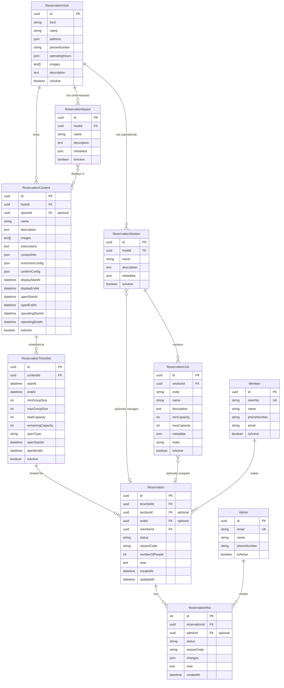

## 개요

LG 멤버십 예약 시스템은 다음 일곱 가지 핵심 리소스로 구성됩니다:

| 리소스 | 설명 | 예시 |
| --- | --- | --- |
| **예약 호스트** | 예약 가능한 장소의 최상위 개념 | LG 아트센터, SKS 레스토랑 |
| **예약 스페이스** | 호스트 내 정보성 공간 (UI 표시용) | 아트센터: 메인홀, 소극장 / SKS: 다이닝룸, 카페 |
| **예약 섹션** | 호스트 내 실제 예약 관리 단위 | 아트센터: 1층, 2층 / SKS: 프라이빗 홀, 메인 홀 |
| **예약 유닛** | 섹션 내 구체적인 예약 단위 | 아트센터: A구역, VIP석 / SKS: 테이블, 룸 |
| **예약 컨텐츠** | 호스트에서 진행되는 구체적인 이벤트/프로그램 | 뮤지컬 '마틸다', 클래식 연주회 |
| **예약 타임슬롯** | 컨텐츠의 특정 시간대 | 2025년 6월 1일 14:00-16:00 |
| **예약** | 사용자가 특정 타임슬롯에 신청한 예약 정보 | 멤버십 번호 123456이 신청한 2명 예약 |

각 리소스는 관리자용(Admin)과 사용자용(App) 두 가지 인터페이스로 API가 제공됩니다.

## API 공통 정보

### 기술 스택

- **백엔드**: tRPC + trpc-openapi, PostgreSQL (Prisma ORM)
- **API 인터페이스**:
  - tRPC: 타입 안전성이 보장되는 기본 API 인터페이스
  - REST: trpc-openapi를 통해 기존 tRPC 라우터를 REST API로도 노출
- **인증**: JWT 기반

### 인증 및 권한

- **관리자 API**: 모든 API 호출 시 인증 필요(JWT)
- **앱 API**: 대부분 인증 불필요(public), 일부 회원 전용 기능만 인증 필요
- **권한 레벨**:
  - publicProcedure: 인증 없이 접근 가능
  - memberProtectedProcedure: 일반 회원만 접근 가능
  - adminProtectedProcedure: 관리자/스태프만 접근 가능

### 응답 상태 코드

- **성공**: 200 OK (데이터 반환 또는 반환 없음)
- **에러**: 400, 401, 403, 404, 409, 500 등 상황에 따라 다름

### 페이지네이션 응답 포맷

목록 조회 API는 항상 아래 포맷으로 응답합니다:

```json
{
  "list": [
    // 해당 리소스의 객체 배열
  ],
  "page": 1,          // [필수] 현재 페이지
  "pageSize": 20,     // [필수] 페이지당 항목 수
  "pageCount": 5,     // [필수] 총 페이지 수
  "totalCount": 100   // [필수] 총 항목 수
}
```

## 데이터 모델 관계도



**주요 관계 설명:**

1. **Host - Space/Section 관계**:
   - Host는 Space(정보성)와 Section(운영용)을 모두 가짐
   - Space는 UI 표시용으로만 사용
   - Section은 실제 예약 운영 단위

2. **Content - Space 관계**:
   - Content는 Space와 연결되어 UI에서 표시 위치를 나타냄
   - Content는 Section과 직접 연결되지 않음

3. **Section - Unit 관계**:
   - Unit은 Section에 속하며 Section 간 이동 불가
   - Unit은 예약 시 선택적으로 할당

4. **Reservation 관계**:
   - Section과 Unit 모두 선택적으로 사용
   - 예약 유형별 패턴:
     - 자유 예약: Section/Unit 모두 미지정 (자유석 공연 등)
     - 구역 예약: Section만 지정 (레스토랑 홀/룸 선택)
     - 지정석 예약: Section + Unit 지정 (특정 좌석/테이블)

## 주요 데이터 타입 및 스키마

### 예약 상태 (ReservationStatus)

```typescript
enum ReservationStatus {
  PENDING = "PENDING",     // 예약 대기
  CONFIRMED = "CONFIRMED", // 예약 확정
  USED = "USED",          // 이용 완료
  CANCELLED = "CANCELLED", // 예약 취소
  NOSHOW = "NOSHOW"       // 노쇼
}
```

### 예약 확정 유형 (ConfirmType)

```typescript
export const ConfirmType = {
  IMMEDIATE: 'IMMEDIATE',         // 즉시 확정
  ADMIN_APPROVAL: 'ADMIN_APPROVAL', // 관리자 승인
  LOTTERY: 'LOTTERY',            // 추첨
} as const;
```

### 예약 오픈 타입 (OpenType)

```typescript
export const OpenType = {
  BATCH: 'BATCH',       // 일괄 오픈
  SEQUENTIAL: 'SEQUENTIAL', // 순차 오픈
} as const;
```

### 호스트 종류 (ReservationHostKind)

```typescript
enum ReservationHostKind {
  ART_CENTER = "ART_CENTER",     // LG 아트센터
  RESTAURANT = "RESTAURANT",     // SKS 레스토랑
}
```

## App API (사용자용)

### 예약 호스트 조회

#### GET /external/app/reservation/hosts

예약 호스트 목록을 조회합니다.

**인증**: 불필요

**요청 파라미터**:
```typescript
{
  kind?: ReservationHostKind  // 호스트 종류 필터
  page?: number               // 페이지 번호 (기본값: 1)
  pageSize?: number          // 페이지 크기 (기본값: 20)
}
```

**응답**:
```json
{
  "list": [
    {
      "id": "uuid",
      "kind": "ART_CENTER",
      "name": "LG 아트센터",
      "address": {
        "zipCode": "06159",
        "mainAddress": "서울시 강남구",
        "detailAddress": "LG아트센터"
      },
      "phoneNumber": "02-2005-0114",
      "operatingHours": [...],
      "images": ["url1", "url2"],
      "description": "설명",
      "spaces": [
        {
          "id": "space-uuid",
          "name": "메인홀"
        }
      ]
    }
  ],
  "page": 1,
  "pageSize": 20,
  "pageCount": 1,
  "totalCount": 3
}
```

### 예약 스페이스 조회

#### GET /external/app/reservation/spaces

예약 스페이스(정보성) 목록을 조회합니다.

**인증**: 불필요

**요청 파라미터**:
```typescript
{
  hostId: string      // [필수] 호스트 ID
  page?: number       // 페이지 번호
  pageSize?: number   // 페이지 크기
}
```

### 예약 섹션 조회

#### GET /external/app/reservation/sections

예약 섹션(실제 예약 관리 단위) 목록을 조회합니다.

**인증**: 불필요

**요청 파라미터**:
```typescript
{
  hostId: string      // [필수] 호스트 ID
  page?: number       // 페이지 번호
  pageSize?: number   // 페이지 크기 (기본값: 10)
}
```

### 예약 컨텐츠 목록 조회

#### GET /external/app/reservation/contents

예약 컨텐츠 목록을 조회합니다.

**인증**: 불필요

**요청 파라미터**:
```typescript
{
  hostId?: string     // 호스트 ID 필터
  spaceId?: string    // 스페이스 ID 필터 (정보성 연결)
  page?: number       // 페이지 번호
  pageSize?: number   // 페이지 크기 (기본값: 10)
}
```

### 예약 컨텐츠 상세 조회

#### GET /external/app/reservation/content/get

예약 컨텐츠를 상세 조회합니다.

**인증**: 불필요

**요청 파라미터**:
```typescript
{
  id: string          // [필수] 컨텐츠 ID
}
```

**응답**:
```json
{
  "id": "content-uuid",
  "name": "뮤지컬 '마틸다'",
  "description": "토니상 수상작",
  "images": ["url1", "url2"],
  "host": {
    "id": "host-uuid",
    "name": "LG 아트센터"
  },
  "space": {
    "id": "space-uuid",
    "name": "메인홀"
  },
  "terms": [
    {
      "id": "terms-uuid",
      "title": "예약 약관",
      "content": "약관 내용",
      "isRequired": true,
      "index": 1
    }
  ],
  "confirmConfig": {
    "confirmType": "LOTTERY",
    "lotteryDate": "2025-05-15",
    "lotteryCapacity": 30
  },
  "instructions": "관람 안내",
  "contactInfo": {
    "phoneNumber": "02-2005-0114"
  }
}
```

### 예약 타임슬롯 조회

#### GET /external/app/reservation/time-slots

예약 타임슬롯 목록을 조회합니다.

**인증**: 불필요

**요청 파라미터**:
```typescript
{
  contentId: string         // [필수] 컨텐츠 ID
  startsAfter?: Date       // 시작일 이후 필터
  startsBefore?: Date      // 시작일 이전 필터
  page?: number            // 페이지 번호
  pageSize?: number        // 페이지 크기
}
```

**응답**:
```json
{
  "list": [
    {
      "id": "timeslot-uuid",
      "contentId": "content-uuid",
      "startAt": "2025-06-01T14:00:00Z",
      "endAt": "2025-06-01T16:00:00Z",
      "totalCapacity": 100,
      "availableCapacity": 75,
      "isOpenForReservation": true,
      "openStartAt": "2025-05-01T12:00:00Z",
      "openEndAt": "2025-05-31T23:59:59Z"
    }
  ],
  "page": 1,
  "pageSize": 20,
  "pageCount": 5,
  "totalCount": 100
}
```

### 내 예약 목록 조회

#### POST /external/app/reservation/me/reservations

내 예약 목록을 조회합니다.

**인증**: 필요 (memberProtectedProcedure)

**요청 바디**:
```json
{
  "timeSlotId": "timeslot-uuid",
  "contentId": "content-uuid",
  "hostId": "host-uuid",
  "statusIn": ["PENDING", "CONFIRMED"],
  "startsAfter": "2025-06-01",
  "startsBefore": "2025-06-30",
  "isCheckableOnly": false,
  "page": 1,
  "pageSize": 20
}
```

**응답**:
```json
{
  "list": [
    {
      "id": "reservation-uuid",
      "sn": "LGR-123abc456def789g",
      "status": "CONFIRMED",
      "groupSize": 2,
      "phoneNumber": "+821012345678",
      "gradeAtIssue": "AS03",
      "timeSlot": {
        "id": "timeslot-uuid",
        "startAt": "2025-06-01T14:00:00Z",
        "endAt": "2025-06-01T16:00:00Z",
        "content": {
          "id": "content-uuid",
          "name": "뮤지컬 '마틸다'",
          "images": ["url1"],
          "confirmConfig": {...},
          "host": {
            "id": "host-uuid",
            "kind": "ART_CENTER",
            "name": "LG 아트센터"
          }
        }
      },
      "space": {
        "id": "space-uuid",
        "name": "메인홀"
      },
      "unit": {
        "id": "unit-uuid",
        "code": "MAIN-A",
        "name": "A구역",
        "minCapacity": 1,
        "maxCapacity": 4
      },
      "hists": [
        {
          "id": "hist-uuid",
          "status": "CONFIRMED",
          "reasonCode": "USER_CREATE_CONFIRMED",
          "createdAt": "2025-05-15T10:00:00Z"
        }
      ]
    }
  ],
  "page": 1,
  "pageSize": 20,
  "pageCount": 1,
  "totalCount": 2
}
```

### 내 예약 상세 조회

#### GET /external/app/reservation/me/reservation/get

내 예약을 상세 조회합니다.

**인증**: 필요 (memberProtectedProcedure)

**요청 파라미터**:
```typescript
{
  id: string          // [필수] 예약 ID
}
```

**응답**:
```json
{
  "id": "reservation-uuid",
  "sn": "LGR-123abc456def789g",
  "status": "CONFIRMED",
  "groupSize": 2,
  "phoneNumber": "+821012345678",
  "gradeAtIssue": "AS03",
  "canModify": true,
  "timeSlot": {
    "id": "timeslot-uuid",
    "startAt": "2025-06-01T14:00:00Z",
    "endAt": "2025-06-01T16:00:00Z",
    "openConfig": {...},
    "content": {
      "id": "content-uuid",
      "name": "뮤지컬 '마틸다'",
      "images": ["url1", "url2"],
      "instructions": "관람 안내",
      "contactInfo": {...},
      "confirmConfig": {...},
      "host": {
        "id": "host-uuid",
        "kind": "ART_CENTER",
        "name": "LG 아트센터",
        "address": {...},
        "phoneNumber": "02-2005-0114"
      }
    }
  },
  "section": {
    "id": "section-uuid",
    "name": "1층 홀"
  },
  "unit": {
    "id": "unit-uuid",
    "code": "MAIN-A",
    "name": "A구역",
    "minCapacity": 1,
    "maxCapacity": 4
  },
  "hists": [...]
}
```

### 예약 생성

#### POST /external/app/reservation/create

예약을 생성합니다.

**인증**: 필요 (memberProtectedProcedure)

**요청 바디**:
```json
{
  "timeSlotId": "timeslot-uuid",
  "groupSize": 2,
  "phoneNumber": "+821012345678",
  "termsAgreements": [
    {
      "termsId": "terms-uuid",
      "isAgreed": true
    }
  ]
}
```

**응답**:
```json
{
  "id": "reservation-uuid",
  "sn": "LGR-123abc456def789g"
}
```

### 예약 수정

#### POST /external/app/reservation/update

예약을 수정합니다.

**인증**: 필요 (memberProtectedProcedure)

**요청 바디**:
```json
{
  "id": "reservation-uuid",
  "timeSlotId": "new-timeslot-uuid",
  "groupSize": 3,
  "phoneNumber": "+821087654321",
  "note": "변경 사유"
}
```

**응답**: 없음 (200 OK)

### 예약 취소

#### POST /external/app/reservation/cancel

예약을 취소합니다.

**인증**: 필요 (memberProtectedProcedure)

**요청 바디**:
```json
{
  "id": "reservation-uuid",
  "note": "취소 사유"
}
```

**응답**: 없음 (200 OK)

### 예약 체크인

#### POST /external/app/reservation/check-in

예약을 체크인합니다 (QR 코드 스캔).

**인증**: 필요 (memberProtectedProcedure)

**요청 바디**:
```json
{
  "id": "reservation-uuid",
  "note": "체크인 메모"
}
```

**응답**: 없음 (200 OK)

## Admin API (관리자용)

### 예약 호스트 관리

#### POST /external/admin/reservation/hosts

예약 호스트 목록을 조회합니다.

**인증**: 필요 (adminProtectedProcedure)

**요청 바디**:
```json
{
  "kind": "ART_CENTER",
  "operatingStatusIn": ["UPCOMING", "IN_PROGRESS"],
  "displayStatusIn": ["UPCOMING", "IN_PROGRESS"],
  "isActive": true,
  "orderBy": "createdAt_desc",
  "page": 1,
  "pageSize": 20
}
```

#### POST /external/admin/reservation/host/create

예약 호스트를 생성합니다.

**인증**: 필요 (adminProtectedProcedure)

**요청 바디**:
```json
{
  "kind": "ART_CENTER",
  "name": "LG 아트센터",
  "address": {
    "zipCode": "06159",
    "mainAddress": "서울시 강남구",
    "detailAddress": "LG아트센터"
  },
  "operatingHours": [...],
  "description": "설명",
  "images": ["url1", "url2"],
  "phoneNumber": "02-2005-0114",
  "operatingStartAt": "2025-01-01",
  "operatingEndAt": "2025-12-31",
  "holidays": {...},
  "instructions": "이용 안내",
  "displayStartAt": "2025-01-01",
  "displayEndAt": "2025-12-31"
}
```

#### POST /external/admin/reservation/host/update

예약 호스트를 수정합니다.

**인증**: 필요 (adminProtectedProcedure)

#### POST /external/admin/reservation/host/delete

예약 호스트를 삭제합니다.

**인증**: 필요 (adminProtectedProcedure)

### 예약 스페이스 관리

#### POST /external/admin/reservation/spaces

예약 스페이스 목록을 조회합니다.

**인증**: 필요 (adminProtectedProcedure)

#### POST /external/admin/reservation/space/create

예약 스페이스를 생성합니다.

**인증**: 필요 (adminProtectedProcedure)

#### POST /external/admin/reservation/space/update

예약 스페이스를 수정합니다.

**인증**: 필요 (adminProtectedProcedure)

#### POST /external/admin/reservation/space/delete

예약 스페이스를 삭제합니다.

**인증**: 필요 (adminProtectedProcedure)

### 예약 섹션 관리

#### POST /external/admin/reservation/sections

예약 섹션(실제 예약 관리 단위) 목록을 조회합니다.

**인증**: 필요 (adminProtectedProcedure)

**요청 바디**:
```json
{
  "hostId": "host-uuid",
  "isActive": true,
  "orderBy": "createdAt_desc",
  "page": 1,
  "pageSize": 20
}
```

#### POST /external/admin/reservation/section/create

예약 섹션을 생성합니다.

**인증**: 필요 (adminProtectedProcedure)

**요청 바디**:
```json
{
  "hostId": "host-uuid",
  "name": "1층 홀",
  "description": "LG 아트센터 1층 메인 홀",
  "isActive": true
}
```

#### POST /external/admin/reservation/section/update

예약 섹션을 수정합니다.

**인증**: 필요 (adminProtectedProcedure)

**요청 바디**:
```json
{
  "id": "section-uuid",
  "name": "2층 홀",
  "description": "업데이트된 설명",
  "isActive": false
}
```

#### POST /external/admin/reservation/section/delete

예약 섉션을 삭제합니다. 섉션에 유닛이 있으면 삭제가 불가능합니다.

**인증**: 필요 (adminProtectedProcedure)

**요청 바디**:
```json
{
  "id": "section-uuid"
}
```

### 예약 유닛 관리

#### POST /external/admin/reservation/units

예약 유닛 목록을 조회합니다.

**인증**: 필요 (adminProtectedProcedure)

**요청 바디**:
```json
{
  "sectionId": "section-uuid",
  "isActive": true,
  "orderBy": "index_asc",
  "page": 1,
  "pageSize": 20
}
```

#### POST /external/admin/reservation/unit/create

예약 유닛을 생성합니다.

**인증**: 필요 (adminProtectedProcedure)

**요청 바디**:
```json
{
  "sectionId": "section-uuid",
  "code": "MAIN-A",
  "name": "A구역",
  "description": "1층 홀 A구역",
  "minCapacity": 1,
  "maxCapacity": 4
}
```

#### POST /external/admin/reservation/unit/update

예약 유닛을 수정합니다. Unit은 Section 간 이동이 불가능합니다.

**인증**: 필요 (adminProtectedProcedure)

**요청 바디**:
```json
{
  "id": "unit-uuid",
  "name": "B구역",
  "description": "업데이트된 설명",
  "minCapacity": 2,
  "maxCapacity": 6,
  "idForBefore": null
}
```

#### POST /external/admin/reservation/unit/delete

예약 유닛을 삭제합니다.

**인증**: 필요 (adminProtectedProcedure)

**요청 바디**:
```json
{
  "id": "unit-uuid"
}
```

### 예약 컨텐츠 관리

#### POST /external/admin/reservation/contents

예약 컨텐츠 목록을 조회합니다.

**인증**: 필요 (adminProtectedProcedure)

**요청 바디**:
```json
{
  "hostId": "host-uuid",
  "spaceId": "space-uuid",
  "operatingStatusIn": ["UPCOMING", "IN_PROGRESS"],
  "displayStatusIn": ["UPCOMING", "IN_PROGRESS"],
  "isActive": true,
  "orderBy": "createdAt_desc",
  "page": 1,
  "pageSize": 20
}
```

#### POST /external/admin/reservation/content/get

예약 컨텐츠를 상세 조회합니다.

**인증**: 필요 (adminProtectedProcedure)

#### POST /external/admin/reservation/content/create

예약 컨텐츠를 생성합니다.

**인증**: 필요 (adminProtectedProcedure)

**요청 바디**:
```json
{
  "name": "뮤지컬 '마틸다'",
  "description": "토니상 수상작",
  "images": ["url1", "url2"],
  "confirmConfig": {
    "confirmType": "LOTTERY",
    "lotteryDate": "2025-05-15",
    "lotteryCapacity": 30
  },
  "hostId": "host-uuid",
  "spaceId": "space-uuid",
  "instructions": "관람 안내",
  "contactInfo": {...},
  "restrictionConfig": {
    "minMembershipGrade": "AS03"
  },
  "displayStartAt": "2025-04-01",
  "displayEndAt": "2025-05-30"
}
```

#### POST /external/admin/reservation/content/update

예약 컨텐츠를 수정합니다.

**인증**: 필요 (adminProtectedProcedure)

#### POST /external/admin/reservation/content/delete

예약 컨텐츠를 삭제합니다.

**인증**: 필요 (adminProtectedProcedure)

### 예약 타임슬롯 관리

#### POST /external/admin/reservation/time-slots

예약 타임슬롯 목록을 조회합니다.

**인증**: 필요 (adminProtectedProcedure)

#### POST /external/admin/reservation/time-slot/create

예약 타임슬롯을 생성합니다.

**인증**: 필요 (adminProtectedProcedure)

#### POST /external/admin/reservation/time-slot/batch-create

예약 타임슬롯을 일괄 생성합니다.

**인증**: 필요 (adminProtectedProcedure)

**요청 바디**:
```json
{
  "contentId": "content-uuid",
  "operatingStartDate": "2025-06-01",
  "operatingEndDate": "2025-06-30",
  "minGroupSize": 1,
  "maxGroupSize": 4,
  "openConfig": {
    "openType": "BATCH",
    "openStartAt": "2025-05-01T12:00:00Z",
    "openEndAt": "2025-05-31T23:59:59Z"
  },
  "timeSlotTemplates": [
    {
      "operatingHours": {
        "days": ["MON", "WED", "FRI"],
        "hours": [{"openTime": "14:00", "closeTime": "16:30"}]
      },
      "totalCapacity": 100
    }
  ],
  "timeUnit": 60,
  "holidays": {...}
}
```

**응답**:
```json
{
  "count": 50
}
```

#### POST /external/admin/reservation/time-slot/update

예약 타임슬롯을 수정합니다.

**인증**: 필요 (adminProtectedProcedure)

#### POST /external/admin/reservation/time-slot/delete

예약 타임슬롯을 삭제합니다.

**인증**: 필요 (adminProtectedProcedure)

### 예약 관리

#### POST /external/admin/reservations

예약 목록을 조회합니다.

**인증**: 필요 (adminProtectedProcedure)

**요청 바디**:
```json
{
  "timeSlotId": "timeslot-uuid",
  "contentId": "content-uuid",
  "hostId": "host-uuid",
  "memberId": "member-uuid",
  "statusIn": ["PENDING", "CONFIRMED"],
  "reasonCodeIn": ["USER_CREATE_PENDING"],
  "startsAfter": "2025-06-01",
  "startsBefore": "2025-06-30",
  "memName": "홍길동",
  "memNo": "1234567890",
  "phoneNumber": "+821012345678",
  "sn": "LGR",
  "includesStats": false,
  "shouldMask": true,
  "orderBy": "createdAt_desc",
  "page": 1,
  "pageSize": 20
}
```

#### POST /external/admin/reservation/get

예약을 상세 조회합니다.

**인증**: 필요 (adminProtectedProcedure)

#### POST /external/admin/reservation/create

예약을 생성합니다.

**인증**: 필요 (adminProtectedProcedure)

#### POST /external/admin/reservation/update

예약을 수정합니다.

**인증**: 필요 (adminProtectedProcedure)

#### POST /external/admin/reservation/status/bulk-change

예약 상태를 대량 변경합니다.

**인증**: 필요 (adminProtectedProcedure)

**요청 바디**:
```json
{
  "ids": ["reservation-id-1", "reservation-id-2"],
  "status": "CONFIRMED",
  "note": "관리자 일괄 승인"
}
```

**응답**:
```json
{
  "successCount": 1,
  "failedIds": ["reservation-id-2"]
}
```

#### POST /external/admin/reservation/lottery/process-results

추첨 결과를 처리합니다.

**인증**: 필요 (adminProtectedProcedure)

**요청 바디**:
```json
{
  "contentId": "content-uuid",
  "lotteryDate": "2025-05-15",
  "winnerIds": ["reservation-id-1", "reservation-id-2"]
}
```

**응답**:
```json
{
  "winnerCount": 2,
  "loserCount": 8
}
```

### 예약 통계

#### POST /external/admin/reservation/stats/overall

전체 예약 통계를 조회합니다.

**인증**: 필요 (adminProtectedProcedure)

## 에러 코드

| 코드 | HTTP 상태 | 설명 | 대응 방법 |
| --- | --- | --- | --- |
| FDE-C-001 | 400 | 요청 데이터가 유효하지 않음 | 요청 형식 및 필수 파라미터 확인 |
| FDE-A-001 | 401 | 인증 오류 | 유효한 JWT 토큰으로 요청 |
| FDE-A-002 | 403 | 권한 부족 또는 비즈니스 로직 제약 위반 | 오류 메시지의 세부 내용 확인 |
| FDE-C-002 | 404 | 요청한 리소스를 찾을 수 없음 | 올바른 ID 확인 |
| FDE-C-003 | 409 | 고유 제약 조건 실패(중복 데이터) | 이미 존재하는 데이터인지 확인 |
| FDE-C-004 | 409 | 외래 키 제약 조건 실패 | 연결된 데이터 먼저 처리 후 재시도 |
| FDE-C-101 | 500 | 내부 서버 오류 | 서버 관리자에게 문의 |

## 예약 타입별 사용 예시

### 자유 예약 (Section/Unit 미지정)
```json
{
  "timeSlotId": "timeslot-uuid",
  "sectionId": null,
  "unitId": null,
  "groupSize": 2,
  "phoneNumber": "+821012345678"
}
```
사용 사례: 자유석 공연, 일반 입장권

### 구역 예약 (Section만 지정)
```json
{
  "timeSlotId": "timeslot-uuid",
  "sectionId": "hall-section-uuid",
  "unitId": null,
  "groupSize": 4,
  "phoneNumber": "+821012345678"
}
```
사용 사례: 레스토랑 홀/룸 선택, 공연장 구역 선택

### 지정석 예약 (Section + Unit 지정)
```json
{
  "timeSlotId": "timeslot-uuid",
  "sectionId": "floor-1-section-uuid",
  "unitId": "seat-1F-15-uuid",
  "groupSize": 1,
  "phoneNumber": "+821012345678"
}
```
사용 사례: 아트센터 지정석, 레스토랑 특정 테이블

## 비즈니스 로직

### 예약 생성 플로우

1. 회원이 예약 컨텐츠와 시간대 선택
2. 약관 동의 확인 (필수 약관 체크)
3. 쿠폰 사용 가능 여부 확인 (프리미엄 라운지, SKS 다이닝 등)
4. `confirmConfig`에 따라 예약 상태 결정:
   - 즉시 확정: CONFIRMED 상태로 생성
   - 관리자 승인: PENDING 상태로 생성
   - 추첨: PENDING 상태로 생성 후 추첨일에 처리
5. 예약 생성 및 이력 기록
6. 쿠폰 사용 시 상태 업데이트

### 예약 상태 전이

- **PENDING → CONFIRMED**: 관리자 승인 또는 추첨 당첨
- **CONFIRMED → USED**: QR 스캔 또는 관리자 수동 처리
- **CONFIRMED → NOSHOW**: 사용일 다음날 자동 처리
- **모든 상태 → CANCELLED**: 취소 처리 (권한에 따라 제한)

### 권한별 가능 작업

- **사용자**: 예약 생성, 수정, 취소 (PENDING/CONFIRMED 상태에서만)
- **관리자**: 모든 상태에서 수정/취소 가능, 상태 직접 변경 가능
- **시스템**: 추첨, 만료, 노쇼 등 자동 처리