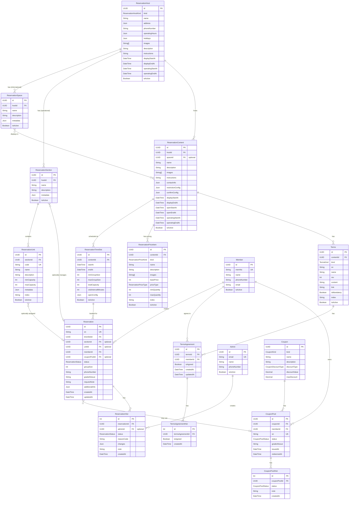

## 개요

LG 멤버십 예약 시스템은 다음 일곱 가지 핵심 리소스로 구성됩니다:

| 리소스 | 설명 | 예시 |
| --- | --- | --- |
| **예약 호스트** | 예약 가능한 장소의 최상위 개념 | SKS 레스토랑 강남점, SKS 레스토랑 판교점 |
| **예약 스페이스** | 호스트 내 정보성 공간 (UI 표시용) | 다이닝룸, 프라이빗 룸, 테라스 |
| **예약 섹션** | 호스트 내 실제 예약 관리 단위 | 메인 홀, 프라이빗 룸 |
| **예약 유닛** | 섹션 내 구체적인 예약 단위 | 테이블 T1-T10, 룸 R1-R5 |
| **예약 컨텐츠** | 호스트에서 진행되는 구체적인 이벤트/프로그램 | 런치 코스, 디너 코스, 와인 디너 |
| **예약 타임슬롯** | 컨텐츠의 특정 시간대 | 2025년 6월 1일 12:00-14:00 (런치), 18:00-20:00 (디너) |
| **예약** | 사용자가 특정 타임슬롯에 신청한 예약 정보 | 멤버십 번호 123456이 신청한 4명 예약 |

각 리소스는 관리자용(Admin)과 사용자용(App) 두 가지 인터페이스로 API가 제공됩니다.

## API 공통 정보

### 기술 스택

- **백엔드**: tRPC + trpc-openapi, PostgreSQL (Prisma ORM)
- **API 인터페이스**:
  - tRPC: 타입 안전성이 보장되는 기본 API 인터페이스
  - REST: trpc-openapi를 통해 기존 tRPC 라우터를 REST API로도 노출
- **인증**: JWT 기반

### 인증 및 권한

- **관리자 API**: 모든 API 호출 시 인증 필요(JWT)
- **앱 API**: 대부분 인증 불필요(public), 일부 회원 전용 기능만 인증 필요
- **권한 레벨**:
  - publicProcedure: 인증 없이 접근 가능
  - memberProtectedProcedure: 일반 회원만 접근 가능
  - adminProtectedProcedure: 관리자/스태프만 접근 가능

### 응답 상태 코드

- **성공**: 200 OK (데이터 반환 또는 반환 없음)
- **에러**: 400, 401, 403, 404, 409, 500 등 상황에 따라 다름

### 페이지네이션 응답 포맷

목록 조회 API는 항상 아래 포맷으로 응답합니다:

```json
{
  "list": [
    // 해당 리소스의 객체 배열
  ],
  "page": 1,          // [필수] 현재 페이지
  "pageSize": 20,     // [필수] 페이지당 항목 수
  "pageCount": 5,     // [필수] 총 페이지 수
  "totalCount": 100   // [필수] 총 항목 수
}
```

## 데이터 모델 관계도



**주요 관계 설명:**

1. **Host - Space/Section 관계**:
   - Host는 Space(정보성)와 Section(운영용)을 모두 가짐
   - Space는 UI 표시용으로만 사용
   - Section은 실제 예약 운영 단위

2. **Content - Space 관계**:
   - Content는 Space와 연결되어 UI에서 표시 위치를 나타냄
   - Content는 Section과 직접 연결되지 않음

3. **Section - Unit 관계**:
   - Unit은 Section에 속하며 Section 간 이동 불가
   - Unit은 예약 시 선택적으로 할당

4. **Reservation 관계**:
   - Section과 Unit 모두 선택적으로 사용
   - 예약 유형별 패턴:
     - 자유 예약: Section/Unit 모두 미지정 (자유석 공연 등)
     - 구역 예약: Section만 지정 (레스토랑 홀/룸 선택)
     - 지정석 예약: Section + Unit 지정 (특정 좌석/테이블)

## 주요 데이터 타입 및 스키마

### 예약 상태 (ReservationStatus)

```typescript
enum ReservationStatus {
  PENDING = "PENDING",     // 예약 대기
  CONFIRMED = "CONFIRMED", // 예약 확정
  USED = "USED",          // 이용 완료
  CANCELLED = "CANCELLED", // 예약 취소
  NOSHOW = "NOSHOW"       // 노쇼
}
```

### 예약 확정 유형 (ConfirmType)

```typescript
export const ConfirmType = {
  IMMEDIATE: 'IMMEDIATE',         // 즉시 확정
  ADMIN_APPROVAL: 'ADMIN_APPROVAL', // 관리자 승인
  LOTTERY: 'LOTTERY',            // 추첨
} as const;
```

### 예약 오픈 타입 (OpenType)

```typescript
export const OpenType = {
  BATCH: 'BATCH',       // 일괄 오픈
  SEQUENTIAL: 'SEQUENTIAL', // 순차 오픈
  GRADED: 'GRADED',     // 등급별 차등 오픈
} as const;
```

### 호스트 종류 (ReservationHostKind)

```typescript
enum ReservationHostKind {
  ART_CENTER = "ART_CENTER",     // LG 아트센터
  RESTAURANT = "RESTAURANT",     // SKS 레스토랑
}
```

## App API (사용자용)

### 예약 호스트 조회

#### GET /external/app/reservation/hosts

예약 호스트 목록을 조회합니다.

**인증**: 불필요

**요청 파라미터**:
- `kind`: [선택] 호스트 종류 (ART_CENTER, RESTAURANT)
- `page`: [선택] 페이지 번호 (기본값: 1)
- `pageSize`: [선택] 페이지 크기 (기본값: 10, 최대: 500)

**응답**:
```json
{
  "list": [
    {
      "id": "770e8400-e29b-41d4-a716-446655440000",
      "kind": "RESTAURANT",
      "name": "SKS 레스토랑 강남점",
      "address": {
        "zipCode": "06159",
        "mainAddress": "서울시 강남구 테헤란로 123",
        "detailAddress": "SKS빌딩 1층"
      },
      "phoneNumber": "02-1234-5678",  // nullable
      "operatingStartAt": "2025-01-01T00:00:00.000Z",  // nullable
      "operatingEndAt": "2025-12-31T23:59:59.000Z",  // nullable
      "operatingHours": [
        {
          "days": ["MON", "TUE", "WED", "THU", "FRI"],
          "hours": [
            {
              "openTime": "11:30",
              "closeTime": "14:30"
            },
            {
              "openTime": "17:30",
              "closeTime": "22:00"
            }
          ]
        }
      ],
      "holidays": {  // nullable
        "regular": {
          "weekly": ["SUN"],
          "monthly": [],
          "yearly": [
            {"month": 1, "day": 1},
            {"month": 12, "day": 25}
          ]
        },
        "specific": ["2025-02-08", "2025-02-09"]
      },
      "description": "프리미엄 다이닝 레스토랑",
      "images": [
        "https://example.com/restaurant/gangnam-1.jpg",
        "https://example.com/restaurant/gangnam-2.jpg"
      ],
      "instructions": "예약 시 알레르기 사전 고지 부탁드립니다",  // nullable
      "spaces": [
        {
          "id": "880e8400-e29b-41d4-a716-446655440000",
          "name": "메인 홀"
        },
        {
          "id": "990e8400-e29b-41d4-a716-446655440000",
          "name": "프라이빗 룸"
        }
      ]
    }
  ],
  "page": 1,
  "pageSize": 10,
  "pageCount": 1,
  "totalCount": 3
}
```

### 예약 스페이스 조회

#### GET /external/app/reservation/spaces

예약 스페이스(정보성) 목록을 조회합니다.

**인증**: 불필요

**요청 파라미터**:
- `hostId`: [필수] 호스트 ID (UUID)
- `page`: [선택] 페이지 번호 (기본값: 1)
- `pageSize`: [선택] 페이지 크기 (기본값: 10, 최대: 500)

**응답**:
```json
{
  "list": [
    {
      "id": "880e8400-e29b-41d4-a716-446655440000",
      "name": "메인 홀",
      "description": "최대 100명 수용 가능한 메인 다이닝 공간"
    },
    {
      "id": "990e8400-e29b-41d4-a716-446655440000",
      "name": "프라이빗 룸",
      "description": "소규모 모임을 위한 독립된 공간 (4-8명)"
    }
  ],
  "page": 1,
  "pageSize": 10,
  "pageCount": 1,
  "totalCount": 2
}
```

### 예약 섹션 조회

#### GET /external/app/reservation/sections

예약 섹션(실제 예약 관리 단위) 목록을 조회합니다.

**인증**: 불필요

**요청 파라미터**:
- `hostId`: [필수] 호스트 ID (UUID)
- `page`: [선택] 페이지 번호 (기본값: 1)
- `pageSize`: [선택] 페이지 크기 (기본값: 10, 최대: 500)

**응답**:
```json
{
  "list": [
    {
      "id": "aa0e8400-e29b-41d4-a716-446655440000",
      "name": "메인 홀 A구역",
      "description": "레스토랑 메인 홀 중앙 구역 (테이블 1-10)"
    },
    {
      "id": "bb0e8400-e29b-41d4-a716-446655440000",
      "name": "메인 홀 B구역",
      "description": "레스토랑 메인 홀 창가 구역 (테이블 11-20)"
    }
  ],
  "page": 1,
  "pageSize": 10,
  "pageCount": 1,
  "totalCount": 2
}
```

### 예약 컨텐츠 목록 조회

#### GET /external/app/reservation/contents

예약 컨텐츠 목록을 조회합니다.

**인증**: 불필요

**요청 파라미터**:
- `hostId`: [선택] 호스트 ID (UUID)
- `spaceId`: [선택] 스페이스 ID (UUID)
- `page`: [선택] 페이지 번호 (기본값: 1)
- `pageSize`: [선택] 페이지 크기 (기본값: 10, 최대: 500)

**응답**:
```json
{
  "list": [
    {
      "id": "660e8400-e29b-41d4-a716-446655440000",
      "name": "런치 코스 A",
      "description": "전채, 메인, 디저트로 구성된 프리미엄 3코스 런치",
      "images": [
        "https://example.com/lunch-course-a-1.jpg",
        "https://example.com/lunch-course-a-2.jpg"
      ],
      "instructions": "예약 시간 10분 전까지 도착 부탁드립니다",  // nullable
      "contactInfo": {  // nullable
        "phoneNumbers": [
          {
            "type": "MAIN",
            "number": "+8221234567",
            "description": "예약 문의"
          }
        ]
      },
      "restrictionConfig": {  // nullable
        "minMembershipGrade": "AS03"
      },
      "confirmConfig": {
        "confirmType": "IMMEDIATE"  // IMMEDIATE, ADMIN_APPROVAL, LOTTERY
      },
      "openStartAt": "2025-05-01T00:00:00.000Z",  // nullable
      "openEndAt": "2025-05-31T23:59:59.000Z",  // nullable
      "operatingStartAt": "2025-06-01T00:00:00.000Z",  // nullable
      "operatingEndAt": "2025-12-31T23:59:59.000Z",  // nullable
      "host": {
        "id": "770e8400-e29b-41d4-a716-446655440000",
        "name": "SKS 레스토랑 강남점"
      },
      "space": {  // nullable
        "id": "880e8400-e29b-41d4-a716-446655440000",
        "name": "메인 홀"
      }
    }
  ],
  "page": 1,
  "pageSize": 10,
  "pageCount": 1,
  "totalCount": 5
}
```

### 예약 컨텐츠 상세 조회

#### GET /external/app/reservation/content/get

예약 컨텐츠를 상세 조회합니다.

**인증**: 불필요

**요청 파라미터**:
- `id`: [필수] 컨텐츠 ID (UUID)

**응답**:
```json
{
  "id": "660e8400-e29b-41d4-a716-446655440000",
  "name": "런치 코스 A",
  "description": "전채, 메인, 디저트로 구성된 프리미엄 3코스 런치",
  "images": [
    "https://example.com/lunch-course-a-1.jpg",
    "https://example.com/lunch-course-a-2.jpg"
  ],
  "instructions": "예약 시간 10분 전까지 도착 부탁드립니다",  // nullable
  "contactInfo": {  // nullable
    "phoneNumbers": [
      {
        "type": "MAIN",
        "number": "+8221234567",
        "description": "예약 문의"
      }
    ]
  },
  "restrictionConfig": {  // nullable
    "minMembershipGrade": "AS03"
  },
  "confirmConfig": {
    "confirmType": "IMMEDIATE"  // IMMEDIATE, ADMIN_APPROVAL, LOTTERY
  },
  "openStartAt": "2025-05-01T00:00:00.000Z",  // nullable
  "openEndAt": "2025-05-31T23:59:59.000Z",  // nullable
  "operatingStartAt": "2025-06-01T00:00:00.000Z",  // nullable
  "operatingEndAt": "2025-12-31T23:59:59.000Z",  // nullable
  "host": {
    "id": "770e8400-e29b-41d4-a716-446655440000",
    "name": "SKS 레스토랑 강남점"
  },
  "space": {  // nullable
    "id": "880e8400-e29b-41d4-a716-446655440000",
    "name": "메인 홀"
  },
  "terms": [
    {
      "id": "cc0e8400-e29b-41d4-a716-446655440000",
      "sn": "TERM001",
      "name": "예약 및 취소 약관",
      "rev": 1,
      "content": "예약 취소는 이용 24시간 전까지 무료로 가능합니다. 이후 취소 시 위약금이 발생할 수 있습니다.",  // nullable
      "link": "https://example.com/terms/reservation",  // nullable
      "isMandatory": true,
      "index": "00001"
    }
  ]
}
```

### 예약 타임슬롯 조회

#### GET /external/app/reservation/time-slots

예약 타임슬롯 목록을 조회합니다.

**인증**: 필수 (memberProtectedProcedure)

**요청 파라미터**:
- `contentId`: [필수] 컨텐츠 ID (UUID)
- `startsAfter`: [선택] 시작일 이후 필터 (ISO 8601)
- `startsBefore`: [선택] 시작일 이전 필터 (ISO 8601)
- `page`: [선택] 페이지 번호 (기본값: 1)
- `pageSize`: [선택] 페이지 크기 (기본값: 500, 최대: 500)

**응답**:
```json
{
  "list": [
    {
      "id": "550e8400-e29b-41d4-a716-446655440000",
      "startAt": "2025-06-01T12:00:00.000Z",
      "endAt": "2025-06-01T14:00:00.000Z",
      "totalCapacity": 40,
      "minGroupSize": 2,
      "maxGroupSize": 6,
      "visitIntervalMinutes": 30,  // nullable
      "openConfig": {
        "openType": "GRADED",
        "openStartAtByGrade": {  // optional
          "AS00": "2025-04-01T10:00:00.000Z",
          "AS01": "2025-04-15T10:00:00.000Z",
          "AS02": "2025-05-01T10:00:00.000Z",
          "AS03": "2025-05-10T10:00:00.000Z",
          "AS04": "2025-05-15T10:00:00.000Z",
          "AS05": "2025-05-20T10:00:00.000Z"
        },
        "modificationByDays": 1,  // optional
        "reservationByDays": 7,  // optional
        "modificationByHours": 24  // optional
      },
      "availableCapacity": 32,
      "availableSections": [  // optional
        {
          "name": "메인 홀 A구역",
          "maxCapacity": 20
        },
        {
          "name": "프라이빗 룸",
          "maxCapacity": 8
        }
      ],
      "isOpenForReservation": true,
      "openStartAt": "2025-05-10T10:00:00.000Z",
      "openEndAt": "2025-05-31T23:59:59.000Z"
    }
  ],
  "page": 1,
  "pageSize": 500,
  "pageCount": 1,
  "totalCount": 30
}
```

**필드 설명**:
- `availableCapacity`: 전체 예약 가능 인원 (totalCapacity - 예약된 인원)
- `availableSections`: 예약 가능한 섹션과 각 섹션의 최대 수용 인원 (선택적, 섹션/유닛이 있는 경우만)
- `isOpenForReservation`: 회원 등급 기준 현재 예약 가능 여부
- `openStartAt`: 현재 회원 등급 기준 예약 오픈 시간
- `openEndAt`: 예약 마감 시간

### 가격 항목 조회

#### GET /external/app/reservation/price-items

예약 가격 항목 목록을 조회합니다.

**인증**: 불필요 (publicProcedure)

**요청 파라미터**:
- `contentId`: [필수] 컨텐츠 ID (UUID)
- `kind`: [선택] 가격 항목 종류 필터 ('MENU' | 'OPTION')
- `page`: [선택] 페이지 번호 (기본값: 1)
- `pageSize`: [선택] 페이지 크기 (기본값: 10, 최대: 500)

**응답**:
```json
{
  "list": [
    {
      "id": "550e8400-e29b-41d4-a716-446655440000",
      "kind": "MENU",
      "name": "런치 코스 A",
      "description": "전채+메인+디저트",  // nullable
      "basePrice": 35000,
      "priceType": "PER_PERSON",  // PER_PERSON, PER_GROUP
      "minQuantity": 1,
      "maxQuantity": 0,  // 0이면 무제한
      "images": [
        "https://example.com/images/lunch-a.jpg"
      ]
    },
    {
      "id": "660e8400-e29b-41d4-a716-446655440000",
      "kind": "OPTION",
      "name": "와인 페어링",
      "description": "코스별 와인 3잔",  // nullable
      "basePrice": 25000,
      "priceType": "PER_PERSON",
      "minQuantity": 1,
      "maxQuantity": 0,
      "images": []
    }
  ],
  "page": 1,
  "pageSize": 10,
  "pageCount": 1,
  "totalCount": 2
}
```

### 내 예약 목록 조회

#### POST /external/app/reservation/me/reservations

내 예약 목록을 조회합니다.

**인증**: 필요 (memberProtectedProcedure)

**요청 바디**:
```json
{
  "timeSlotId": "550e8400-e29b-41d4-a716-446655440000",  // [선택] 타임슬롯 ID 필터
  "contentId": "660e8400-e29b-41d4-a716-446655440000",  // [선택] 컨텐츠 ID 필터
  "hostId": "770e8400-e29b-41d4-a716-446655440000",  // [선택] 호스트 ID 필터
  "statusIn": ["PENDING", "CONFIRMED"],  // [선택] 상태 필터
  "startsAfter": "2025-06-01T00:00:00.000Z",  // [선택] 시작일 이후
  "startsBefore": "2025-06-30T23:59:59.000Z",  // [선택] 시작일 이전
  "isCheckableOnly": false,  // [선택] 체크인 가능 예약만 (기본값: false)
  "page": 1,  // [선택] 페이지 번호 (기본값: 1)
  "pageSize": 10  // [선택] 페이지 크기 (기본값: 10, 최대: 500)
}
```

**응답**:
```json
{
  "list": [
    {
      "id": "990e8400-e29b-41d4-a716-446655440000",
      "sn": "LGR20250615001",
      "status": "CONFIRMED",  // PENDING, CONFIRMED, USED, CANCELLED, NOSHOW
      "groupSize": 4,
      "phoneNumber": "+821012345678",
      "requestNote": "창가 자리 요청",  // nullable
      "additionalInfo": {  // nullable
        "visitTime": "19:30",
        "vehicleNumber": "123-가-1234",
        "needsShowroomTour": false,
        "needsProductConsultation": true
      },
      "createdAt": "2025-05-15T10:00:00.000Z",
      "updatedAt": "2025-05-15T10:00:00.000Z",
      "timeSlot": {
        "id": "550e8400-e29b-41d4-a716-446655440000",
        "startAt": "2025-06-01T12:00:00.000Z",
        "endAt": "2025-06-01T14:00:00.000Z",
        "content": {
          "id": "660e8400-e29b-41d4-a716-446655440000",
          "name": "런치 코스 A",
          "images": [
            "https://example.com/lunch-a-1.jpg",
            "https://example.com/lunch-a-2.jpg"
          ],
          "confirmConfig": {
            "confirmType": "IMMEDIATE"
          },
          "host": {
            "id": "770e8400-e29b-41d4-a716-446655440000",
            "kind": "RESTAURANT",
            "name": "SKS 레스토랑 강남점"
          },
          "space": {  // nullable
            "id": "880e8400-e29b-41d4-a716-446655440000",
            "name": "메인 홀"
          }
        }
      },
      "section": {  // nullable
        "id": "aa0e8400-e29b-41d4-a716-446655440000",
        "name": "메인 홀 A구역"
      },
      "unit": {  // nullable
        "id": "bb0e8400-e29b-41d4-a716-446655440000",
        "code": "T-05",
        "name": "테이블 5번",
        "minCapacity": 2,
        "maxCapacity": 4
      },
      "hists": [
        {
          "id": 1,  // number, not uuid
          "status": "CONFIRMED",
          "reasonCode": "USER_CREATE_CONFIRMED",
          "createdAt": "2025-05-15T10:00:00.000Z"
        }
      ]
    }
  ],
  "page": 1,
  "pageSize": 10,
  "pageCount": 1,
  "totalCount": 2
}
```

### 내 예약 상세 조회

#### GET /external/app/reservation/me/reservation/get

내 예약을 상세 조회합니다.

**인증**: 필요 (memberProtectedProcedure)

**요청 파라미터**:
- `id`: [필수] 예약 ID (UUID)

**응답**:
```json
{
  "id": "990e8400-e29b-41d4-a716-446655440000",
  "sn": "LGR20250615001",
  "status": "CONFIRMED",
  "groupSize": 4,
  "phoneNumber": "+821012345678",
  "gradeAtIssue": "AS03",
  "requestNote": "창가 자리 요청",  // nullable
  "additionalInfo": {  // nullable
    "visitTime": "19:30",
    "vehicleNumber": "123-가-1234",
    "needsShowroomTour": false,
    "needsProductConsultation": true
  },
  "createdAt": "2025-05-15T10:00:00.000Z",
  "updatedAt": "2025-05-15T10:00:00.000Z",
  "timeSlot": {
    "id": "550e8400-e29b-41d4-a716-446655440000",
    "startAt": "2025-06-01T12:00:00.000Z",
    "endAt": "2025-06-01T14:00:00.000Z",
    "openConfig": {
      "openType": "GRADED",
      "modificationByDays": 1
    },
    "content": {
      "id": "660e8400-e29b-41d4-a716-446655440000",
      "name": "런치 코스 A",
      "images": [
        "https://example.com/lunch-a-1.jpg",
        "https://example.com/lunch-a-2.jpg"
      ],
      "instructions": "예약 시간 10분 전까지 도착 부탁드립니다",  // nullable
      "contactInfo": {  // nullable
        "phoneNumbers": [
          {
            "type": "MAIN",
            "number": "+8221234567",
            "description": "예약 문의"
          }
        ]
      },
      "confirmConfig": {
        "confirmType": "IMMEDIATE"
      },
      "host": {
        "id": "770e8400-e29b-41d4-a716-446655440000",
        "kind": "RESTAURANT",
        "name": "SKS 레스토랑 강남점",
        "address": {
          "zipCode": "06159",
          "mainAddress": "서울시 강남구 테헤란로 123",
          "detailAddress": "SKS빌딩 1층"
        },
        "phoneNumber": "02-1234-5678"  // nullable
      },
      "space": {  // nullable
        "id": "880e8400-e29b-41d4-a716-446655440000",
        "name": "메인 홀"
      }
    }
  },
  "section": {  // nullable
    "id": "aa0e8400-e29b-41d4-a716-446655440000",
    "name": "메인 홀 A구역"
  },
  "unit": {  // nullable
    "id": "bb0e8400-e29b-41d4-a716-446655440000",
    "code": "T-05",
    "name": "테이블 5번",
    "minCapacity": 2,
    "maxCapacity": 4
  },
  "hists": [
    {
      "id": 1,  // number, not uuid
      "status": "CONFIRMED",
      "reasonCode": "USER_CREATE_CONFIRMED",
      "changes": {},  // nullable
      "note": "예약 확정",  // nullable
      "createdAt": "2025-05-15T10:00:00.000Z"
    }
  ],
  "canModify": true
}
```

### 예약 생성

#### POST /external/app/reservation/create

예약을 생성합니다.

**인증**: 필요 (memberProtectedProcedure)

<Note>
**GRADED 오픈 타입 동작 방식:**
- 회원 등급에 따라 예약 오픈 시간이 다르게 적용됩니다
- 예약 생성 시 자동으로 회원 등급을 조회하여 해당 등급의 오픈 시간을 적용합니다
</Note>

**요청 바디**:
```json
{
  "timeSlotId": "550e8400-e29b-41d4-a716-446655440000",  // [필수] 타임슬롯 ID
  "groupSize": 2,  // [필수] 예약 인원
  "phoneNumber": "+821012345678",  // [필수] 연락처
  "requestNote": "창가 자리 요청",  // [선택] 요청사항 (최대 500자)
  "additionalInfo": {  // [선택] 추가 정보
    "visitTime": "19:30",
    "vehicleNumber": "123-가-1234",
    "needsShowroomTour": true,
    "needsProductConsultation": false
  },
  "sectionId": "aa0e8400-e29b-41d4-a716-446655440000",  // [선택] 섹션 ID (구역 예약시)
  "unitId": "bb0e8400-e29b-41d4-a716-446655440000",  // [선택] 유닛 ID (지정석 예약시)
  "termsAgreements": [  // [필수] 약관 동의
    {
      "termsId": "cc0e8400-e29b-41d4-a716-446655440000",
      "isAgreed": true
    }
  ]
}
```

**응답**:
```json
{
  "id": "dd0e8400-e29b-41d4-a716-446655440000",
  "sn": "LGR20250615002"
}
```

### 예약 수정

#### POST /external/app/reservation/update

예약을 수정합니다.

**인증**: 필요 (memberProtectedProcedure)

<Note>
**GRADED 오픈 타입 동작 방식:**
- 타임슬롯 변경 시 회원 등급에 따른 오픈 시간이 적용됩니다
- 예약 수정 시 자동으로 회원 등급을 조회하여 해당 등급의 오픈 시간을 적용합니다
</Note>

**요청 바디**:
```json
{
  "id": "990e8400-e29b-41d4-a716-446655440000",  // [필수] 예약 ID
  "timeSlotId": "cc0e8400-e29b-41d4-a716-446655440000",  // [선택] 새 타임슬롯 ID
  "groupSize": 3,  // [선택] 새 예약 인원
  "phoneNumber": "+821087654321",  // [선택] 새 연락처
  "requestNote": "인원 변경 요청",  // [선택] 요청사항
  "additionalInfo": {  // [선택] 추가 정보
    "visitTime": "20:00",
    "vehicleNumber": "234-나-5678",
    "needsShowroomTour": true,
    "needsProductConsultation": false
  },
  "sectionId": "aa0e8400-e29b-41d4-a716-446655440000",  // [선택] 새 섹션 ID
  "unitId": "dd0e8400-e29b-41d4-a716-446655440000",  // [선택] 새 유닛 ID
  "note": "일행 1명이 추가로 참석합니다"  // [선택] 수정 사유 노트 (최대 500자)
}
```

**응답**: 없음 (200 OK)

### 예약 취소

#### POST /external/app/reservation/cancel

예약을 취소합니다.

**인증**: 필요 (memberProtectedProcedure)

**요청 바디**:
```json
{
  "id": "990e8400-e29b-41d4-a716-446655440000",  // [필수] 예약 ID
  "note": "일정 변경으로 인한 취소"  // [선택] 취소 사유 (최대 500자)
}
```

**응답**: 없음 (200 OK)

### 예약 체크인

#### POST /external/app/reservation/checkin

예약을 체크인합니다 (QR 코드 스캔).

**인증**: 필요 (memberProtectedProcedure)

**요청 바디**:
```json
{
  "id": "990e8400-e29b-41d4-a716-446655440000",  // [필수] 예약 ID
  "note": "정시 도착"  // [선택] 체크인 메모 (최대 500자)
}
```

**응답**: 없음 (200 OK)

**체크인 가능 조건**:
- 예약 상태가 CONFIRMED여야 함
- 현재 시간이 타임슬롯 시작 시간 30분 전부터 종료 시간 이내여야 함
- 본인의 예약이어야 함

### 예약 공지사항 조회

#### GET /external/app/reservation/notices

특정 컨텐츠의 공지사항 목록을 조회합니다.

**인증**: 불필요 (publicProcedure)

**요청 파라미터**:
- `reservationContentId`: [필수] 컨텐츠 ID (UUID)
- `page`: [선택] 페이지 번호 (기본값: 1)
- `pageSize`: [선택] 페이지 크기 (기본값: 10, 최대: 500)
- `orderBy`: [선택] 정렬 방식 (기본값: createdAt_desc)

**응답**:
```json
{
  "list": [
    {
      "id": "cc0e8400-e29b-41d4-a716-446655440000",
      "title": "시스템 정기 점검 안내",
      "isActive": true,
      "createdAt": "2025-06-25T09:00:00.000Z",
      "updatedAt": "2025-06-25T09:00:00.000Z"
    },
    {
      "id": "dd0e8400-e29b-41d4-a716-446655440000",
      "title": "예약 변경 안내",
      "isActive": true,
      "createdAt": "2025-06-20T14:00:00.000Z",
      "updatedAt": "2025-06-20T14:00:00.000Z"
    }
  ],
  "page": 1,
  "pageSize": 10,
  "pageCount": 1,
  "totalCount": 5
}
```

**참고**:
- 목록 조회 시 `content` 필드는 제외됩니다.
- `isActive`가 true인 공지사항만 조회됩니다.

#### GET /external/app/reservation/notice/get

공지사항 상세 정보를 조회합니다.

**인증**: 불필요 (publicProcedure)

**요청 파라미터**:
- `id`: [필수] 공지사항 ID (UUID)

**응답**:
```json
{
  "id": "cc0e8400-e29b-41d4-a716-446655440000",
  "title": "시스템 정기 점검 안내",
  "content": "2025년 7월 1일 오전 2시부터 4시까지 시스템 정기 점검이 진행됩니다.\n\n점검 시간 동안 예약 서비스 이용이 제한될 수 있습니다.",
  "isActive": true,
  "createdAt": "2025-06-25T09:00:00.000Z",
  "updatedAt": "2025-06-25T09:00:00.000Z"
}
```

**참고**: 상세 조회 시에만 `content` 필드가 포함됩니다.

## Admin API (관리자용)

### 예약 호스트 관리

#### POST /external/admin/reservation/hosts

예약 호스트 목록을 조회합니다.

**인증**: 필요 (adminProtectedProcedure)

**요청 바디**:
```json
{
  "kind": "RESTAURANT",  // [선택] RESTAURANT, ART_CENTER
  "operatingStatusIn": ["UPCOMING", "ONGOING", "COMPLETED"],  // [선택]
  "displayStatusIn": ["UPCOMING", "ONGOING", "COMPLETED"],  // [선택]
  "isActive": true,  // [선택] 기본값: true
  "orderBy": "createdAt_desc",  // [선택] 기본값: createdAt_desc
  "page": 1,  // [선택] 기본값: 1
  "pageSize": 20  // [선택] 기본값: 20, 최대: 500
}
```

**응답**:
```json
{
  "list": [
    {
      "id": "770e8400-e29b-41d4-a716-446655440000",
      "kind": "RESTAURANT",
      "name": "SKS 레스토랑 강남점",
      "address": {
        "zipCode": "06159",
        "mainAddress": "서울시 강남구 테헤란로 123",
        "detailAddress": "SKS빌딩 1층"
      },
      "phoneNumber": "02-1234-5678",  // nullable
      "operatingStartAt": "2025-01-01T00:00:00.000Z",  // nullable
      "operatingEndAt": "2025-12-31T23:59:59.000Z",  // nullable
      "operatingHours": [  // JSON 배열
        {
          "days": ["MON", "TUE", "WED", "THU", "FRI"],
          "hours": [
            {"openTime": "11:30", "closeTime": "14:30"},
            {"openTime": "17:30", "closeTime": "22:00"}
          ]
        }
      ],
      "holidays": {  // nullable
        "regular": {
          "weekly": ["SUN"],
          "monthly": [],
          "yearly": [
            {"month": 1, "day": 1},
            {"month": 12, "day": 25}
          ]
        },
        "specific": ["2025-02-08", "2025-02-09"]
      },
      "description": "프리미엄 다이닝 레스토랑",
      "images": [
        "https://example.com/restaurant/gangnam-1.jpg",
        "https://example.com/restaurant/gangnam-2.jpg"
      ],
      "instructions": "예약 시간 10분 전까지 도착 부탁드립니다",  // nullable
      "displayStartAt": "2025-01-01T00:00:00.000Z",  // nullable
      "displayEndAt": "2025-12-31T23:59:59.000Z",  // nullable
      "isActive": true,
      "createdAt": "2024-12-01T00:00:00.000Z",
      "updatedAt": "2025-01-15T10:00:00.000Z",
      "spaces": [
        {
          "id": "880e8400-e29b-41d4-a716-446655440000",
          "name": "메인 홀"
        },
        {
          "id": "990e8400-e29b-41d4-a716-446655440000",
          "name": "프라이빗 룸"
        }
      ]
    }
  ],
  "page": 1,
  "pageSize": 20,
  "pageCount": 1,
  "totalCount": 3
}
```

#### POST /external/admin/reservation/host/create

예약 호스트를 생성합니다.

**인증**: 필요 (adminProtectedProcedure)

**요청 바디**:
```json
{
  "kind": "RESTAURANT",  // [필수] RESTAURANT, ART_CENTER
  "name": "SKS 레스토랑 판교점",  // [필수] 최대 35자
  "address": {  // [필수]
    "zipCode": "06159",  // [필수]
    "mainAddress": "서울시 서초구 판교대로 100",  // [필수]
    "detailAddress": "SKS빌딩 2층"  // [선택]
  },
  "phoneNumber": "02-2005-0114",  // [선택]
  "operatingStartAt": "2025-01-01T00:00:00.000Z",  // [선택]
  "operatingEndAt": "2025-12-31T23:59:59.000Z",  // [선택]
  "operatingHours": [  // [필수] 최소 1개
    {
      "days": ["MON", "TUE", "WED", "THU", "FRI"],
      "hours": [{"openTime": "11:30", "closeTime": "22:00"}]
    }
  ],
  "holidays": {  // [필수]
    "fixedHolidays": ["01-01", "12-25"],
    "temporaryHolidays": ["2025-02-08"]
  },
  "description": "프리미엄 레스토랑",  // [필수] 최대 500자
  "images": ["https://example.com/rest1.jpg", "https://example.com/rest2.jpg"],  // [필수] 최소 1개
  "instructions": "예약 3일 전 취소 가능",  // [선택] 최대 2000자
  "displayStartAt": "2025-01-01T00:00:00.000Z",  // [선택]
  "displayEndAt": "2025-12-31T23:59:59.000Z",  // [선택]
  "isActive": true  // [선택] 기본값: true
}
```

**응답**: 없음 (200 OK)

#### POST /external/admin/reservation/host/update

예약 호스트를 수정합니다.

**인증**: 필요 (adminProtectedProcedure)

**요청 바디**:
```json
{
  "id": "770e8400-e29b-41d4-a716-446655440000",  // [필수]
  "kind": "RESTAURANT",  // [선택]
  "name": "LG 아트센터 서울",  // [선택] 최대 35자
  "address": {  // [선택]
    "zipCode": "06159",
    "mainAddress": "서울시 강남구 강남대로 100",
    "detailAddress": "LG빌딩 1층"
  },
  "phoneNumber": "02-2005-0115",  // [선택]
  "operatingStartAt": "2025-01-01T00:00:00.000Z",  // [선택]
  "operatingEndAt": "2025-12-31T23:59:59.000Z",  // [선택]
  "operatingHours": [  // [선택]
    {
      "days": ["MON", "TUE", "WED", "THU", "FRI", "SAT"],
      "hours": [{"openTime": "10:00", "closeTime": "20:00"}]
    }
  ],
  "holidays": {  // [선택]
    "fixedHolidays": ["01-01", "12-25"],
    "temporaryHolidays": ["2025-02-09", "2025-02-10"]
  },
  "description": "업데이트된 설명",  // [선택] 최대 500자
  "images": ["https://example.com/img1.jpg", "https://example.com/img2.jpg"],  // [선택]
  "instructions": "업데이트된 이용 안내",  // [선택] 최대 2000자
  "displayStartAt": "2025-01-01T00:00:00.000Z",  // [선택]
  "displayEndAt": "2025-12-31T23:59:59.000Z",  // [선택]
  "isActive": true  // [선택]
}
```

**응답**: 없음 (200 OK)

#### POST /external/admin/reservation/host/delete

예약 호스트를 삭제합니다.

**인증**: 필요 (adminProtectedProcedure)

**요청 바디**:
```json
{
  "id": "770e8400-e29b-41d4-a716-446655440000"  // [필수]
}
```

**응답**: 없음 (200 OK)

### 예약 스페이스 관리

#### GET /external/admin/reservation/spaces

예약 스페이스 목록을 조회합니다.

**인증**: 필요 (adminProtectedProcedure)

**요청 파라미터**:
- `hostId`: [선택] 호스트 ID 필터 (UUID)
- `isActive`: [선택] 활성 상태 필터 (기본값: true)
- `orderBy`: [선택] 정렬 기준 (기본값: createdAt_desc)
- `page`: [선택] 페이지 번호 (기본값: 1)
- `pageSize`: [선택] 페이지 크기 (기본값: 20, 최대: 500)

**응답**:
```json
{
  "list": [
    {
      "id": "880e8400-e29b-41d4-a716-446655440000",
      "name": "메인 홀",
      "description": "최대 100명 수용 가능한 메인 다이닝 공간",
      "isActive": true,
      "createdAt": "2024-12-01T00:00:00.000Z",
      "updatedAt": "2025-01-15T10:00:00.000Z",
      "host": {
        "id": "770e8400-e29b-41d4-a716-446655440000",
        "name": "SKS 레스토랑 강남점"
      }
    }
  ],
  "page": 1,
  "pageSize": 20,
  "pageCount": 1,
  "totalCount": 2
}
```

#### POST /external/admin/reservation/space/create

예약 스페이스를 생성합니다.

**인증**: 필요 (adminProtectedProcedure)

**요청 바디**:
```json
{
  "hostId": "770e8400-e29b-41d4-a716-446655440000",  // [필수]
  "name": "프라이빗 룸",  // [필수] 최대 35자
  "description": "소규모 모임을 위한 독립된 공간 (4-8명)",  // [필수] 최대 500자
  "isActive": true  // [선택] 기본값: true
}
```

**응답**: 없음 (200 OK)

#### POST /external/admin/reservation/space/update

예약 스페이스를 수정합니다.

**인증**: 필요 (adminProtectedProcedure)

**요청 바디**:
```json
{
  "id": "880e8400-e29b-41d4-a716-446655440000",  // [필수]
  "hostId": "770e8400-e29b-41d4-a716-446655440000",  // [선택]
  "name": "소극장 A",  // [선택] 최대 35자
  "description": "업데이트된 설명",  // [선택] 최대 500자
  "isActive": true  // [선택]
}
```

**응답**: 없음 (200 OK)

#### POST /external/admin/reservation/space/delete

예약 스페이스를 삭제합니다.

**인증**: 필요 (adminProtectedProcedure)

**요청 바디**:
```json
{
  "id": "880e8400-e29b-41d4-a716-446655440000"  // [필수]
}
```

**응답**: 없음 (200 OK)

### 예약 섹션 관리

#### GET /external/admin/reservation/sections

예약 섹션(실제 예약 관리 단위) 목록을 조회합니다.

**인증**: 필요 (adminProtectedProcedure)

**요청 파라미터**:
- `hostId`: [선택] 호스트 ID (UUID)
- `isActive`: [선택] 활성 상태 (기본값: true)
- `orderBy`: [선택] 정렬 방식 (기본값: createdAt_desc)
- `page`: [선택] 페이지 번호 (기본값: 1)
- `pageSize`: [선택] 페이지 크기 (기본값: 20, 최대: 500)

**응답**:
```json
{
  "list": [
    {
      "id": "aa0e8400-e29b-41d4-a716-446655440000",
      "name": "메인 홀",
      "description": "레스토랑 메인 홀 섹션",
      "isActive": true,
      "createdAt": "2025-01-01T00:00:00.000Z",
      "updatedAt": "2025-01-01T00:00:00.000Z",
      "host": {
        "id": "770e8400-e29b-41d4-a716-446655440000",
        "name": "SKS 레스토랑 강남점"
      },
      "units": [
        {
          "id": "bb0e8400-e29b-41d4-a716-446655440000",
          "code": "T01",
          "name": "테이블 1",
          "minCapacity": 2,
          "maxCapacity": 4
        }
      ]
    }
  ],
  "page": 1,
  "pageSize": 20,
  "pageCount": 1,
  "totalCount": 3
}
```

#### POST /external/admin/reservation/section/create

예약 섹션을 생성합니다.

**인증**: 필요 (adminProtectedProcedure)

**요청 바디**:
```json
{
  "hostId": "770e8400-e29b-41d4-a716-446655440000",  // [필수]
  "name": "메인 홀",  // [필수] 최대 35자
  "description": "레스토랑 메인 홀",  // [필수] 최대 500자
  "isActive": true  // [선택] 기본값: true
}
```

**응답**: 없음 (200 OK)

#### POST /external/admin/reservation/section/update

예약 섹션을 수정합니다.

**인증**: 필요 (adminProtectedProcedure)

**요청 바디**:
```json
{
  "id": "aa0e8400-e29b-41d4-a716-446655440000",  // [필수]
  "hostId": "770e8400-e29b-41d4-a716-446655440000",  // [선택]
  "name": "프라이빗 룸",  // [선택] 최대 35자
  "description": "업데이트된 설명",  // [선택] 최대 500자
  "isActive": false  // [선택]
}
```

**응답**: 없음 (200 OK)

#### POST /external/admin/reservation/section/delete

예약 섹션을 삭제합니다. 섹션에 유닛이 있으면 삭제가 불가능합니다.

**인증**: 필요 (adminProtectedProcedure)

**요청 바디**:
```json
{
  "id": "aa0e8400-e29b-41d4-a716-446655440000"  // [필수]
}
```

**응답**: 없음 (200 OK)

### 예약 유닛 관리

#### GET /external/admin/reservation/units

예약 유닛 목록을 조회합니다.

**인증**: 필요 (adminProtectedProcedure)

**요청 파라미터**:
- `sectionId`: [선택] 섹션 ID (UUID)
- `timeSlotId`: [선택] 타임슬롯 ID (UUID) - 특정 시간대의 가용성 확인
- `isActive`: [선택] 활성 상태 (기본값: true)
- `orderBy`: [선택] 정렬 방식 (기본값: index_asc)
- `page`: [선택] 페이지 번호 (기본값: 1)
- `pageSize`: [선택] 페이지 크기 (기본값: 20, 최대: 500)
- `shouldMask`: [선택] 마스킹 여부 (기본값: true)

**응답**:
```json
{
  "list": [
    {
      "id": "unit-uuid",
      "code": "TABLE-01",
      "name": "테이블 1",
      "description": "메인 홀 테이블 1",
      "minCapacity": 1,
      "maxCapacity": 4,
      "metadata": null,
      "index": "a0000001",
      "isActive": true,
      "createdAt": "2025-01-01T00:00:00.000Z",
      "updatedAt": "2025-01-01T00:00:00.000Z",
      "section": {
        "id": "section-uuid",
        "name": "메인 홀"
      },
      "isAvailable": true,  // [선택] timeSlotId가 제공된 경우에만
      "reservation": null  // [선택] timeSlotId가 제공된 경우에만, 예약 정보
    }
  ],
  "page": 1,
  "pageSize": 20,
  "pageCount": 1,
  "totalCount": 5
}
```

#### POST /external/admin/reservation/unit/create

예약 유닛을 생성합니다.

**인증**: 필요 (adminProtectedProcedure)

**요청 바디**:
```json
{
  "sectionId": "aa0e8400-e29b-41d4-a716-446655440000",  // [필수]
  "code": "TABLE-02",  // [필수] 최대 20자
  "name": "테이블 2",  // [필수] 최대 35자
  "description": "메인 홀 테이블 2",  // [필수] 최대 500자
  "minCapacity": 1,  // [선택] 기본값: 0, 최소: 0
  "maxCapacity": 4,  // [선택] 기본값: 0, 최소: 0
  "metadata": { "floor": 1 },  // [선택]
  "isActive": true  // [선택] 기본값: true
}
```

**응답**: 없음 (200 OK)

#### POST /external/admin/reservation/unit/update

예약 유닛을 수정합니다. Unit은 Section 간 이동이 불가능합니다.

**인증**: 필요 (adminProtectedProcedure)

**요청 바디**:
```json
{
  "id": "bb0e8400-e29b-41d4-a716-446655440000",  // [필수]
  "code": "TABLE-03",  // [선택] 최대 20자
  "name": "테이블 3",  // [선택] 최대 35자
  "description": "업데이트된 설명",  // [선택] 최대 500자
  "minCapacity": 2,  // [선택]
  "maxCapacity": 6,  // [선택]
  "metadata": { "floor": 2 },  // [선택]
  "isActive": false,  // [선택]
  "idForBefore": "cc0e8400-e29b-41d4-a716-446655440000"  // [선택] 순서 변경용, null이면 마지막
}
```

**응답**: 없음 (200 OK)

#### POST /external/admin/reservation/unit/delete

예약 유닛을 삭제합니다.

**인증**: 필요 (adminProtectedProcedure)

**요청 바디**:
```json
{
  "id": "bb0e8400-e29b-41d4-a716-446655440000"  // [필수]
}
```

**응답**: 없음 (200 OK)

### 예약 컨텐츠 관리

#### POST /external/admin/reservation/contents

예약 컨텐츠 목록을 조회합니다.

**인증**: 필요 (adminProtectedProcedure)

**요청 바디**:
```json
{
  "hostId": "770e8400-e29b-41d4-a716-446655440000",  // [선택] 호스트 ID 필터
  "spaceId": "880e8400-e29b-41d4-a716-446655440000",  // [선택] 스페이스 ID 필터
  "operatingStatusIn": ["UPCOMING", "ONGOING", "COMPLETED"],  // [선택]
  "displayStatusIn": ["UPCOMING", "ONGOING", "COMPLETED"],  // [선택]
  "isActive": true,  // [선택] 기본값: true
  "orderBy": "createdAt_desc",  // [선택] 기본값: createdAt_desc
  "page": 1,  // [선택] 기본값: 1
  "pageSize": 20  // [선택] 기본값: 20, 최대: 500
}
```

**응답**:
```json
{
  "list": [
    {
      "id": "660e8400-e29b-41d4-a716-446655440000",
      "name": "런치 코스",
      "description": "프리미엄 3코스 런치",
      "images": ["https://example.com/lunch1.jpg"],
      "instructions": "예약 3일 전까지 취소 가능",  // nullable
      "contactInfo": {  // nullable
        "type": "PHONE",
        "value": "02-1234-5678"
      },
      "restrictionConfig": {  // nullable
        "minMembershipGrade": "AS03"
      },
      "confirmConfig": {
        "confirmType": "LOTTERY",
        "lotteryDate": "2025-05-20",
        "lotteryCapacity": 100
      },
      "displayStartAt": "2025-04-01T00:00:00.000Z",  // nullable
      "displayEndAt": "2025-05-30T23:59:59.000Z",  // nullable
      "openStartAt": "2025-05-01T00:00:00.000Z",  // nullable
      "openEndAt": "2025-05-25T23:59:59.000Z",  // nullable
      "operatingStartAt": "2025-06-01T00:00:00.000Z",  // nullable
      "operatingEndAt": "2025-06-30T23:59:59.000Z",  // nullable
      "isActive": true,
      "createdAt": "2025-01-01T00:00:00.000Z",
      "updatedAt": "2025-01-01T00:00:00.000Z",
      "host": {
        "id": "770e8400-e29b-41d4-a716-446655440000",
        "name": "SKS 레스토랑 강남점"
      },
      "space": {  // nullable
        "id": "880e8400-e29b-41d4-a716-446655440000",
        "name": "메인 홀"
      }
    }
  ],
  "page": 1,
  "pageSize": 20,
  "pageCount": 1,
  "totalCount": 5
}
```

#### GET /external/admin/reservation/content/get

예약 컨텐츠를 상세 조회합니다.

**인증**: 필요 (adminProtectedProcedure)

**요청 파라미터**:
- `id`: [필수] 컨텐츠 ID (UUID)

**응답**:
```json
{
  "id": "660e8400-e29b-41d4-a716-446655440000",
  "name": "뮤지컬 '마틸다'",
  "description": "토니상 수상작",
  "images": ["https://example.com/matilda1.jpg", "https://example.com/matilda2.jpg"],
  "instructions": "예약 및 이용 안내",  // nullable
  "contactInfo": {  // nullable
    "phoneNumbers": [
      {
        "type": "MAIN",
        "number": "+8225441234",
        "description": "문의"
      }
    ]
  },
  "restrictionConfig": {  // nullable
    "minMembershipGrade": "AS03"
  },
  "confirmConfig": {
    "confirmType": "LOTTERY",
    "lotteryDate": "2025-05-20",
    "lotteryCapacity": 200
  },
  "displayStartAt": "2025-04-01T00:00:00.000Z",  // nullable
  "displayEndAt": "2025-05-30T23:59:59.000Z",  // nullable
  "openStartAt": "2025-05-01T00:00:00.000Z",  // nullable
  "openEndAt": "2025-05-25T23:59:59.000Z",  // nullable
  "operatingStartAt": "2025-06-01T00:00:00.000Z",  // nullable
  "operatingEndAt": "2025-06-30T23:59:59.000Z",  // nullable
  "isActive": true,
  "createdAt": "2025-01-01T00:00:00.000Z",
  "updatedAt": "2025-01-01T00:00:00.000Z",
  "host": {
    "id": "770e8400-e29b-41d4-a716-446655440000",
    "name": "LG 아트센터"
  },
  "space": {  // nullable
    "id": "880e8400-e29b-41d4-a716-446655440000",
    "name": "메인홀"
  },
  "terms": []
}
```

#### POST /external/admin/reservation/content/create

예약 컨텐츠를 생성합니다.

**인증**: 필요 (adminProtectedProcedure)

**요청 바디**:
```json
{
  "name": "디너 코스",  // [필수] 최대 35자
  "description": "프리미엄 5코스 디너",  // [필수]
  "images": ["https://example.com/dinner1.jpg", "https://example.com/dinner2.jpg"],  // [필수] 최소 1개
  "instructions": "예약 및 이용 안내",  // [선택] 최대 2000자
  "contactInfo": {  // [선택]
    "type": "PHONE",
    "value": "02-3456-7890"
  },
  "restrictionConfig": {  // [선택]
    "minMembershipGrade": "AS03"
  },
  "confirmConfig": {  // [필수]
    "confirmType": "LOTTERY",
    "lotteryDate": "2025-05-20",  // LOTTERY인 경우 필수
    "lotteryCapacity": 50  // LOTTERY인 경우 필수
  },
  "displayStartAt": "2025-04-01T00:00:00.000Z",  // [선택]
  "displayEndAt": "2025-05-30T23:59:59.000Z",  // [선택]
  "hostId": "770e8400-e29b-41d4-a716-446655440000",  // [필수]
  "spaceId": "880e8400-e29b-41d4-a716-446655440000",  // [선택]
  "isActive": true  // [선택] 기본값: true
}
```

**응답**: 없음 (200 OK)

#### POST /external/admin/reservation/content/update

예약 컨텐츠를 수정합니다.

**인증**: 필요 (adminProtectedProcedure)

**요청 바디**:
```json
{
  "id": "660e8400-e29b-41d4-a716-446655440000",  // [필수]
  "name": "런치 코스 (수정)",  // [선택]
  "description": "업데이트된 메뉴 설명",  // [선택]
  "images": ["https://example.com/lunch-update.jpg"],  // [선택]
  "instructions": "업데이트된 이용 안내",  // [선택]
  "contactInfo": {  // [선택]
    "type": "EMAIL",
    "value": "reservation@example.com"
  },
  "restrictionConfig": {  // [선택]
    "minMembershipGrade": "AS04"
  },
  "confirmConfig": {  // [선택]
    "confirmType": "ADMIN_APPROVAL"
  },
  "displayStartAt": "2025-04-01T00:00:00.000Z",  // [선택]
  "displayEndAt": "2025-05-30T23:59:59.000Z",  // [선택]
  "hostId": "770e8400-e29b-41d4-a716-446655440000",  // [선택]
  "spaceId": "880e8400-e29b-41d4-a716-446655440000",  // [선택]
  "isActive": false  // [선택]
}
```

**응답**: 없음 (200 OK)

#### POST /external/admin/reservation/content/delete

예약 컨텐츠를 삭제합니다.

**인증**: 필요 (adminProtectedProcedure)

**요청 바디**:
```json
{
  "id": "660e8400-e29b-41d4-a716-446655440000"  // [필수]
}
```

**응답**: 없음 (200 OK)

### 예약 타임슬롯 관리

#### POST /external/admin/reservation/timeslots

예약 타임슬롯 목록을 조회합니다.

**인증**: 필요 (adminProtectedProcedure)

**요청 바디**:
```json
{
  "contentId": "660e8400-e29b-41d4-a716-446655440000",  // [필수]
  "startsAfter": "2025-06-01T00:00:00.000Z",  // [선택]
  "startsBefore": "2025-06-30T23:59:59.000Z",  // [선택]
  "isActive": true,  // [선택] 기본값: true
  "orderBy": "startAt_asc",  // [선택] 기본값: startAt_asc
  "page": 1,  // [선택] 기본값: 1
  "pageSize": 20  // [선택] 기본값: 20, 최대: 500
}
```

**응답**:
```json
{
  "list": [
    {
      "id": "990e8400-e29b-41d4-a716-446655440000",
      "startAt": "2025-06-01T12:00:00.000Z",
      "endAt": "2025-06-01T14:00:00.000Z",
      "totalCapacity": 40,
      "minGroupSize": 1,
      "maxGroupSize": 4,
      "visitIntervalMinutes": 30,  // nullable
      "openConfig": {
        "openType": "GRADED",
        "openStartAtByGrade": {
          "AS00": "2025-04-01T10:00:00.000Z",
          "AS01": "2025-05-01T10:00:00.000Z",
          "AS02": "2025-05-01T10:00:00.000Z",
          "AS03": "2025-05-01T10:00:00.000Z",
          "AS04": "2025-05-01T10:00:00.000Z",
          "AS05": "2025-05-01T10:00:00.000Z"
        }
      },
      "isActive": true,
      "createdAt": "2025-01-01T00:00:00.000Z",
      "updatedAt": "2025-01-01T00:00:00.000Z",
      "content": {
        "id": "660e8400-e29b-41d4-a716-446655440000",
        "name": "런치 코스"
      },
      "reservationCount": 5,
      "availableCapacity": 35
    }
  ],
  "page": 1,
  "pageSize": 20,
  "pageCount": 1,
  "totalCount": 10
}
```

#### POST /external/admin/reservation/time-slot/create

예약 타임슬롯을 생성합니다.

**인증**: 필요 (adminProtectedProcedure)

**요청 바디**:
```json
{
  "contentId": "660e8400-e29b-41d4-a716-446655440000",  // [필수]
  "startAt": "2025-06-01T18:00:00.000Z",  // [필수]
  "endAt": "2025-06-01T20:00:00.000Z",  // [필수]
  "totalCapacity": 40,  // [필수] 최소 1
  "minGroupSize": 1,  // [필수] 최소 1
  "maxGroupSize": 4,  // [필수] 최소 1
  "visitIntervalMinutes": 30,  // [선택] 5~480분
  "openConfig": {  // [필수]
    "openType": "BATCH",
    "openStartAt": "2025-05-01T10:00:00.000Z",
    "openEndAt": "2025-05-25T23:59:59.000Z",
    "reservationByHours": 24,  // [선택]
    "modificationByHours": 3  // [선택]
  },
  "isActive": true  // [선택] 기본값: true
}
```

**응답**: 없음 (200 OK)

#### POST /external/admin/reservation/time-slot/batch-create

예약 타임슬롯을 일괄 생성합니다.

**인증**: 필요 (adminProtectedProcedure)

**요청 바디**:
```json
{
  "contentId": "660e8400-e29b-41d4-a716-446655440000",  // [필수]
  "operatingStartDate": "2025-06-01T00:00:00.000Z",  // [필수]
  "operatingEndDate": "2025-06-30T23:59:59.000Z",  // [필수]
  "minGroupSize": 1,  // [필수] 최소 1
  "maxGroupSize": 4,  // [필수] 최소 1
  "visitIntervalMinutes": 30,  // [선택] 5~480분
  "openConfig": {  // [필수]
    "openType": "GRADED",
    "modificationByDays": 2,  // [선택]
    "reservationByDays": 1,  // [선택]
    "modificationByHours": 3  // [선택]
  },
  "timeSlotTemplates": [  // [필수] 최소 1개
    {
      "operatingHours": {  // [필수]
        "days": ["MON", "WED", "FRI"],  // [필수] 최소 1개
        "hours": [  // [필수] 최소 1개
          {"openTime": "14:00", "closeTime": "16:30"}
        ]
      },
      "calculateCapacityFromUnits": true,  // [선택]
      "totalCapacity": 100  // [선택]
    }
  ],
  "timeUnit": 60,  // [선택] 기본값: 60, 30~1440분
  "holidays": {  // [필수]
    "dates": ["2025-06-05"],
    "weekdays": ["SUN"]
  },
  "isActive": true  // [선택] 기본값: true
}
```

<Note>
  **openConfig 타입별 설정**

  - **BATCH**: 일괄 오픈 - openStartAt, openEndAt 필수
  - **SEQUENTIAL**: 순차 오픈 - openStartByDays, openEndByDays 필수
  - **GRADED**: 등급별 차등 오픈 - openStartAtByGrade 선택적 (미제공 시 SKS_RESERVATION_POLICY로 자동 계산)
</Note>

**응답**:
```json
{
  "count": 50
}
```

#### POST /external/admin/reservation/time-slot/update

예약 타임슬롯을 수정합니다.

**인증**: 필요 (adminProtectedProcedure)

**요청 바디**:
```json
{
  "id": "990e8400-e29b-41d4-a716-446655440000",  // [필수]
  "startAt": "2025-06-01T18:00:00.000Z",  // [선택]
  "endAt": "2025-06-01T20:00:00.000Z",  // [선택]
  "totalCapacity": 150,  // [선택] 최소 1
  "minGroupSize": 2,  // [선택] 최소 1
  "maxGroupSize": 6,  // [선택] 최소 1
  "visitIntervalMinutes": null,  // [선택] nullable, 5~480분
  "openConfig": {  // [선택]
    "openType": "SEQUENTIAL",
    "openStartByDays": 7,
    "openEndByDays": 1,
    "modificationByHours": 3
  },
  "isActive": false  // [선택]
}
```

**응답**: 없음 (200 OK)

#### POST /external/admin/reservation/time-slot/delete

예약 타임슬롯을 삭제합니다.

**인증**: 필요 (adminProtectedProcedure)

**요청 바디**:
```json
{
  "id": "990e8400-e29b-41d4-a716-446655440000"  // [필수]
}
```

**응답**: 없음 (200 OK)

### 예약 가격 항목 관리

#### POST /external/admin/reservation/price-items

예약 가격 항목 목록을 조회합니다.

**인증**: 필요 (adminProtectedProcedure)

**요청 바디**:
```json
{
  "contentId": "660e8400-e29b-41d4-a716-446655440000",  // [선택]
  "kind": "MENU",  // [선택] MENU, OPTION
  "isActive": true,  // [선택]
  "orderBy": "index_asc",  // [선택] 기본값: index_asc
  "page": 1,  // [선택] 기본값: 1
  "pageSize": 20  // [선택] 기본값: 20, 최대: 500
}
```

**응답**:
```json
{
  "list": [
    {
      "id": "550e8400-e29b-41d4-a716-446655440000",
      "kind": "MENU",
      "name": "런치 코스 A",
      "description": "전채+메인+디저트",  // nullable
      "basePrice": 35000,
      "priceType": "PER_PERSON",
      "minQuantity": 1,
      "maxQuantity": 0,  // 0이면 무제한
      "images": [
        "https://example.com/images/lunch-a.jpg"
      ],
      "index": "00001",
      "isActive": true,
      "createdAt": "2025-01-15T10:30:00.000Z",
      "updatedAt": "2025-01-15T10:30:00.000Z",
      "content": {
        "id": "660e8400-e29b-41d4-a716-446655440000",
        "name": "LG 시그니처 레스토랑"
      }
    }
  ],
  "page": 1,
  "pageSize": 20,
  "pageCount": 1,
  "totalCount": 3
}
```

#### POST /external/admin/reservation/price-item/create

예약 가격 항목을 생성합니다.

**인증**: 필요 (adminProtectedProcedure)

**요청 바디**:
```json
{
  "contentId": "660e8400-e29b-41d4-a716-446655440000",  // [필수]
  "kind": "MENU",  // [필수] MENU, OPTION
  "name": "디너 코스 A",  // [필수] 최대 35자
  "description": "프리미엄 5코스 디너",  // [선택] 최대 500자
  "basePrice": 85000,  // [필수] 0 이상
  "priceType": "PER_PERSON",  // [필수] PER_PERSON, PER_GROUP
  "minQuantity": 1,  // [선택] 기본값: 1
  "maxQuantity": 0,  // [선택] 기본값: 0 (무제한)
  "images": [  // [선택] 기본값: []
    "https://example.com/images/dinner-a.jpg"
  ],
  "isActive": true  // [선택] 기본값: true
}
```

**응답**: 없음 (200 OK)
```

#### POST /external/admin/reservation/price-item/update

예약 가격 항목을 수정합니다.

**인증**: 필요 (adminProtectedProcedure)

**요청 바디**:
```json
{
  "id": "770e8400-e29b-41d4-a716-446655440000",  // [필수]
  "kind": "MENU",  // [선택]
  "name": "디너 코스 A (수정)",  // [선택] 최대 35자
  "description": "프리미엄 7코스 디너",  // [선택] 최대 500자
  "basePrice": 95000,  // [선택] 0 이상
  "priceType": "PER_PERSON",  // [선택]
  "minQuantity": 1,  // [선택]
  "maxQuantity": 4,  // [선택] 0이면 무제한
  "images": [  // [선택]
    "https://example.com/images/dinner-a-new.jpg"
  ],
  "isActive": true,  // [선택]
  "idForBefore": "550e8400-e29b-41d4-a716-446655440000"  // [선택] 순서 변경용, nullable
}
```

**응답**: 없음 (200 OK)
```

#### POST /external/admin/reservation/price-item/delete

예약 가격 항목을 삭제합니다.

**인증**: 필요 (adminProtectedProcedure)

**요청 바디**:
```json
{
  "id": "770e8400-e29b-41d4-a716-446655440000"  // [필수]
}
```

**응답**: 없음 (200 OK)

### 예약 관리

#### POST /external/admin/reservations

예약 목록을 조회합니다.

**인증**: 필요 (adminProtectedProcedure)

**요청 바디**:
```json
{
  "timeSlotId": "550e8400-e29b-41d4-a716-446655440000",  // [선택]
  "contentId": "660e8400-e29b-41d4-a716-446655440000",  // [선택]
  "hostId": "770e8400-e29b-41d4-a716-446655440000",  // [선택]
  "memberId": "880e8400-e29b-41d4-a716-446655440000",  // [선택]
  "statusIn": ["PENDING", "CONFIRMED"],  // [선택] ReservationStatus 배열
  "reasonCodeIn": ["USER_CREATE_PENDING"],  // [선택] ReservationStatusReasonCode 배열
  "startsAfter": "2025-06-01T00:00:00.000Z",  // [선택]
  "startsBefore": "2025-06-30T23:59:59.000Z",  // [선택]
  "createdAfter": "2025-05-01T00:00:00.000Z",  // [선택]
  "createdBefore": "2025-05-31T23:59:59.000Z",  // [선택]
  "memName": "홍길동",  // [선택]
  "memNo": "LGM1234567890",  // [선택]
  "phoneNumber": "+821012345678",  // [선택]
  "sn": "LGR202506",  // [선택] 예약번호 부분 검색
  "includesStats": false,  // [선택] 기본값: false
  "shouldMask": true,  // [선택] 기본값: true
  "orderBy": "createdAt_desc",  // [선택] 기본값: createdAt_desc
  "page": 1,  // [선택] 기본값: 1
  "pageSize": 20  // [선택] 기본값: 20, 최대: 500
}
```

**응답** (includesStats=false):
```json
{
  "list": [
    {
      "id": "990e8400-e29b-41d4-a716-446655440000",
      "sn": "LGR20250615001",
      "status": "CONFIRMED",
      "groupSize": 4,
      "phoneNumber": "+821012345678",
      "gradeAtIssue": "AS03",
      "requestNote": "창가 자리 요청",  // nullable
      "additionalInfo": {  // nullable
        "visitTime": "19:30",
        "vehicleNumber": "123-가-1234",
        "needsShowroomTour": false,
        "needsProductConsultation": false
      },
      "createdAt": "2025-06-01T10:00:00.000Z",
      "updatedAt": "2025-06-10T14:00:00.000Z",
      "timeSlot": {
        "id": "550e8400-e29b-41d4-a716-446655440000",
        "startAt": "2025-06-15T18:00:00.000Z",
        "endAt": "2025-06-15T20:00:00.000Z",
        "content": {
          "id": "660e8400-e29b-41d4-a716-446655440000",
          "name": "LG 시그니처 레스토랑",
          "confirmConfig": {
            "confirmType": "IMMEDIATE"
          },
          "host": {
            "id": "770e8400-e29b-41d4-a716-446655440000",
            "kind": "RESTAURANT",
            "name": "LG 시그니처 레스토랑 강남점"
          },
          "space": {  // nullable
            "id": "880e8400-e29b-41d4-a716-446655440000",
            "name": "메인 홀"
          }
        }
      },
      "section": null,  // nullable
      "unit": null,  // nullable
      "member": {
        "id": "880e8400-e29b-41d4-a716-446655440000",
        "memName": "홍*동",  // 마스킹 처리
        "memNo": "LGM12****7890"  // 마스킹 처리
      }
    }
  ],
  "page": 1,
  "pageSize": 20,
  "pageCount": 5,
  "totalCount": 95
}
```

**응답** (includesStats=true):
```json
{
  "list": [...],  // 위와 동일
  "page": 1,
  "pageSize": 20,
  "pageCount": 5,
  "totalCount": 100,
  "stats": {
    "totalCapacity": 1000,
    "availableCapacity": 160,
    "pendingCount": 50,
    "confirmedCount": 200,
    "cancelledCount": 30,
    "usedCount": 150,
    "noshowCount": 20,
    "totalPendingSize": 100,
    "totalConfirmedSize": 400,
    "totalCancelledSize": 60,
    "totalUsedSize": 300,
    "totalNoshowSize": 40,
    "actualReservedSize": 840,
    "actualConfirmedSize": 740,
    "actualCancelledSize": 60,
    "reservationRate": 84.0,
    "confirmationRate": 74.0,
    "utilizationRate": 40.5,
    "cancellationRate": 6.7,
    "noshowRate": 5.4,
    "timeSlotStats": [
      {
        "timeSlotId": "550e8400-e29b-41d4-a716-446655440000",
        "startAt": "2025-06-15T18:00:00.000Z",
        "endAt": "2025-06-15T20:00:00.000Z",
        "totalCapacity": 100,
        "availableCapacity": 20,
        "pendingCount": 10,
        "confirmedCount": 30,
        "cancelledCount": 5,
        "usedCount": 0,
        "noshowCount": 0,
        "totalPendingSize": 20,
        "totalConfirmedSize": 60,
        "totalCancelledSize": 10,
        "totalUsedSize": 0,
        "totalNoshowSize": 0,
        "actualReservedSize": 80,
        "actualConfirmedSize": 60,
        "actualCancelledSize": 10,
        "reservationRate": 80.0,
        "confirmationRate": 60.0,
        "utilizationRate": 0.0,
        "cancellationRate": 11.1,
        "noshowRate": 0.0
      }
    ]
  }
}
```

#### POST /external/admin/reservation/get

예약을 상세 조회합니다.

**인증**: 필요 (adminProtectedProcedure)

**요청 바디**:
```json
{
  "id": "990e8400-e29b-41d4-a716-446655440000",  // [필수]
  "shouldMask": true  // [선택] 기본값: true
}
```

**응답**:
```json
{
  "id": "990e8400-e29b-41d4-a716-446655440000",
  "sn": "LGR20250601001",
  "status": "CONFIRMED",
  "groupSize": 2,
  "phoneNumber": "+8210****5678",  // 마스킹 처리
  "gradeAtIssue": "AS03",  // nullable
  "requestNote": "창가 자리 요청",  // nullable
  "additionalInfo": null,  // nullable
  "createdAt": "2025-06-01T00:00:00.000Z",
  "updatedAt": "2025-06-01T00:00:00.000Z",
  "timeSlot": {
    "id": "550e8400-e29b-41d4-a716-446655440000",
    "startAt": "2025-06-15T14:00:00.000Z",
    "endAt": "2025-06-15T15:00:00.000Z",
    "totalCapacity": 100,
    "content": {
      "id": "660e8400-e29b-41d4-a716-446655440000",
      "name": "LG 시그니처 레스토랑",
      "confirmConfig": {
        "confirmType": "IMMEDIATE"
      },
      "host": {
        "id": "770e8400-e29b-41d4-a716-446655440000",
        "kind": "RESTAURANT",
        "name": "LG 시그니처 레스토랑 강남점"
      },
      "space": null  // nullable
    }
  },
  "section": null,  // nullable
  "unit": null,  // nullable
  "member": {
    "id": "880e8400-e29b-41d4-a716-446655440000",
    "memName": "홍*동",  // 마스킹 처리
    "memNo": "LGM12****7890"  // 마스킹 처리
  },
  "priceItems": [],
  "units": [],
  "histories": [
    {
      "id": "aa1e8400-e29b-41d4-a716-446655440000",
      "status": "PENDING",
      "reason": "USER_CREATE_PENDING",
      "note": "예약 생성",  // nullable
      "createdAt": "2025-06-01T00:00:00.000Z"
    }
  ]
}
```

#### POST /external/admin/reservation/create

예약을 생성합니다.

**인증**: 필요 (adminProtectedProcedure)

**요청 바디**:
```json
{
  "timeSlotId": "550e8400-e29b-41d4-a716-446655440000",  // [필수]
  "groupSize": 2,  // [필수] 최소 1
  "phoneNumber": "+821012345678",  // [필수]
  "memberId": "880e8400-e29b-41d4-a716-446655440000",  // [필수]
  "note": "관리자 메모",  // [선택] 최대 500자
  "additionalInfo": {  // [선택] 추가 정보
    "visitTime": "19:30",
    "vehicleNumber": "123-가-1234",
    "needsShowroomTour": true,
    "needsProductConsultation": false
  },
  "priceItems": [  // [선택]
    {
      "priceItemId": "770e8400-e29b-41d4-a716-446655440000",
      "quantity": 2
    }
  ],
  "unitIds": [  // [선택]
    "bb0e8400-e29b-41d4-a716-446655440000",
    "cc0e8400-e29b-41d4-a716-446655440000"
  ]
}
```

**응답**:
```json
{
  "id": "990e8400-e29b-41d4-a716-446655440000",
  "sn": "LGR20250601001"
}
```

#### POST /external/admin/reservation/update

예약을 수정합니다.

**인증**: 필요 (adminProtectedProcedure)

**요청 바디**:
```json
{
  "id": "990e8400-e29b-41d4-a716-446655440000",  // [필수]
  "groupSize": 3,  // [선택] 최소 1
  "phoneNumber": "+821098765432",  // [선택]
  "requestNote": "업데이트된 요청사항",  // [선택] 최대 500자
  "additionalInfo": {  // [선택] 추가 정보
    "visitTime": "20:00",
    "vehicleNumber": "234-나-5678",
    "needsShowroomTour": false,
    "needsProductConsultation": true
  },
  "priceItems": [  // [선택]
    {
      "priceItemId": "770e8400-e29b-41d4-a716-446655440000",
      "quantity": 3
    }
  ]
}
```

**응답**: 없음 (200 OK)

#### POST /external/admin/reservation/status/bulk-change

예약 상태를 대량 변경합니다.

**인증**: 필요 (adminProtectedProcedure)

**요청 바디**:
```json
{
  "ids": [  // [필수] 최소 1개
    "990e8400-e29b-41d4-a716-446655440000",
    "aa0e8400-e29b-41d4-a716-446655440000"
  ],
  "status": "CONFIRMED",  // [필수] ReservationStatus
  "note": "관리자 일괄 승인"  // [선택] 최대 500자
}
```

**응답**:
```json
{
  "successCount": 1,
  "failedIds": ["aa0e8400-e29b-41d4-a716-446655440000"]
}
```

#### POST /external/admin/reservation/lottery/process-results

추첨 결과를 처리합니다.

**인증**: 필요 (adminProtectedProcedure)

**요청 바디**:
```json
{
  "contentId": "660e8400-e29b-41d4-a716-446655440000",  // [필수]
  "lotteryDate": "2025-05-15",  // [필수] YYYY-MM-DD 형식
  "winnerIds": [  // [필수] 최소 1개
    "990e8400-e29b-41d4-a716-446655440000",
    "aa0e8400-e29b-41d4-a716-446655440000"
  ]
}
```

**응답**:
```json
{
  "winnerCount": 2,
  "loserCount": 8
}
```

### 예약 공지사항 관리

#### GET /external/admin/reservation/notices

예약 공지사항 목록을 조회합니다.

**인증**: 필요 (adminProtectedProcedure)

**요청 파라미터**:
- `reservationContentId`: [선택] 컨텐츠 ID (UUID)
- `isActive`: [선택] 활성 상태 (boolean)
- `orderBy`: [선택] 정렬 순서 (기본값: createdAt_desc)
- `page`: [선택] 페이지 번호 (기본값: 1)
- `pageSize`: [선택] 페이지 크기 (기본값: 20, 최대: 500)

**응답**:
```json
{
  "list": [
    {
      "id": "cc0e8400-e29b-41d4-a716-446655440000",
      "title": "시스템 정기 점검 안내",
      "isActive": true,
      "createdAt": "2025-06-25T09:00:00.000Z",
      "updatedAt": "2025-06-25T09:00:00.000Z"
    }
  ],
  "page": 1,
  "pageSize": 20,
  "pageCount": 1,
  "totalCount": 10
}
```

#### GET /external/admin/reservation/notice/get

예약 공지사항 상세 정보를 조회합니다.

**인증**: 필요 (adminProtectedProcedure)

**요청 파라미터**:
- `id`: [필수] 공지사항 ID (UUID)

**응답**:
```json
{
  "id": "cc0e8400-e29b-41d4-a716-446655440000",
  "title": "시스템 정기 점검 안내",
  "content": "2025년 7월 1일 오전 2시부터 4시까지 시스템 정기 점검이 진행됩니다.",
  "isActive": true,
  "createdAt": "2025-06-25T09:00:00.000Z",
  "updatedAt": "2025-06-25T09:00:00.000Z"
}
```

#### POST /external/admin/reservation/notice/create

예약 컨텐츠에 대한 공지사항을 생성합니다.

**인증**: 필요 (adminProtectedProcedure)

**요청 바디**:
```json
{
  "reservationContentId": "660e8400-e29b-41d4-a716-446655440000",  // [필수]
  "title": "시스템 정기 점검 안내",  // [필수] 최대 255자
  "content": "2025년 7월 1일 오전 2시부터 4시까지 시스템 정기 점검이 진행됩니다."  // [필수]
}
```

**응답**: 없음 (200 OK)

#### POST /external/admin/reservation/notice/update

예약 공지사항을 수정합니다.

**인증**: 필요 (adminProtectedProcedure)

**요청 바디**:
```json
{
  "id": "cc0e8400-e29b-41d4-a716-446655440000",  // [필수]
  "reservationContentId": "660e8400-e29b-41d4-a716-446655440000",  // [선택]
  "title": "시스템 정기 점검 안내 (수정)",  // [선택] 최대 255자
  "content": "점검 시간이 변경되었습니다.",  // [선택]
  "isActive": true  // [선택]
}
```

**응답**: 없음 (200 OK)

#### POST /external/admin/reservation/notice/delete

예약 공지사항을 삭제합니다.

**인증**: 필요 (adminProtectedProcedure)

**요청 바디**:
```json
{
  "id": "cc0e8400-e29b-41d4-a716-446655440000"  // [필수]
}
```

**응답**: 없음 (200 OK)

### 회원 관리

#### GET /external/admin/member/get-coupons

회원의 쿠폰 목록을 조회합니다.

**인증**: 필요 (adminProtectedProcedure)

**요청 파라미터**:
```json
{
  "memberId": "880e8400-e29b-41d4-a716-446655440000",  // [선택] memberId 또는 memNo 중 하나 필수
  "memNo": "LGM1234567890",  // [선택] memberId 또는 memNo 중 하나 필수
  "kind": "HOME_APPLIANCE_CONCIERGE"  // [선택] MembershipBenefitsKind
}
```

**응답**:
```json
{
  "list": [
    {
      "sn": "COUPON202501150001",
      "status": "ISSUED",  // CouponPoolStatus: ISSUED, REDEEMED, EXPIRED
      "issuedAt": "2025-01-01T09:00:00.000Z",
      "redeemedAt": "2025-01-10T14:30:00.000Z",  // nullable
      "startDate": "2025-01-01T00:00:00.000Z",
      "endDate": "2025-12-31T23:59:59.000Z",
      "coupon": {
        "kind": "FREE_APPLIANCE_RELOCATION_SERVICE",  // IntegratedCouponKind
        "name": "무료 가전 이전 설치 서비스",
        "discountType": "PASS",  // CouponDiscountType: FIXED, PERCENTAGE, PASS
        "discountValue": "0",
        "maxDiscount": "0"
      },
      "reservation": {  // nullable
        "id": "990e8400-e29b-41d4-a716-446655440000"
      }
    },
    {
      "sn": "COUPON202501150002",
      "status": "REDEEMED",
      "issuedAt": "2025-01-05T10:00:00.000Z",
      "redeemedAt": "2025-01-12T15:45:00.000Z",
      "startDate": "2025-01-05T00:00:00.000Z",
      "endDate": "2025-06-30T23:59:59.000Z",
      "coupon": {
        "kind": "LOUNGE_ACCESS",
        "name": "LG 시그니처 라운지 이용권",
        "discountType": "PASS",
        "discountValue": "0",
        "maxDiscount": "0"
      },
      "reservation": {
        "id": "aa0e8400-e29b-41d4-a716-446655440000"
      }
    }
  ]
}
```

## 에러 코드

| 코드 | HTTP 상태 | 설명 | 대응 방법 |
| --- | --- | --- | --- |
| FDE-C-001 | 400 | 요청 데이터가 유효하지 않음 | 요청 형식 및 필수 파라미터 확인 |
| FDE-A-001 | 401 | 인증 오류 | 유효한 JWT 토큰으로 요청 |
| FDE-A-002 | 403 | 권한 부족 또는 비즈니스 로직 제약 위반 | 오류 메시지의 세부 내용 확인 |
| FDE-C-002 | 404 | 요청한 리소스를 찾을 수 없음 | 올바른 ID 확인 |
| FDE-C-003 | 409 | 고유 제약 조건 실패(중복 데이터) | 이미 존재하는 데이터인지 확인 |
| FDE-C-004 | 409 | 외래 키 제약 조건 실패 | 연결된 데이터 먼저 처리 후 재시도 |
| FDE-C-101 | 500 | 내부 서버 오류 | 서버 관리자에게 문의 |

## 예약 타입별 사용 예시

### 자유 예약 (Section/Unit 미지정)
```json
{
  "timeSlotId": "timeslot-uuid",
  "sectionId": null,
  "unitId": null,
  "groupSize": 2,
  "phoneNumber": "+821012345678"
}
```
사용 사례: 자유석 공연, 일반 입장권

### 구역 예약 (Section만 지정)
```json
{
  "timeSlotId": "timeslot-uuid",
  "sectionId": "hall-section-uuid",
  "unitId": null,
  "groupSize": 4,
  "phoneNumber": "+821012345678"
}
```
사용 사례: 레스토랑 홀/룸 선택, 공연장 구역 선택

### 지정석 예약 (Section + Unit 지정)
```json
{
  "timeSlotId": "timeslot-uuid",
  "sectionId": "floor-1-section-uuid",
  "unitId": "seat-1F-15-uuid",
  "groupSize": 1,
  "phoneNumber": "+821012345678"
}
```
사용 사례: 아트센터 지정석, 레스토랑 특정 테이블

## 비즈니스 로직

### 예약 생성 플로우

1. 회원이 예약 컨텐츠와 시간대 선택
2. 약관 동의 확인 (필수 약관 체크)
3. 쿠폰 사용 가능 여부 확인 (프리미엄 라운지, SKS 다이닝 등)
4. `confirmConfig`에 따라 예약 상태 결정:
   - 즉시 확정: CONFIRMED 상태로 생성
   - 관리자 승인: PENDING 상태로 생성
   - 추첨: PENDING 상태로 생성 후 추첨일에 처리
5. 예약 생성 및 이력 기록
6. 쿠폰 사용 시 상태 업데이트

### 예약 상태 전이

- **PENDING → CONFIRMED**: 관리자 승인 또는 추첨 당첨
- **CONFIRMED → USED**: QR 스캔 또는 관리자 수동 처리
- **CONFIRMED → NOSHOW**: 사용일 다음날 자동 처리
- **모든 상태 → CANCELLED**: 취소 처리 (권한에 따라 제한)

### 권한별 가능 작업

- **사용자**: 예약 생성, 수정, 취소 (PENDING/CONFIRMED 상태에서만)
- **관리자**: 모든 상태에서 수정/취소 가능, 상태 직접 변경 가능
- **시스템**: 추첨, 만료, 노쇼 등 자동 처리