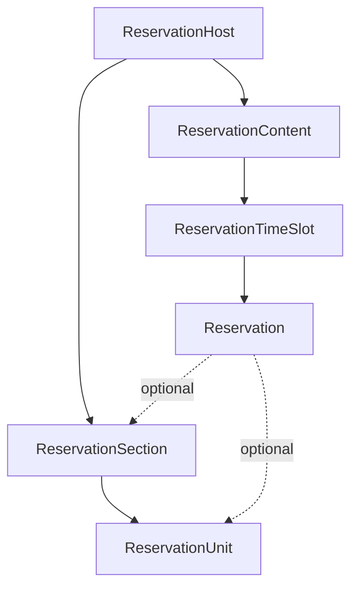

## 개요

LG 멤버십 예약 시스템은 복잡한 예약 용량 관리를 위해 **FFD(First Fit Decreasing) 알고리즘**을 구현했습니다.
이는 레스토랑의 테이블 배치나 공연장의 좌석 배정과 같은 실제 비즈니스 요구사항을 효과적으로 처리합니다.

### 핵심 특징

- **섹션 독립성**: 각 섹션(홀, 룸)이 독립적으로 예약 관리
- **가변 용량 지원**: 테이블/룸의 최소-최대 수용 인원 범위 처리
- **자동 전략 선택**: 상황에 따라 최적 알고리즘 자동 적용
- **실시간 시뮬레이션**: 예약 가능 여부 즉시 판단

## 시스템 아키텍처

### 계층 구조



### 데이터 모델

| 엔티티 | 역할 | 예시 |
|--------|------|------|
| **Host** | 예약 장소 | SKS 레스토랑 강남점 |
| **Section** | 독립 운영 구역 | 메인 홀, VIP 룸 |
| **Unit** | 실제 예약 단위 | 테이블 T1 (2-4인), 룸 R1 (6-8인) |
| **TimeSlot** | 예약 시간대 | 2025-06-01 12:00-14:00 |
| **Reservation** | 실제 예약 | 4인 예약 (미배정 상태) |

## 전략 자동 선택

시스템은 유닛 구성을 분석하여 최적의 예약 전략을 자동으로 선택합니다:

### SIMPLE_COUNT 전략
단순 개수 기반 계산 방식으로 다음 경우에 사용됩니다:
- 유닛이 없는 경우 (공연장 전체 좌석)
- 모든 유닛이 1인 고정석인 경우
- 단순한 구성의 경우

### FFD_SIMULATION 전략
복잡한 배치 시뮬레이션이 필요한 경우:
- 가변 용량 유닛이 있는 경우 (2-4인 테이블)
- 다양한 크기의 유닛이 3개 이상인 경우
- 최적 배치가 중요한 경우

## FFD 알고리즘 상세

### 작동 원리

FFD(First Fit Decreasing)는 Bin Packing 문제의 효율적인 해결 방법입니다:

1. **정렬**: 예약 그룹을 크기 내림차순으로 정렬
2. **배치**: 큰 그룹부터 순서대로 배치 시도
3. **최적화**: Best Fit 방식으로 낭비 최소화

### 구현 코드

```typescript
class FFDReservationSimulator {
  simulate(
    units: Unit[],
    existingReservations: Reservation[],
    newGroupSize?: number,
    targetSectionId?: string
  ): CapacityCheckResult {
    // 1. 예약 분류 (배정/미배정)
    const assignedReservations = existingReservations.filter(r => r.unitId);
    const unassignedReservations = existingReservations.filter(r => !r.unitId);

    // 2. 미배정 그룹 준비
    const groupsToPlace = unassignedReservations.map(r => r.groupSize);
    if (newGroupSize) groupsToPlace.push(newGroupSize);

    // 3. FFD: 큰 그룹부터 정렬
    groupsToPlace.sort((a, b) => b - a);

    // 4. 섹션별 독립적 시뮬레이션
    // ...
  }
}
```

### Best Fit 유닛 선택

```typescript
private tryPlaceGroup(groupSize: number, availableUnits: Unit[]): Result {
  let bestUnit = null;
  let minWaste = Number.MAX_SAFE_INTEGER;

  for (const unit of availableUnits) {
    if (unit.remaining >= groupSize && groupSize >= unit.minCapacity) {
      const waste = unit.remaining - groupSize;
      if (waste < minWaste) {
        minWaste = waste;
        bestUnit = unit;
      }
    }
  }

  return bestUnit ? { unitId: bestUnit.id } : null;
}
```

## API 사용 가이드

### checkCapacity 함수

예약 가능 여부와 가용 용량을 확인하는 핵심 함수입니다:

```typescript
const checkCapacity = async (
  timeSlotId: string,
  groupSize: number,
  options?: {
    sectionId?: string;         // 특정 섹션 지정
    excludeReservationId?: string; // 제외할 예약 (수정 시)
  }
): Promise<CapacityCheckResult>
```

### 반환 타입

```typescript
interface CapacityCheckResult {
  strategy: 'SIMPLE_COUNT' | 'FFD_SIMULATION';
  sections: SectionResult[];
  reservationCount: number;    // PENDING/CONFIRMED 예약 건수
}

interface SectionResult {
  sectionId: string;
  sectionName: string;
  canAccommodate: boolean;    // 예약 가능 여부
  totalCapacity: number;      // 총 수용 가능 인원
  minGroupSize: number;       // 최소 수용 가능 그룹 크기
  maxGroupSize: number;       // 최대 수용 가능 그룹 크기
  availableCapacity: number;  // 남은 용량
  totalUnits: number;         // 전체 유닛 수
  availableUnits: number;     // 가용 유닛 수
  message?: string;
}
```

## 사용 예시

### 예약 생성 시 용량 체크

```typescript
// 특정 섹션에 4명 예약 가능 여부 확인
const result = await checkCapacity(timeSlotId, 4, {
  sectionId: 'section-123'
});

const section = result.sections[0];
if (!section.canAccommodate) {
  throw new Error(section.message);
}
```

### 타임슬롯 목록 조회

```typescript
// 모든 섹션의 현재 가용 상태 확인 (추가 예약 없이)
const capacityResult = await checkCapacity(slot.id, 0);

// 예약 건수 (어드민 전용)
const reservationCount = capacityResult.reservationCount;

// 가용 용량 및 섹션 정보 (앱/어드민 공통)
if (capacityResult.strategy === 'SIMPLE_COUNT') {
  // 단일 가상 섹션
  const section = capacityResult.sections[0];
  availableCapacity = section.availableCapacity;
} else {
  // 실제 섹션들
  availableSections = capacityResult.sections
    .filter(s => s.canAccommodate)
    .map(s => ({
      name: s.sectionName,
      totalCapacity: s.totalCapacity,  // 총 수용 가능 인원
      minGroupSize: s.minGroupSize,  // 최소 예약 가능 그룹 크기
      maxGroupSize: s.maxGroupSize,  // 최대 예약 가능 그룹 크기
      availableCapacity: s.availableCapacity,  // 남은 용량
      totalUnits: s.totalUnits,  // 전체 유닛 수
      availableUnits: s.availableUnits  // 가용 유닛 수
    }));

  // 전체 가용 인원 (모든 셉션 합계)
  availableCapacity = capacityResult.sections
    .reduce((sum, s) => sum + s.availableCapacity, 0);
}
```

## 주요 특징 및 제한사항

### 섹션 독립성

- 각 섹션은 완전히 독립적으로 운영됩니다
- 섹션 간 유닛 이동은 불가능합니다
- 섹션별로 별도의 예약 용량을 관리합니다

### 주요 필드 설명

#### availableCapacity의 의미

`availableCapacity`는 항상 **예약 가능한 인원수**를 나타냅니다:

- **SIMPLE_COUNT 전략**: totalCapacity - 예약된 인원수
- **FFD_SIMULATION 전략**: 사용 가능한 유닛들의 총 수용 인원수

**주의사항**:
- FFD_SIMULATION에서 유닛이 부분적으로 사용되어도 전체가 사용된 것으로 계산됩니다
- 예: 4인 테이블에 2명 배치 → 해당 테이블의 remaining = 0 (실제로는 2자리 남았지만 사용 불가로 처리)
- 따라서 `availableCapacity`는 실제 남은 자리보다 적게 표시될 수 있습니다

#### reservationCount와의 차이

- **reservationCount**: PENDING/CONFIRMED 상태의 예약 건수 (운영 지표)
- **availableCapacity**: 실제 예약 가능한 용량 (사용자 정보)
- 어드민에서는 두 값 모두 중요하지만, 앱에서는 주로 `availableCapacity`만 필요

### 통합된 로직

현재 앱과 어드민은 동일한 `checkCapacity` 함수를 사용하여 용량을 계산합니다:
- 모든 전략(SIMPLE_COUNT, FFD_SIMULATION)에서 `availableSections` 제공
- 어드민에서 추가 DB 쿼리 없이 `reservationCount` 획득
- 일관된 섹션별 정보 반환 (`minGroupSize`, `maxGroupSize`, `availableUnits`, `totalUnits` 포함)
- SIMPLE_COUNT 전략에서는 유닛이 없으므로 `availableUnits`와 `totalUnits`가 0으로 설정됨
- `totalCapacity`는 섹션의 총 수용 가능 인원을 나타냅니다
- `availableCapacity`는 해당 섹션 내에서 현재 예약 가능한 인원을 나타냅니다

### 강제 할당 (Force Assignment)

어드민은 유닛의 용량 제한을 무시하고 강제로 예약을 할당할 수 있습니다:

#### 강제 할당 동작 방식

- **일반 할당**: 유닛의 minCapacity ≤ groupSize ≤ maxCapacity 검증
- **강제 할당**: `isForced: true` 옵션으로 용량 검증 건너뜀
- **예시**: 4인 테이블(maxCapacity=4)에 6명 그룹 강제 배정 가능

#### 통계 영향

**예약 목록 통계 (calculateReservationStats)**:
- 실제 groupSize로 집계 (예: 6명으로 기록)
- SIMPLE_COUNT, FFD_SIMULATION 전략 모두 동일하게 적용

**타임슬롯 가용성 (checkCapacity)**:
- **FFD_SIMULATION**: 유닛 점유 상태만 확인, 실제 인원수와 무관
  - 4인 테이블이 6명에게 할당되어도 → 유닛은 "점유됨"으로 처리
  - 남은 테이블의 availableCapacity는 정확히 계산
- **SIMPLE_COUNT**: totalCapacity - 예약된 인원수로 계산
  - 강제 할당된 초과 인원도 포함되어 계산

#### 실제 시나리오

```
상황: 4인 테이블 3개 (총 12명 수용 가능)
강제 할당: 테이블1에 6명 배정
결과:
- 예약 통계: 6명 서비스 중
- 가용 용량: 8명 (남은 테이블 2개 × 4인)
- 실제 의미: 6명을 수용했고, 추가로 8명까지 예약 가능
```

이러한 비대칭성은 의도된 설계로, 실제 서비스한 인원(통계)과 예약 가능 인원(가용성)을 각각 정확히 추적합니다.

### 향후 개선 방향

1. **부분 사용 지원**: 유닛의 부분적 사용 추적
2. **낭비 용량 계산**: wastedCapacity 필드 활용
3. **동적 재배치**: 예약 변경 시 최적 재배치
4. **우선순위 큐**: VIP 예약 우선 배치

## 성능 최적화

### 시간 복잡도

- 정렬: O(n log n)
- 배치: O(n × m) where n = 그룹 수, m = 유닛 수
- 전체: O(n log n + n × m)

### 최적화 전략

1. **캐싱**: 자주 조회되는 타임슬롯 결과 캐시
2. **인덱싱**: 섹션/유닛 조회 최적화
3. **배치 처리**: 여러 시뮬레이션 동시 실행

## 관련 문서

- [예약 시스템 ERD](/reservation-system/reservation-erd)
- [예약 시스템 API 레퍼런스](/reservation-system/reservation-api-reference)
- [예약 운영 가이드라인](/reservation-system/reservation-operation-guidelines)