## 전체 시스템 ERD

```mermaid
erDiagram
    Admin {
        UUID id PK
        String email UK
        String password
        String salt
        String name
        String phoneNumber
        Json twoFas
        Json permissions
        Boolean requiresPasswordChange
        DateTime lastLoginAt
        Boolean isActive
        DateTime createdAt
        DateTime updatedAt
    }

    Member {
        UUID id PK
        String email
        String name
        String phoneNumber
        Json permissions
        String unifyId UK
        String ci UK
        String memNo UK
        String mbti
        DateTime mbtiCreatedAt
        DateTime mbtiUpdatedAt
        Boolean isActive
        DateTime createdAt
        DateTime updatedAt
    }

    ReservationHost {
        UUID id PK
        ReservationHostKind kind
        String name
        Json address
        String phoneNumber
        DateTime operatingStartAt
        DateTime operatingEndAt
        Json operatingHours
        Json holidays
        String description
        String[] images
        String instructions
        DateTime displayStartAt
        DateTime displayEndAt
        Boolean isActive
        DateTime createdAt
        DateTime updatedAt
    }

    ReservationSpace {
        UUID id PK
        String name
        String description
        UUID hostId FK
        Json metadata
        Boolean isActive
        DateTime createdAt
        DateTime updatedAt
    }

    ReservationSection {
        UUID id PK
        String name
        String description
        UUID hostId FK
        Json metadata
        Boolean isActive
        DateTime createdAt
        DateTime updatedAt
    }

    ReservationUnit {
        UUID id PK
        String code UK
        String name
        String description
        Int minCapacity
        Int maxCapacity
        Json metadata
        UUID sectionId FK
        String index
        Boolean isActive
        DateTime createdAt
        DateTime updatedAt
    }

    ReservationContent {
        UUID id PK
        String name
        String description
        String[] images
        String instructions
        Json contactInfo
        Json restrictionConfig
        Json confirmConfig
        DateTime displayStartAt
        DateTime displayEndAt
        DateTime openStartAt
        DateTime openEndAt
        DateTime operatingStartAt
        DateTime operatingEndAt
        UUID hostId FK
        UUID spaceId FK
        Boolean isActive
        DateTime createdAt
        DateTime updatedAt
    }

    ReservationTimeSlot {
        UUID id PK
        DateTime startAt
        DateTime endAt
        Int totalCapacity
        Int minGroupSize
        Int maxGroupSize
        Int visitIntervalMinutes
        Json openConfig
        UUID contentId FK
        Boolean isActive
        DateTime createdAt
        DateTime updatedAt
    }

    Reservation {
        UUID id PK
        String sn UK
        ReservationStatus status
        Int groupSize
        String phoneNumber
        String gradeAtIssue
        String requestNote
        Json additionalInfo
        UUID timeSlotId FK
        UUID sectionId FK
        UUID unitId FK
        UUID memberId FK
        UUID couponPoolId FK
        DateTime createdAt
        DateTime updatedAt
    }

    ReservationHist {
        Int id PK
        ReservationStatus status
        String reasonCode
        Json changes
        String note
        UUID reservationId FK
        UUID adminId FK
        DateTime createdAt
    }

    Coupon {
        UUID id PK
        CouponKind kind
        String name
        String description
        String instructions
        CouponIssuanceType issuanceType
        CouponDiscountType discountType
        Decimal discountValue
        Decimal maxDiscount
        Json policy
        DateTime startDate
        DateTime endDate
        DateTime createdAt
        DateTime updatedAt
    }

    CouponPool {
        UUID id PK
        String sn UK
        CouponPoolStatus status
        DateTime issuedAt
        DateTime redeemedAt
        String gradeAtIssue
        DateTime startDate
        DateTime endDate
        UUID couponId FK
        UUID memberId FK
        DateTime createdAt
        DateTime updatedAt
    }

    CouponPoolHist {
        Int id PK
        CouponPoolStatus status
        String note
        UUID couponPoolId FK
        DateTime createdAt
    }

    Terms {
        UUID id PK
        TermsKind kind
        String sn
        String name
        Int rev
        String content
        String link
        Boolean isMandatory
        UUID reservationContentId FK
        String index
        Boolean isActive
        DateTime createdAt
        DateTime updatedAt
    }

    TermsAgreement {
        UUID id PK
        Boolean isAgreed
        UUID termsId FK
        UUID memberId FK
        DateTime createdAt
        DateTime updatedAt
    }

    TermsAgreementHist {
        Int id PK
        Boolean isAgreed
        UUID termsAgreementId FK
        DateTime createdAt
    }

    ReservationPriceItem {
        UUID id PK
        ReservationPriceKind kind
        String name
        String description
        String[] images
        Int basePrice
        ReservationPriceType priceType
        Int minQuantity
        Int maxQuantity
        UUID contentId FK
        String index
        Boolean isActive
        DateTime createdAt
        DateTime updatedAt
    }

    %% 관계 정의
    ReservationHost ||--o{ ReservationSpace : "has (informational)"
    ReservationHost ||--o{ ReservationSection : "has (operational)"
    ReservationHost ||--o{ ReservationContent : "hosts"
    ReservationSpace }o--o{ ReservationContent : "displays in"
    ReservationSection ||--o{ ReservationUnit : "contains"
    ReservationSection }o--o| Reservation : "optionally manages"
    ReservationUnit }o--o| Reservation : "optionally assigned"
    ReservationContent ||--o{ ReservationTimeSlot : "scheduled at"
    ReservationContent ||--o{ ReservationPriceItem : "has pricing"
    ReservationContent ||--o{ Terms : "has"
    ReservationTimeSlot ||--o{ Reservation : "booked for"
    Reservation ||--o{ ReservationHist : "has"
    Reservation }o--o| CouponPool : "may use"
    Terms ||--o{ TermsAgreement : "has"
    Terms }o--o| ReservationContent : "may belong to"
    TermsAgreement ||--o{ TermsAgreementHist : "has"
    Member ||--o{ Reservation : "makes"
    Member ||--o{ TermsAgreement : "agrees to"
    Member ||--o{ CouponPool : "owns"
    Coupon ||--o{ CouponPool : "has"
    CouponPool ||--o{ CouponPoolHist : "has"
    Admin ||--o{ ReservationHist : "creates"
```



## Prisma 스키마

### 관리자 (Admin)

```sql
model Admin {
  id                     String    @id @default(dbgenerated("gen_random_uuid()")) @db.Uuid
  email                  String    @unique @db.VarChar(255)
  password               String    @db.VarChar(255)
  salt                   String    @db.VarChar(255)
  name                   String    @db.VarChar(255)
  phoneNumber            String    @db.VarChar(20)
  twoFas                 Json      @default("{}") // { otp: 20 bytes base32 secret -> aes-256-cbc -> hex }
  permissions            Json      @default("{\"role\": \"ADMIN\", \"custom\": {}}")
  requiresPasswordChange Boolean   @default(true)
  lastLoginAt            DateTime?

  passwordHists     AdminPasswordHist[]
  trails            AdminTrail[]
  reservationHists  ReservationHist[]
  lotteryBlacklists LotteryBlacklist[]
  lotteryHists      LotteryHist[]
  lotteryResults    LotteryResult[]

  isActive  Boolean  @default(true)
  createdAt DateTime @default(now())
  updatedAt DateTime @updatedAt

  @@map(name: "admin")
}
```

### 회원 (Member)

```sql
model Member {
  id          String  @id @default(dbgenerated("gen_random_uuid()")) @db.Uuid
  email       String? @db.VarChar(255)
  name        String? @db.VarChar(255)
  phoneNumber String? @db.VarChar(20)
  permissions Json    @default("{\"role\": \"MEMBER\", \"custom\": {}}")

  unifyId String @unique @db.VarChar(255)
  ci      String @unique @db.VarChar(255)
  memNo   String @unique @db.VarChar(255)

  mbti          String?   @db.VarChar(4)
  mbtiCreatedAt DateTime?
  mbtiUpdatedAt DateTime?

  coupons              CouponPool[]
  reservations         Reservation[]
  vehicleRegistrations VehicleRegistration[]
  personalTraits       PersonalTraits[]
  termsAgreements      TermsAgreement[]

  isActive  Boolean  @default(true)
  createdAt DateTime @default(now())
  updatedAt DateTime @updatedAt

  @@map(name: "member")
}
```

### 예약 시스템

```sql
enum ReservationHostKind {
  ART_CENTER
  RESTAURANT
}

model ReservationHost {
  id               String              @id @default(dbgenerated("gen_random_uuid()")) @db.Uuid
  kind             ReservationHostKind
  name             String              @db.VarChar(35)
  address          Json
  phoneNumber      String?             @db.VarChar(20)
  operatingStartAt DateTime?
  operatingEndAt   DateTime?
  operatingHours   Json
  holidays         Json?
  description      String
  images           String[]            @db.VarChar(2048)
  instructions     String?
  displayStartAt   DateTime?
  displayEndAt     DateTime?

  spaces   ReservationSpace[]
  sections ReservationSection[]
  contents ReservationContent[]

  isActive  Boolean  @default(true)
  createdAt DateTime @default(now())
  updatedAt DateTime @updatedAt

  @@map(name: "reservationHost")
}

model ReservationSpace {
  id          String @id @default(dbgenerated("gen_random_uuid()")) @db.Uuid
  name        String @db.VarChar(35)
  description String
  metadata    Json?

  host     ReservationHost      @relation(fields: [hostId], references: [id])
  hostId   String               @db.Uuid
  contents ReservationContent[]

  isActive  Boolean  @default(true)
  createdAt DateTime @default(now())
  updatedAt DateTime @updatedAt

  @@map(name: "reservationSpace")
}

model ReservationSection {
  id          String @id @default(dbgenerated("gen_random_uuid()")) @db.Uuid
  name        String @db.VarChar(35)
  description String
  metadata    Json?

  host         ReservationHost   @relation(fields: [hostId], references: [id])
  hostId       String            @db.Uuid
  units        ReservationUnit[]
  reservations Reservation[]

  isActive  Boolean  @default(true)
  createdAt DateTime @default(now())
  updatedAt DateTime @updatedAt

  @@map(name: "reservationSection")
}

model ReservationUnit {
  id          String @id @default(dbgenerated("gen_random_uuid()")) @db.Uuid
  code        String @unique @db.VarChar(20)
  name        String @db.VarChar(35)
  description String
  minCapacity Int    @default(0)
  maxCapacity Int    @default(0)
  metadata    Json?

  section      ReservationSection @relation(fields: [sectionId], references: [id])
  sectionId    String             @db.Uuid
  reservations Reservation[]

  index     String
  isActive  Boolean  @default(true)
  createdAt DateTime @default(now())
  updatedAt DateTime @updatedAt

  @@unique([sectionId, index])
  @@map(name: "reservationUnit")
}

model ReservationContent {
  id                String    @id @default(dbgenerated("gen_random_uuid()")) @db.Uuid
  name              String    @db.VarChar(35)
  description       String
  images            String[]  @db.VarChar(2048)
  instructions      String?
  contactInfo       Json?
  restrictionConfig Json?
  confirmConfig     Json
  displayStartAt    DateTime?
  displayEndAt      DateTime?
  openStartAt       DateTime?
  openEndAt         DateTime?
  operatingStartAt  DateTime?
  operatingEndAt    DateTime?

  host       ReservationHost        @relation(fields: [hostId], references: [id])
  hostId     String                 @db.Uuid
  space      ReservationSpace?      @relation(fields: [spaceId], references: [id])
  spaceId    String?                @db.Uuid
  timeSlots  ReservationTimeSlot[]
  priceItems ReservationPriceItem[]
  terms     Terms[]

  isActive  Boolean  @default(true)
  createdAt DateTime @default(now())
  updatedAt DateTime @updatedAt

  @@index([isActive, displayStartAt, displayEndAt])
  @@map(name: "reservationContent")
}

model ReservationTimeSlot {
  id                   String   @id @default(dbgenerated("gen_random_uuid()")) @db.Uuid
  startAt              DateTime
  endAt                DateTime
  totalCapacity        Int
  minGroupSize         Int
  maxGroupSize         Int
  visitIntervalMinutes Int?     // 방문 시간 간격 (분 단위)
  openConfig           Json     // {openType: 'BATCH'|'SEQUENTIAL'|'GRADED', ...}

  content      ReservationContent @relation(fields: [contentId], references: [id])
  contentId    String             @db.Uuid
  reservations Reservation[]

  isActive  Boolean  @default(true)
  createdAt DateTime @default(now())
  updatedAt DateTime @updatedAt

  @@index([contentId, isActive, startAt])
  @@map(name: "reservationTimeSlot")
}

// additionalInfo JSON 필드 구조 예시:
// {
//   visitTime?: string,          // 방문 예정 시간 (HH:MM 형식)
//   vehicleNumber?: string,      // 차량 번호 (예: 123-가-1234)
//   needsShowroomTour?: boolean, // 쇼룸 투어 필요 여부
//   needsProductConsultation?: boolean // 제품 상담 필요 여부
// }

// openConfig JSON 필드 구조 예시:
// BATCH: {
//   openType: 'BATCH',
//   openStartAt: 'ISO DateTime',
//   openEndAt: 'ISO DateTime',
//   reservationByHours?: number,
//   modificationByHours?: number
// }
// SEQUENTIAL: {
//   openType: 'SEQUENTIAL',
//   openStartByDays: number,
//   openEndByDays: number,
//   modificationByHours?: number
// }
// GRADED: {
//   openType: 'GRADED',
//   openStartAtByGrade?: {
//     AS00: 'ISO DateTime',
//     AS01: 'ISO DateTime',
//     AS02: 'ISO DateTime',
//     AS03: 'ISO DateTime',
//     AS04: 'ISO DateTime',
//     AS05: 'ISO DateTime'
//   },
//   reservationByDays?: number,
//   modificationByDays?: number
// }

enum ReservationStatus {
  PENDING   // 예약 대기
  CONFIRMED // 예약 확정
  USED      // 이용 완료
  CANCELLED // 예약 취소
  NOSHOW    // 노쇼
}

enum ReservationPriceKind {
  TICKET  // 티켓
  MENU    // 메뉴
  SERVICE // 서비스
}

enum ReservationPriceType {
  FIXED    // 고정 가격
  PER_UNIT // 단위당 가격
}

model ReservationPriceItem {
  id          String               @id @default(dbgenerated("gen_random_uuid()")) @db.Uuid
  kind        ReservationPriceKind
  name        String               @db.VarChar(35)
  description String?
  images      String[]             @db.VarChar(2048)
  basePrice   Int
  priceType   ReservationPriceType
  minQuantity Int                  @default(1)
  maxQuantity Int                  @default(0) // 0이면 무제한

  content   ReservationContent @relation(fields: [contentId], references: [id], onDelete: Cascade)
  contentId String             @db.Uuid

  index     String
  isActive  Boolean  @default(true)
  createdAt DateTime @default(now())
  updatedAt DateTime @updatedAt

  @@index([contentId, kind])
  @@index([contentId, index])
  @@map(name: "reservationPriceItem")
}

model Reservation {
  id             String            @id @default(dbgenerated("gen_random_uuid()")) @db.Uuid
  sn             String            @unique @db.VarChar(50)
  status         ReservationStatus
  groupSize      Int
  phoneNumber    String            @db.VarChar(20)
  gradeAtIssue   String?           @db.VarChar(4)
  requestNote    String?
  additionalInfo Json?

  timeSlot     ReservationTimeSlot  @relation(fields: [timeSlotId], references: [id])
  timeSlotId   String               @db.Uuid
  section      ReservationSection?  @relation(fields: [sectionId], references: [id])
  sectionId    String?              @db.Uuid
  unit         ReservationUnit?     @relation(fields: [unitId], references: [id])
  unitId       String?              @db.Uuid
  member       Member               @relation(fields: [memberId], references: [id], onDelete: Cascade)
  memberId     String               @db.Uuid
  couponPool   CouponPool?          @relation(fields: [couponPoolId], references: [id])
  couponPoolId String?              @unique @db.Uuid
  hists        ReservationHist[]

  createdAt DateTime @default(now())
  updatedAt DateTime @updatedAt

  @@index([timeSlotId, status])
  @@index([memberId, status])
  @@map(name: "reservation")
}

model ReservationHist {
  id         Int               @id @default(autoincrement())
  status     ReservationStatus
  reasonCode String
  changes    Json?
  note       String?

  reservation   Reservation @relation(fields: [reservationId], references: [id], onDelete: Cascade)
  reservationId String      @db.Uuid
  admin         Admin?      @relation(fields: [adminId], references: [id])
  adminId       String?     @db.Uuid

  createdAt DateTime @default(now())

  @@index([reservationId, createdAt])
  @@index([reasonCode])
  @@map(name: "reservationHist")
}
```

### 쿠폰 시스템

```sql
enum CouponKind {
  FREE_ADMISSION_ART_CENTER_SHOW
  LG_TWINS_TICKET_DISCOUNT
  SUBSCRIPTION_REWARD
}

enum CouponIssuanceType {
  INSTANT
  POOL
}

enum CouponDiscountType {
  AMOUNT // 정액
  RATIO  // 정률
  PASS   // 이용
}

model Coupon {
  id            String             @id @default(dbgenerated("gen_random_uuid()")) @db.Uuid
  kind          CouponKind
  name          String             @db.VarChar(255)
  description   String
  instructions  String
  issuanceType  CouponIssuanceType
  discountType  CouponDiscountType
  discountValue Decimal            @default(0) @db.Decimal(19, 4)
  maxDiscount   Decimal            @default(0) @db.Decimal(19, 4)
  policy        Json               @default("{}")

  startDate DateTime
  endDate   DateTime

  couponPools CouponPool[]

  createdAt DateTime @default(now())
  updatedAt DateTime @updatedAt

  @@map(name: "coupon")
}

enum CouponPoolStatus {
  PENDING   // 발급 대기
  ISSUED    // 발급 완료
  REDEEMED  // 사용 완료
  CANCELLED // 취소 완료
}

model CouponPool {
  id           String           @id @default(dbgenerated("gen_random_uuid()")) @db.Uuid
  sn           String           @unique @db.VarChar(50)
  status       CouponPoolStatus
  issuedAt     DateTime?
  redeemedAt   DateTime?
  gradeAtIssue String?          @db.VarChar(4)

  startDate DateTime
  endDate   DateTime

  coupon      Coupon           @relation(fields: [couponId], references: [id])
  couponId    String           @db.Uuid
  member      Member?          @relation(fields: [memberId], references: [id], onDelete: Cascade)
  memberId    String?          @db.Uuid
  reservation Reservation?
  hists       CouponPoolHist[]

  createdAt DateTime @default(now())
  updatedAt DateTime @updatedAt

  @@index([memberId, status])
  @@map(name: "couponPool")
}

model CouponPoolHist {
  id     Int              @id @default(autoincrement())
  status CouponPoolStatus
  note   String?

  couponPool   CouponPool @relation(fields: [couponPoolId], references: [id], onDelete: Cascade)
  couponPoolId String     @db.Uuid

  createdAt DateTime @default(now())

  @@map(name: "couponPoolHist")
}
```

### 약관 시스템

```sql
enum TermsKind {
  MEMBERSHIP
  RESERVATION
}

model Terms {
  id          String    @id @default(dbgenerated("gen_random_uuid()")) @db.Uuid
  kind        TermsKind
  sn          String    @db.VarChar(50)
  name        String    @db.VarChar(35)
  rev         Int
  content     String?
  link        String?   @db.VarChar(2048)
  isMandatory Boolean   @default(false)

  reservationContent   ReservationContent? @relation(fields: [reservationContentId], references: [id])
  reservationContentId String?             @db.Uuid
  termsAgreements      TermsAgreement[]

  index     String
  isActive  Boolean  @default(true)
  createdAt DateTime @default(now())
  updatedAt DateTime @updatedAt

  @@unique([sn, rev])
  @@unique([kind, index])
  @@map(name: "terms")
}

model TermsAgreement {
  id       String  @id @default(dbgenerated("gen_random_uuid()")) @db.Uuid
  isAgreed Boolean

  terms    Terms                @relation(fields: [termsId], references: [id])
  termsId  String               @db.Uuid
  member   Member               @relation(fields: [memberId], references: [id], onDelete: Cascade)
  memberId String               @db.Uuid
  hists    TermsAgreementHist[]

  createdAt DateTime @default(now())
  updatedAt DateTime @updatedAt

  @@unique([termsId, memberId])
  @@map(name: "termsAgreement")
}

model TermsAgreementHist {
  id       Int     @id @default(autoincrement())
  isAgreed Boolean

  termsAgreement   TermsAgreement @relation(fields: [termsAgreementId], references: [id], onDelete: Cascade)
  termsAgreementId String         @db.Uuid

  createdAt DateTime @default(now())

  @@map(name: "termsAgreementHist")
}
```

## 주요 엔티티 설명

### 1. 예약 계층 구조

예약 시스템은 6단계 계층 구조로 설계되어 있습니다:

1. **ReservationHost** (예약 호스트)
   - 예약 서비스를 제공하는 최상위 엔티티 (예: LG 아트센터, 레스토랑)
   - 운영 시간, 주소, 휴일 정보 관리
   - 현재 `ART_CENTER`, `RESTAURANT` 타입 지원

2. **ReservationSpace** (예약 공간 - 정보성)
   - 호스트 내의 정보성 공간 표시 (예: 메인홀, 소극장, 다이닝룸)
   - UI에서 콘텐츠 표시 위치를 나타내는 용도
   - 실제 예약 운영과는 무관

3. **ReservationSection** (예약 섹션 - 운영)
   - 호스트 내의 실제 예약 운영 단위 (예: 1층, 2층, 프라이빗 홀)
   - Unit들을 포함하며 예약 관리의 기준
   - 예약 시 선택적으로 지정

4. **ReservationUnit** (예약 단위)
   - Section 내 구체적인 물리적 단위 (예: 좌석, 테이블)
   - `code`: 고유 좌석/테이블 코드 (예: "R1", "H4-1")
   - 최소/최대 수용 인원 (`minCapacity`/`maxCapacity`) 관리
   - 예약 시 선택적으로 할당 (지정석/자유석)
   - Fractional Index로 순서 관리

5. **ReservationContent** (예약 콘텐츠)
   - 실제 예약 대상이 되는 콘텐츠 (예: 특정 공연, 전시, 일별 다이닝)
   - Space와 연결되어 UI 표시 위치 결정
   - 예약 오픈 기간(`openStartAt`/`openEndAt`)과 운영 기간(`operatingStartAt`/`operatingEndAt`) 분리 관리
   - `confirmConfig`: 예약 확정 방식 설정 (즉시 확정, 관리자 승인, 추첨)
   - `restrictionConfig`: 예약 제한 설정

6. **ReservationTimeSlot** (예약 시간대)
   - 콘텐츠의 구체적인 예약 가능 시간
   - 수용 인원, 그룹 크기 제한 설정
   - `openConfig`: 시간대별 오픈 설정

### 2. 예약 및 이력 관리

- **Reservation**: 실제 예약 정보
  - `sn`: 고유 일련번호
  - `status`: 예약 상태 (PENDING, CONFIRMED, USED, CANCELLED, NOSHOW)
  - `gradeAtIssue`: 예약 시점의 회원 등급
  - `requestNote`: 고객 요청사항
  - `additionalInfo`: 추가 정보 (JSON)
  - Section과 Unit 관계 (모두 선택적):
    - Section만: 구역 예약 (예: 홀, 룸)
    - Section + Unit: 지정석 예약 (예: 특정 테이블)
    - 둘 다 없음: 자유 예약
  - 쿠폰과 1:1 관계 (`couponPoolId`)

- **ReservationHist**: 예약 상태 변경 이력
  - 모든 상태 변경 추적
  - `reasonCode`: 상태 변경 이유 코드
  - `changes`: 변경된 필드 정보 (JSON)
  - 관리자 작업 추적 (`adminId`)

### 3. 쿠폰 시스템

- **Coupon**: 쿠폰 정의
  - `kind`: 쿠폰 종류 (아트센터 무료입장권, LG트윈스 할인권, 구독 보상)
  - `issuanceType`: 발급 방식 (INSTANT: 즉시 발급, POOL: 대기 후 발급)
  - `discountType`: 할인 유형 (AMOUNT: 정액, RATIO: 정률, PASS: 이용권)
  - `policy`: 추가 정책 정보 (JSON)

- **CouponPool**: 발급된 쿠폰 인스턴스
  - 실제 사용자에게 발급된 쿠폰
  - `status`: 쿠폰 상태 추적
  - 예약과 1:1 관계로 사용 관리

- **CouponPoolHist**: 쿠폰 상태 변경 이력

### 4. 약관 시스템

- **Terms**: 약관 정의
  - `kind`: 약관 종류 (MEMBERSHIP, RESERVATION)
  - `rev`: 약관 버전
  - `isMandatory`: 필수 동의 여부
  - 예약 콘텐츠별 약관 연결 가능

- **TermsAgreement**: 회원별 약관 동의 정보
- **TermsAgreementHist**: 약관 동의 이력

## 인덱스 전략

### 성능 최적화를 위한 주요 인덱스

1. **ReservationContent**
   - `(isActive, displayStartAt, displayEndAt)`: 노출 가능한 콘텐츠 조회

2. **ReservationTimeSlot**
   - `(contentId, isActive, startAt)`: 콘텐츠별 활성 시간대 조회

3. **Reservation**
   - `(timeSlotId, status)`: 시간대별 예약 현황
   - `(memberId, status)`: 회원별 예약 조회

4. **ReservationHist**
   - `(reservationId, createdAt)`: 예약별 이력 시간순 조회
   - `(reasonCode)`: 이유별 통계 분석

5. **CouponPool**
   - `(memberId, status)`: 회원별 쿠폰 조회

6. **Terms**
   - `(sn, rev)`: 약관 버전 관리
   - `(kind, index)`: 약관 종류별 순서 관리

## 비즈니스 로직

### 1. 예약 생성 플로우

1. 회원이 예약 콘텐츠와 시간대 선택
2. 약관 동의 확인 (필수 약관 체크)
3. 쿠폰 사용 여부 확인
4. `confirmConfig`에 따라 예약 상태 결정:
   - 즉시 확정: CONFIRMED 상태로 생성
   - 관리자 승인: PENDING 상태로 생성
   - 추첨: PENDING 상태로 생성 후 추첨 진행
5. 예약 생성 및 이력 기록
6. 쿠폰 사용 시 상태 업데이트

### 2. 예약 상태 관리

- **PENDING → CONFIRMED**: 관리자 승인 또는 추첨 당첨
- **CONFIRMED → USED**: QR 스캔 또는 관리자 수동 처리
- **CONFIRMED → NOSHOW**: 사용일 다음날 자동 처리
- **모든 상태 → CANCELLED**: 취소 처리

### 3. 쿠폰 생명주기

1. **생성**: Coupon 엔티티 정의
2. **발급**: CouponPool 레코드 생성
   - INSTANT: 즉시 ISSUED 상태
   - POOL: PENDING 상태로 생성 후 발급
3. **사용**: 예약 시 REDEEMED 상태로 변경
4. **취소**: 예약 취소 시 쿠폰 삭제 (혜택 원복)

### 4. 데이터 무결성

- **Cascade Delete**: 회원 삭제 시 관련 데이터 자동 삭제
- **Unique Constraints**: 중복 방지 (회원 CI/unifyId/memNo, 예약 SN, 쿠폰 SN)
- **Foreign Key**: 참조 무결성 보장
- **트랜잭션**: 예약-쿠폰-약관 동시 처리