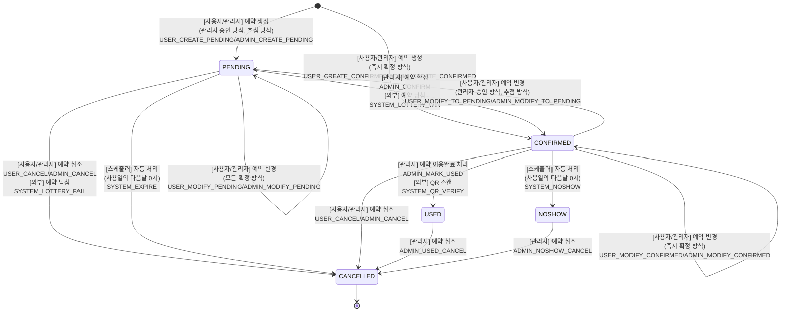
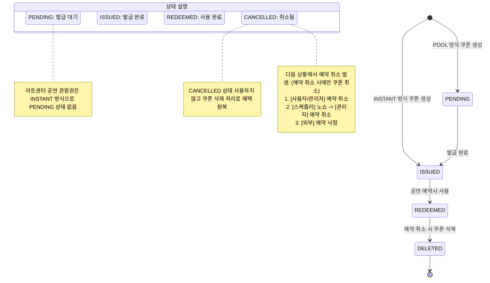

## 예약 상태 다이어그램

예약 시스템의 상태 전환을 보여주는 유한 상태 기계(FSM)입니다.



## 예약 상태 변경 이유 코드

```typescript
/**
 * 예약 상태 변경 이유 코드
 * 모든 상태 변경은 명확한 이유와 함께 기록됩니다.
 */
export const ReservationStatusReasonCode = {
  // 초기 예약 생성 (사용자/관리자 구분)
  USER_CREATE_PENDING: 'USER_CREATE_PENDING',       // 사용자: PENDING 상태로 예약 생성
  ADMIN_CREATE_PENDING: 'ADMIN_CREATE_PENDING',     // 관리자: PENDING 상태로 예약 생성
  USER_CREATE_CONFIRMED: 'USER_CREATE_CONFIRMED',   // 사용자: 즉시 확정으로 예약 생성
  ADMIN_CREATE_CONFIRMED: 'ADMIN_CREATE_CONFIRMED', // 관리자: 즉시 확정으로 예약 생성

  // 상태 변경 - PENDING→CONFIRMED
  ADMIN_CONFIRM: 'ADMIN_CONFIRM',                   // 관리자 승인
  SYSTEM_LOTTERY_WIN: 'SYSTEM_LOTTERY_WIN',         // 시스템: 추첨 당첨

  // 상태 변경 - PENDING→CANCELLED
  USER_CANCEL: 'USER_CANCEL',                       // 사용자 취소
  ADMIN_CANCEL: 'ADMIN_CANCEL',                     // 관리자 취소
  SYSTEM_LOTTERY_FAIL: 'SYSTEM_LOTTERY_FAIL',       // 시스템: 추첨 낙첨
  SYSTEM_EXPIRE: 'SYSTEM_EXPIRE',                   // 시스템: 자동 만료

  // 예약 수정 (상태 유지)
  USER_MODIFY_PENDING: 'USER_MODIFY_PENDING',       // 사용자 수정 (PENDING 상태 유지)
  ADMIN_MODIFY_PENDING: 'ADMIN_MODIFY_PENDING',     // 관리자 수정 (PENDING 상태 유지)
  USER_MODIFY_CONFIRMED: 'USER_MODIFY_CONFIRMED',   // 사용자 수정 (CONFIRMED 상태 유지)
  ADMIN_MODIFY_CONFIRMED: 'ADMIN_MODIFY_CONFIRMED', // 관리자 수정 (CONFIRMED 상태 유지)

  // 상태 변경을 수반하는 예약 수정
  USER_MODIFY_TO_PENDING: 'USER_MODIFY_TO_PENDING',   // 사용자 변경으로 PENDING 전환
  ADMIN_MODIFY_TO_PENDING: 'ADMIN_MODIFY_TO_PENDING', // 관리자 변경으로 PENDING 전환

  // CONFIRMED→USED/NOSHOW
  ADMIN_MARK_USED: 'ADMIN_MARK_USED',               // 관리자 이용 완료 처리
  SYSTEM_QR_VERIFY: 'SYSTEM_QR_VERIFY',             // 시스템: QR 확인 완료
  SYSTEM_NOSHOW: 'SYSTEM_NOSHOW',                   // 시스템: 자동 노쇼 처리

  // 이용 완료/노쇼 후 취소 (관리자만 가능)
  ADMIN_USED_CANCEL: 'ADMIN_USED_CANCEL',           // 관리자: 이용 완료 후 취소
  ADMIN_NOSHOW_CANCEL: 'ADMIN_NOSHOW_CANCEL',       // 관리자: 노쇼 후 취소
} as const;
```

## 쿠폰 상태 다이어그램

예약과 연동되는 쿠폰 시스템의 상태 전환입니다.



## 예약 상태 설명

### PENDING (대기)
- **의미**: 예약이 생성되었으나 아직 확정되지 않은 상태
- **진입 조건**: 
  - 관리자 승인이 필요한 예약 방식으로 생성
  - 추첨 방식으로 생성
- **다음 상태**: CONFIRMED(확정), CANCELLED(취소)

### CONFIRMED (확정)
- **의미**: 예약이 확정되어 서비스 이용이 보장된 상태
- **진입 조건**:
  - 즉시 확정 방식으로 생성
  - 관리자가 PENDING 상태 예약을 승인
  - 추첨에서 당첨
- **다음 상태**: USED(사용완료), NOSHOW(노쇼), CANCELLED(취소), PENDING(재검토 필요시)

### USED (사용완료)
- **의미**: 고객이 예약한 서비스를 정상적으로 이용 완료
- **진입 조건**:
  - 관리자가 수동으로 이용 완료 처리
  - QR 코드 스캔으로 자동 확인
- **다음 상태**: CANCELLED(특수한 경우 관리자가 취소 가능)

### NOSHOW (노쇼)
- **의미**: 예약 시간에 고객이 나타나지 않음
- **진입 조건**: 사용일 다음날 0시 스케줄러가 자동 처리
- **다음 상태**: CANCELLED(관리자가 취소 가능)

### CANCELLED (취소)
- **의미**: 예약이 취소되어 무효화된 상태
- **진입 조건**:
  - 사용자 또는 관리자의 취소 요청
  - 추첨 낙첨
  - 시스템 자동 만료
- **다음 상태**: 없음 (최종 상태)

## 주요 비즈니스 규칙

### 1. 예약 생성 방식
- **즉시 확정**: 예약 생성과 동시에 CONFIRMED 상태
- **관리자 승인**: PENDING 상태로 생성 후 관리자 승인 필요
- **추첨 방식**: PENDING 상태로 생성 후 추첨 결과에 따라 상태 변경

### 2. 예약 수정 시 상태 전환
- 확정 방식이 변경되면 상태도 함께 변경될 수 있음
- 즉시 확정 → 관리자 승인/추첨: CONFIRMED → PENDING
- 관리자 승인/추첨 → 즉시 확정: PENDING → CONFIRMED

### 3. 자동 처리 규칙
- **만료 처리**: PENDING 상태 예약이 사용일을 지나면 자동 취소
- **노쇼 처리**: CONFIRMED 상태 예약이 사용일을 지나면 자동으로 NOSHOW

### 4. 권한별 가능 작업
- **사용자**: 예약 생성, 수정, 취소 (PENDING/CONFIRMED 상태에서만)
- **관리자**: 모든 상태에서 수정/취소 가능, 상태 직접 변경 가능
- **시스템**: 추첨, 만료, 노쇼 등 자동 처리

### 5. 쿠폰 연동
- 쿠폰을 사용한 예약이 취소되면 쿠폰도 함께 삭제 처리
- CANCELLED 상태를 사용하지 않고 물리적 삭제로 혜택 원복
- 아트센터 공연 관람권은 INSTANT 방식으로 즉시 발급

## 상태 전환 감사 로그

모든 상태 변경은 다음 정보와 함께 기록됩니다:
- 변경 일시
- 이전 상태 → 새로운 상태
- 변경 이유 코드 (ReservationStatusReasonCode)
- 변경 주체 (사용자/관리자/시스템)
- 추가 컨텍스트 정보

이를 통해 예약의 전체 생명주기를 추적하고 문제 발생 시 원인을 파악할 수 있습니다.