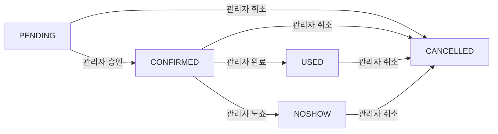

## 개요

이 문서는 예약 시스템 운영 시 준수해야 할 정책과 규칙을 정의합니다. 운영팀과 개발팀 모두가 참조해야 하는 가이드라인입니다.

## 1. 예약 관리 정책

### 1.1 권한 체계

#### 권한별 비교표

| 구분 | 일반 사용자 | 관리자 |
|------|------------|--------|
| **예약 생성 시간** | openConfig 설정에 따름<br/>(예: D-7 오픈, D-1 마감) | 타임슬롯 종료 시간까지<br/>(당일 예약도 가능) |
| **예약 수정 시간** | openConfig 타입별 상이<br/>- BATCH/SEQUENTIAL: modificationByHours<br/>- GRADED: modificationByDays | 제한 없음<br/>(이미 시작된 예약도 수정 가능) |
| **예약 취소 시간** | openConfig 타입별 상이<br/>(수정과 동일한 제한 적용) | 제한 없음 |
| **비회원 예약** | 불가능 | 가능 (이름/전화번호만) |
| **상태 변경 권한** | PENDING ↔ CONFIRMED, CANCELLED만 | 모든 상태 변경 가능<br/>(NOSHOW, USED 포함) |
| **대량 처리** | 불가능 | 가능 (bulk API) |

### 1.2 예약 생성

#### 일반 사용자

**제약사항**
```
예: 순차 오픈(SEQUENTIAL) 설정 시
- D-7일 12:00 오픈
- D-1일 23:59 마감
→ 6월 15일 예약은 6월 8일 12:00 ~ 6월 14일 23:59만 가능
```

#### 관리자

**특권**
```
- 6월 15일 18:00-20:00 타임슬롯
→ 6월 15일 20:00까지 예약 생성 가능
→ 현장에서 Walk-in 고객도 즉시 예약 가능
```

#### 비회원 예약

- 멤버십 미가입 VIP 고객 대응
- 시스템 내부: `GUEST_SYSTEM` 더미 계정 자동 할당
- 예약자 실명: `additionalInfo.guestName` 필드 저장
- 쿠폰 사용: 불가 (회원 전용 혜택)

### 1.3 예약 수정

#### 수정 가능/불가능 항목

**수정 가능 항목**
- 예약자 정보: 이름, 전화번호
- 예약 내용: 그룹 크기, 타임슬롯
- 부가 정보: 요청사항, 차량번호 등

**수정 불가능 항목**
- 섹션 ID: 한 번 배정된 섹션은 변경 불가
- 유닛 ID: 일반 사용자는 변경 불가
  - 관리자는 `/external/admin/reservation/unit/assign` API를 통해 유닛 재배정 가능
  - 일반 사용자는 유닛 변경이 필요한 경우 예약 취소 후 재생성

#### 시간 제한

- 일반 사용자:
  - BATCH/SEQUENTIAL: `modificationByHours` 적용 (예: 시작 3시간 전)
  - GRADED: `modificationByDays` 적용 (D-N일 23:59:59 마감)
    - 예: D-2 설정 시 → 이용 2일 전 23:59:59까지 변경 가능
- 관리자: **제한 없음** (이미 진행 중인 예약도 수정 가능)

#### 인원(groupSize) 변경 규칙

- **유닛 배정 전**: 변경 불가
  - 에러 메시지: "유닛 배정 전에는 인원 변경이 불가능합니다. 예약을 취소 후 다시 생성해 주세요."
  - 인원 변경이 필요한 경우 예약 취소 후 재생성 필요
- **유닛 배정 후**: FFD 알고리즘이 같은 섹션 내에서 자동으로 적합한 유닛 재배치 시도
  - 현재 4인 테이블 → 6명 변경 요청 시: 같은 섹션의 6인 테이블로 자동 재배치
  - 현재 6인 테이블 → 3명 변경 요청 시: 같은 섹션의 4인 테이블로 자동 재배치
  - **섹션 변경은 불가**: 다른 섹션으로의 이동은 지원하지 않음
  - 같은 섹션 내에서도 재배치 불가능한 경우: "예약이 불가합니다. 다시 확인해 주세요" 에러 발생

#### 변경 가능 항목 상세

- 방문시간 (additionalInfo.visitTime)
- 요청사항 (requestNote)
- 차량 유무 및 번호 (additionalInfo.vehicleNumber)
- 추가 옵션 (additionalInfo 내 기타 필드)

**사용 예시**
```
상황: 19:00 예약 고객이 19:30에 도착하여 인원 추가 요청
- 일반 사용자: 수정 불가 (이미 시작됨)
- 관리자: 즉시 수정 가능
```

### 1.4 예약 상태 관리

#### 상태 전이 규칙 (FSM)



#### 상태별 설명

- **PENDING**: 예약 대기 (추첨 대기 또는 승인 대기)
- **CONFIRMED**: 예약 확정
- **CANCELLED**: 예약 취소 (쿠폰 자동 환불)
- **NOSHOW**: 예약 불참 (패널티 가능)
- **USED**: 이용 완료 (정상 사용)

#### 권한별 가능 동작

- 일반 사용자: CANCELLED만 가능
- 관리자: 모든 상태 변경 가능 (NOSHOW, USED 포함)

### 1.5 관리자 전용 API

#### reservationCreate
- **용도**: 회원 예약 생성
- **엔드포인트**: `POST /external/admin/reservation/create`
- **특징**: 타임슬롯 종료 시간까지 생성 가능, openConfig 무시

#### reservationCreateForGuest
- **용도**: 비회원 예약 생성
- **엔드포인트**: `POST /external/admin/reservation/create-for-guest`
- **주요 필드**:
```typescript
{
  timeSlotId: string,     // [필수] 타임슬롯 ID
  groupSize: number,      // [필수] 인원 수
  phoneNumber: string,    // [필수] 전화번호
  guestName: string,      // [필수] 비회원 이름
  requestNote?: string,   // [선택] 요청사항
  sectionId?: string,     // [선택] 특정 섹션 지정
  additionalInfo?: {      // [선택] 부가 정보
    vehicleNumber?: string,
    // guestName은 여기에 자동 저장됨
  }
}
```

#### reservationUpdate
- **용도**: 예약 정보 수정
- **엔드포인트**: `POST /external/admin/reservation/update`
- **특징**: 시간 제한 없이 수정 가능, FSM 규칙 적용

#### reservationStatusBulkChange
- **용도**: 예약 상태 대량 변경
- **엔드포인트**: `POST /external/admin/reservation/status/bulk-change`
- **지원 상태**: CONFIRMED, CANCELLED, NOSHOW, USED

### 1.6 운영 시나리오

#### 시나리오 1: Walk-in 고객 대응
```
상황: 18:30 예약 마감된 레스토랑에 19:00 VIP 고객 방문
해결:
1. reservationCreateForGuest로 즉시 예약 생성
2. 고객명과 연락처만으로 처리
3. 현장에서 바로 서비스 제공
```

#### 시나리오 2: 대량 노쇼 처리
```
상황: 단체 예약 20건이 연락 없이 불참
해결:
1. reservationStatusBulkChange 사용
2. 20건 동시에 NOSHOW 처리
3. 향후 패널티 정책 적용 가능
```

#### 시나리오 3: 긴급 예약 조정
```
상황: VIP 고객이 예약 시간 중 인원 변경 요청
해결:
1. reservationUpdate로 즉시 수정
2. 시간 제한 없이 처리
3. 고객 만족도 향상
```

### 1.7 노쇼 패널티 정책

#### 적용 대상
- SKS 다이닝 (RESTAURANT 타입) 예약만 해당
- 아트센터, 프리미엄 라운지 등 다른 서비스는 미적용

#### 패널티 조건
- NOSHOW 상태로 처리된 예약이 있는 경우
- 노쇼 발생일로부터 6개월간 패널티 적용

#### 패널티 내용
- 해당 기간 동안 SKS 다이닝 신규 예약 불가
- 에러 메시지에 패널티 해제 예정일 표시

#### 운영 시나리오
```
상황: 회원이 1월 15일에 SKS 다이닝 노쇼 처리됨
결과:
- 패널티 기간: 1월 15일 ~ 7월 15일
- 해당 기간 동안 SKS 다이닝 예약 시도 시 에러 발생
- 에러 메시지: "노쇼 패널티로 인해 예약이 제한되어 있습니다. (해제일: 2025년 07월 15일)"
```

## 2. 콘텐츠 관리 정책

### 2.1 이미지 관리

#### images 배열 순서 규칙

예약 시스템의 `images` 필드는 배열 인덱스별로 특정 용도가 지정되어 있습니다. 이 규칙은 반드시 준수되어야 합니다.

#### 기본 규칙

| 인덱스 | 용도 | 설명 | 필수 여부 |
|--------|------|------|-----------|
| 0 | 썸네일 | 목록 화면에 표시되는 대표 이미지 | 필수 |
| 1 | 프로모 영상/이미지 | 홍보용 미디어 (비디오 URL 또는 이미지) | 선택 |
| 2~ | 소개 이미지 | 상세 화면에 표시되는 추가 이미지들 | 선택 |

#### 적용 대상

- `ReservationHost.images`: 호스트(아트센터, 레스토랑) 이미지
- `ReservationContent.images`: 컨텐츠(공연, 메뉴) 이미지
- `ReservationPriceItem.images`: 가격 항목(티켓, 메뉴, 서비스) 이미지

#### Host별 세부 규칙

#### 아트센터 (kind: ART_CENTER)
```typescript
{
  images: [
    "thumbnail.jpg",        // [0] 필수: 아트센터 대표 이미지
    "promo-video.mp4",      // [1] 선택: 홍보 영상
    "hall-1.jpg",           // [2] 선택: 공연장 내부
    "hall-2.jpg",           // [3] 선택: 로비
    // ...
  ]
}
```

#### SKS 다이닝 (kind: RESTAURANT + name에 "SKS" 포함)
```typescript
{
  images: [
    "restaurant-thumb.jpg",  // [0] 필수: 레스토랑 대표 이미지
    "promo-video.mp4",      // [1] 권장: SKS 다이닝 프로모 영상
    "interior-1.jpg",       // [2] 선택: 내부 전경
    "interior-2.jpg",       // [3] 선택: 개별룸
    // ...
  ]
}
```

#### 가격 항목별 규칙

#### 티켓 (kind: TICKET)
```typescript
{
  images: [
    "ticket-thumb.jpg",    // [0] 필수: 티켓 대표 이미지
    "ticket-detail.jpg",   // [1] 선택: 상세 이미지
    // ...
  ]
}
```

#### 메뉴 (kind: MENU)
```typescript
{
  images: [
    "menu-thumb.jpg",    // [0] 필수: 메뉴 대표 이미지
    "menu-detail.jpg",   // [1] 선택: 상세 이미지
    // ...
  ]
}
```

#### 서비스 (kind: SERVICE)
```typescript
{
  images: [
    "service-thumb.jpg",  // [0] 권장: 서비스 대표 이미지
    // ...
  ]
}
```

#### 운영 지침

#### 이미지 업로드 시
1. **순서 준수**: 반드시 지정된 인덱스에 맞는 용도의 이미지 업로드
2. **썸네일 필수**: 첫 번째 이미지(index 0)는 반드시 존재해야 함
3. **일관성 유지**: 같은 카테고리의 호스트는 동일한 구조 유지

#### 어드민 UI 구현 가이드
```typescript
// 어드민 이미지 업로드 UI 예시
interface ImageUploadSection {
  thumbnail: {
    label: "썸네일 이미지 (필수)",
    accept: "image/*",
    maxSize: "10MB",
    index: 0
  },
  promoMedia: {
    label: "프로모 영상/이미지 (선택)",
    accept: "image/*,video/mp4,video/webm",
    maxSize: "100MB",
    index: 1
  },
  gallery: {
    label: "소개 이미지 (선택, 여러 개 가능)",
    accept: "image/*",
    maxSize: "10MB each",
    startIndex: 2
  }
}
```

#### 클라이언트 사용 예시
```typescript
// 원클릭 예약 화면
const thumbnail = host.images[0]; // 썸네일 표시

// SKS 다이닝 상세 화면
const promoVideo = host.images[1]; // 프로모 영상 재생

// 갤러리 뷰
const galleryImages = host.images.slice(2); // 추가 이미지들
```

#### 주의사항

1. **이미지 삭제 시**: 인덱스가 변경되지 않도록 빈 문자열("")로 대체하거나, 전체 재정렬 필요
2. **마이그레이션**: 기존 데이터는 수동으로 순서 조정 필요
3. **검증**: API에서 images[0]이 없는 경우 에러 처리

### 2.2 SKS 다이닝 그룹 처리

#### 그룹핑 규칙
SKS 다이닝은 여러 개의 Host로 구성되지만, 앱에서는 하나의 그룹으로 표시됩니다.

#### 필터링 조건
```typescript
// SKS 다이닝 그룹 조회
const sksHosts = hosts.filter(host =>
  host.kind === 'RESTAURANT' &&
  host.name.includes('SKS')
);
```

#### 그룹 대표 이미지
- SKS 다이닝 그룹의 썸네일: "SKS 다이닝 - 식사" Host의 images[0] 사용
- 프로모 영상: "SKS 다이닝 - 식사" Host의 images[1] 사용

## 3. 변경 이력

### 2025-01-10
- 노쇼 패널티 운영 정책 추가 (섹션 1.7)
  - SKS 다이닝 예약 시 노쇼 패널티 검증 로직 반영
  - 6개월 패널티 기간 및 에러 메시지 문서화

### 2025-01-19 (3차 업데이트)
- 예약 변경 정책 구현 완료
  - GRADED 타입에서 `modificationByDays` 처리 추가 (D-N일 23:59:59 마감)
  - 유닛 배정 전 groupSize 변경 차단 구현
  - 유닛 배정 후 FFD 알고리즘이 같은 섹션 내에서 자동 재배치 시도하도록 명시

### 2025-01-19 (2차 업데이트)
- 유저 예약 변경 정책 상세화
  - 카페/다이닝 D-2 제한 추가
  - 인원 변경 특별 규칙 (유닛 capacity 기반)
  - 변경 가능 항목 상세 명시
- 섹션/유닛 변경 제약사항 명시
  - 관리자는 유닛 재배정 API 사용 가능
  - 일반 사용자는 유닛 변경 불가

### 2025-01-19
- 관리자 예약 관리 정책 추가
- 관리자 예약 생성 시간 제약 수정 (타임슬롯 종료 시간까지)
- 비회원 예약 기능 문서화
- 관리자 전용 API 설명 추가

### 2025-01-17
- 초기 문서 작성
- images 배열 순서 규칙 정의
- SKS 다이닝 그룹 처리 규칙 추가
- ReservationPriceItem images 규칙 추가

## 4. 향후 추가 예정 정책

- 예약 확정 방식별 운영 규칙
- 쿠폰 적용 가능 컨텐츠 지정 규칙
- 추첨 운영 세부 규칙