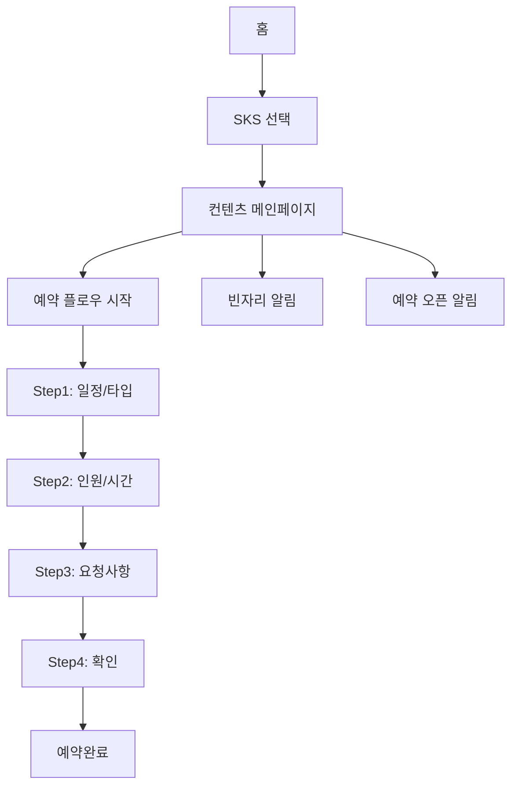

## 1. 진입 구조

### 1.1 홈 화면

<Card title="메인 홈" icon="house">
  **주요 구성**
  - 상단 배너 영역
  - 빠른 예약 바로가기
  - 호스트별 컨텐츠 (아트센터, SKS)
  - 하단 네비게이션
</Card>

### 1.2 원클릭 예약 / API 통해 진입

<CardGroup cols={2}>
  <Card title="원클릭 예약" icon="mouse-pointer">
    - 홈에서 직접 예약
    - 컨텐츠 자동 선택
  </Card>

  <Card title="API 통해 진입" icon="link">
    - 외부 링크 통한 접근
    - 딥링크 파라미터 전달
  </Card>
</CardGroup>

## 2. SKS 메인 페이지 (플레이스)

### 2.1 설명 영역

<Card title="SKS 메인 페이지" icon="store">
  **컨텐츠 선택 영역**
  - 컨텐츠 1: 다이닝
    - 컨텐츠 배인 이미지
    - 컨텐츠 이름
  
  - 컨텐츠 2: 카페  
    - 컨텐츠 배인 이미지
    - 컨텐츠 이름
</Card>

## 3. 컨텐츠 메인페이지 (플로우 시작)

### 3.1 헤더영역

- 제목
- 뒤로가기 버튼

### 3.2 컨텐츠 배너 영역

<Note>
  **배너 이미지**
  - 메인 이미지
  - 서브 이미지 슬라이드
</Note>

### 3.3 컨텐츠 요약정보 영역

<Card title="요약 정보" icon="info-circle">
  **표시 항목**
  - 컨텐츠명
  - 운영 시간
  - 인원 제한
  - 위치 정보
</Card>

### 3.4 예약 일자 선택 영역

<Card title="달력 영역" icon="calendar">
  **예약가능일자 표시**
  - 캘린더 뷰
  - 날짜별 예약 가능 여부
  - 만석/가능 상태 표시
</Card>

### 3.5 소식영역

<Card title="소식 리스트" icon="newspaper">
  **소식 항목**
  - 공지사항
  - 이벤트
  - 메뉴 업데이트
</Card>

### 3.6 예약 오픈 일정 영역

<Card title="오픈 일정" icon="clock">
  **예약 오픈 정보**
  - 다음 오픈 일시
  - 예약 가능 기간 안내
</Card>

### 3.7 플로팅 버튼 영역

- 예약하기 버튼 (활성/비활성)

## 4. 예약 신청 FLOW (바텀 모달)

### Step 1: 일정/타입 선택

<Card title="일정 선택 모달" icon="calendar-days">
  **선택 영역**
  - 달력 뷰
  - 날짜 선택
  - 컨텐츠 타입 선택 (다이닝/카페)
  - 좌석 타입 선택 (룸/홀)
  
  **버튼**
  - 다음 버튼
  - 취소 버튼
</Card>

### Step 2: 인원/시간 가격

<Card title="인원/시간 선택" icon="users">
  **방문시간 영역**
  - 시간 선택 슬롯
  - 30분 단위 선택
  
  **인원 선택**
  - +/- 버튼으로 조정
  - 최소/최대 인원 제한
  
  **운영시간 영역**
  - 다이닝: 11:00-14:00
  - 카페: 15:00-18:00
  
  **메뉴보기 모달 링크**
</Card>

### Step 3: 요청사항 등 입력

<Card title="상세 정보 입력" icon="edit">
  **기본정보 영역**
  - 이름 (자동)
  - 연락처 (자동)
  
  **추가 입력**
  - 알러지 정보
  - 쇼룸투어 체크
  - 제품상담 체크
  - 차량번호
  - 요청사항
  
  **쿠폰영역**
  - 보유 쿠폰 리스트
  - 적용 가능 쿠폰 선택
  
  **Changes 노트**
  - 변경 가능 항목 안내
  - 취소/변경 정책
</Card>

### Step 4: 확인

<Card title="예약 확인" icon="check">
  **예약 정보 요약**
  - 선택 일정
  - 선택 인원
  - 방문 시간
  - 요청사항
  
  **동의 항목**
  - 개인정보 제3자 제공
  - 예약 정책 동의
  
  **버튼**
  - 이전
  - 예약하기
</Card>

## 5. 예약 완료/실패 모달

### 5.1 예약완료 모달

<Card title="예약 성공" icon="check-circle">
  **표시 내용**
  - 예약번호
  - 예약일시
  - 인원
  - 안내 메시지
  
  **버튼**
  - 예약 상세 보기
  - 홈으로
</Card>

### 5.2 예약실패 모달

<Card title="예약 실패" icon="times-circle">
  **에러 메시지**
  - 실패 사유
  - 안내 문구
  
  **버튼**
  - 다시 시도
  - 홈으로
</Card>

## 6. 빈자리 알림

### 6.1 빈자리 알림 신청 모달

<Card title="알림 신청" icon="bell">
  **입력 정보**
  - 희망 날짜 (자동)
  - 컨텐츠 타입
  - 연락처 확인
  
  **안내 문구**
  - 취소 발생 시 알림
  - 선착순 예약 안내
  
  **버튼**
  - 신청하기
  - 취소
</Card>

### 6.2 예약 오픈 일정 받기 모달

<Card title="오픈 알림" icon="bell-on">
  **알림 설정**
  - 예약 오픈일 알림
  - 푸시 알림 동의
  
  **버튼**
  - 알림 받기
  - 닫기
</Card>

## 7. 예약 변경/취소

### 7.1 예약 변경 플로우

<Note>
  **변경 가능 항목**
  - 날짜/시간 (배정 전)
  - 인원 (제한적)
  - 요청사항
  - 차량정보
</Note>

### 7.2 예약 취소 모달

<Warning>
  **취소 정책**
  - D-2까지 가능
  - 취소 사유 선택
  - 쿠폰 복구 안내
</Warning>

## 8. 기타 모달

### 8.1 노출 시 예약 불가 모달

<Card title="예약 불가 안내" icon="ban">
  **표시 상황**
  - 당일 예약 시도
  - 예약 마감
  - 시스템 점검
  
  **안내 메시지**
  - 불가 사유
  - 대안 제시
</Card>

### 8.2 메뉴보기 모달

<Card title="메뉴 정보" icon="utensils">
  **다이닝 메뉴**
  - 코스 구성
  - 가격 정보
  
  **카페 메뉴**
  - 음료/디저트
  - 시즌 메뉴
</Card>

## 9. 네비게이션 흐름

