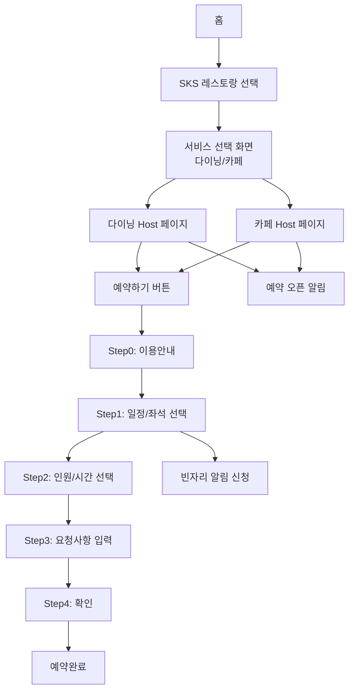

## 1. 진입 구조

### 1.1 홈 화면

<Card title="메인 홈" icon="house-user">
  **주요 구성**
  - 원클릭 예약 버튼
  - 프리빌리지 라이프스타일 배너 영역
    - LG 아트센터
    - SKS 레스토랑 (다이닝/카페 통합)
    - 기타 프리미엄 서비스
</Card>

### 1.2 예약 진입 경로

<Card title="예약 진입" icon="hand">
  **진입 방법**
  - 원클릭 예약 버튼 클릭
  - 프리빌리지 배너 클릭

  **예약 가능 목록 (앱 하드코딩)**
  - LG아트센터 → 공연 목록 화면
  - SKS 레스토랑 → 다이닝/카페 선택 화면

  **구현 방식**
  ```typescript
  // 앱 하드코딩
  const RESERVATION_MENU = {
    'LG아트센터': {
      hostId: 'host-1',  // kind: ART_CENTER
      flow: 'contents'
    },
    'SKS 레스토랑': {
      // 다이닝과 카페는 각각 독립된 Host
      hostIds: [
        'host-2',  // SKS 서울 다이닝 (kind: RESTAURANT)
        'host-3'   // SKS 서울 카페 (kind: RESTAURANT)
      ],
      flow: 'service-select'
    }
  }
  ```

  **백엔드 Host 구조**
  - Host 3개 존재: LG 아트센터, SKS 서울 다이닝, SKS 서울 카페
  - 다이닝과 카페는 독립적인 Host로 각각 운영
  - 앱에서 "SKS 레스토랑"으로 묶어서 표시
</Card>

### 1.3 딥링크 진입

<Card title="딥링크 진입" icon="link">
  - 딥링크를 통한 직접 진입
  - 특정 호스트로 바로 이동 가능
  - 예: `/host/{hostId}` → 해당 호스트 화면으로 직접 이동
</Card>

## 2. SKS 서비스 선택 페이지

### 2.1 화면 구성

<Card title="SKS 서비스 선택" icon="store">
  **브랜드 홍보 영역 (앱 하드코딩)**
  - SKS 레스토랑 통합 홍보 영상/이미지 배너
  - 영상일 경우 자동재생, 소리 on/off (디폴트 off)

  **Host 선택 영역**
  - 다이닝 Host (host-2)
    - 호스트 이미지
    - 호스트 설명
    - 영역 클릭 시 → 다이닝 Host 예약 페이지로 이동

  - 카페 Host (host-3)
    - 호스트 이미지
    - 호스트 설명
    - 영역 클릭 시 → 카페 Host 예약 페이지로 이동

  **구현 방식**
  - "SKS 레스토랑" 선택 시에만 이 화면 표시
  - 각 Host 영역 클릭 시 해당 Host의 예약 플로우로 진입
</Card>

## 3. Host 예약 페이지 (다이닝/카페)

**구현 방식**
- 다이닝/카페는 Content가 1개뿐 (앱 하드코딩으로 자동 선택)
- 아트센터와 달리 Content 선택 화면 스킵
- Content 데이터를 중심으로 표시

### 3.1 헤더영역

- Host 이름 (다이닝 or 카페)

### 3.2 컨텐츠 배너 영역

<Note>
  **배너 이미지**
  - Content의 images 필드 슬라이드
  - 여러 장인 경우 스와이프
</Note>

### 3.3 컨텐츠 정보 영역

<Card title="기본 정보" icon="list">
  **표시 항목 (Content 데이터)**
  - 컨텐츠명 (Content.name)
  - 컨텐츠 설명 (Content.description)
  - 컨텐츠 요금 (앱 하드코딩)

  **버튼**
  - 매장정보 버튼 (→ 7.1 매장정보 모달, Host 데이터 사용)
  - 메뉴보기 버튼 (→ 7.2 메뉴보기 모달)
</Card>

### 3.4 쿠폰 영역

<Card title="쿠폰 영역" icon="tag">
  **사용가능한 쿠폰만 표시**
  - 보유중인 쿠폰 중 현재 Host(다이닝/카페)에 해당하는 쿠폰만 표시
  - 다이닝: 식사 할인권 (50%/30%/20%/10% 등급별)
  - 카페: 시그니처 음료 제공권 (변동 가능성 있음)
  - 사용가능한 쿠폰만 표시 (사용완료, 유효기간 만료 제외)

  **쿠폰 카드 구성**
  - 앞면
    - 쿠폰명
    - 쿠폰 설명
  - 뒷면 (탭/플립으로 전환)
    - 쿠폰 유효기간
    - 쿠폰 유의사항
</Card>

### 3.5 예약 일자 선택 영역

<Card title="달력 영역" icon="calendar-day">
  **날짜 선택**
  - 2주간 날짜 가로 슬라이드 표시
  - 예약 상태: 예약 가능/예약 마감/휴무
  - 잔여 좌석 수 표시 (테이블/룸 통합 계산)
  - 최초 진입 시 선택 없음
</Card>

### 3.6 소식영역

<Card title="소식 리스트" icon="newspaper">
  **소식 항목**
  - Content의 관련 소식 표시
  - 공지사항, 이벤트 등
  - 여러개일 경우 스와이프
</Card>

### 3.7 예약 오픈 일정 영역

<Card title="예약 오픈 일정" icon="clock">
  **익월 예약 오픈 안내**
  - 다다음달 예약이 다음달에 오픈되는 일정 표시
  - 예: 9월 1일 현재 → "10월 1일 오전 10시 11월 예약 오픈"
  - 등급별 예약 가능 기간 표시
    - 나머지 등급: 해당월 1일~말일
    - 블랙 등급: 해당월 1일~익월 말일

  **예약 오픈 알림 버튼**
  - 미신청: "예약 오픈 알림 받기" 아이콘
  - 기신청: "예약 오픈 알림 받는 중" 아이콘
  - 버튼 클릭 시:
    - 미신청 → 예약 오픈 알림 신청 모달(7.3)
    - 기신청 → 알림 해제
</Card>

### 3.8 플로팅 버튼 영역

<Card title="예약하기 버튼" icon="calendar-plus">
  - 예약하기 버튼 (항상 활성 상태)
  - 버튼 클릭 시:
    - 3.5에서 선택한 날짜가 이미 예약한 날인지 확인
    - 이미 예약한 날: 토스트 알림 표시
    - 예약 가능한 날: 예약 신청 플로우(섹션 4)로 이동
</Card>

## 4. 예약 신청 플로우

### Step 0: 이용안내 및 유의사항

<Card title="이용안내" icon="info">
  **안내 내용**
  - Content.instructions 내용 표시
  - 예약 규정 및 주의사항

  **버튼**
  - 다음 버튼 → Step 1로 이동
</Card>

### Step 1: 일정/좌석 선택

<Card title="일정 선택 모달" icon="calendar-check">
  **달력 영역**
  - 월별 달력 뷰
  - 3.5에서 선택한 날짜가 선택된 상태로 표시
  - 휴일/한국 법정공휴일 빨간색 표시
  - 다음 월로만 이동 가능 (블랙: +2개월, 나머지: +1개월)
  - 일별 예약 상태: 예약 가능/예약 만석/예약 종료
  - 내가 예약한 날짜 별도 표시
  - 날짜 선택 시 예약 상태에 따라 하단 영역 활성화 결정

  **빈자리 알림 버튼**
  - 예약 만석 날짜 선택 시에만 활성화
  - 버튼 클릭 시:
    - 해당 날짜 기신청 → 알림 해제
    - 해당 날짜 미신청 → 빈자리 알림 신청 모달(7.4)

  **좌석 타입 영역**
  - 예약 가능 날짜 선택 시에만 활성화
  - 룸/홀 선택
  - 타입별 아이콘, 잔여 좌석 표시
  - 좌석 타입 설명

  **버튼**
  - 이전/다음
</Card>

### Step 2: 인원/시간 선택 & 가격 확인

<Card title="인원/시간 선택" icon="users">
  **방문 시간 선택**
  - 운영 시간 내에서 정해진 시간 간격으로 선택 (30분 단위)
  - 예: 11:00, 11:30, 12:00...

  **인원 선택**
  - 인원 선택 버튼 (2명, 3명, 4명...)
  - 유아 포함하여 선택 안내 메시지
  - 룸 선택 시 최소 4인 안내
  - 좌석 타입별 잔여에 따른 최소/최대 인원 제한
    - 예: 홀 선택 시 4인 테이블만 남았다면 최대 4인으로 제한

  **예약 가격**
  - 선택한 인원별 가격 변동
  - 룸차지 5만원 추가 (룸 선택 시)
  - 쿠폰 적용 가격 표시

  **버튼**
  - 이전/다음
</Card>

### Step 3: 요청사항 입력

<Card title="상세 정보 입력" icon="pen">
  **요청사항**
  - 텍스트 입력 (최대 100자)
  - 플레이스홀더: "알러지, 유아의자 필요 등"

  **추가 옵션**
  - 쇼룸투어 체크박스
  - 제품상담 체크박스
  - 각 옵션별 한줄 설명 또는 아이콘 표시

  **차량 정보**
  - 차량 이용 여부 체크박스
  - 차량 이용 선택 시 차량번호 입력란 표시
  - 기존 등록 차량번호 자동 불러오기 (수정 가능)
  - 수정해도 등록된 차량번호에는 영향 없음

  **버튼**
  - 이전/다음
</Card>

### Step 4: 확인

<Card title="예약 확인" icon="check">
  **예약 관련 안내 메시지**
  - 예약 확정 안내
  - 취소 정책 안내

  **예약 정보 요약**
  - 선택된 일정/좌석
  - 선택된 인원/시간
  - 입력된 요청사항
    - 선택한 추가 옵션 (쇼룸투어, 제품상담)
    - 차량 정보 (차량번호 포함)
  - 예상 청구 금액 (쿠폰 차감 후)

  **약관 동의**
  - 개인정보 수집 및 이용 동의
  - 개인정보 제3자 제공 동의

  **버튼**
  - 이전
  - 예약하기
</Card>

## 5. 예약 완료/실패

### 5.1 예약완료 모달

<Card title="예약 성공" icon="check">
  **표시 내용**
  - 예약 완료 메시지
  - 예약일자, 시간
  - 성공 애니메이션/로티

  **버튼**
  - 초대장 보내기
  - 닫기
</Card>

### 5.2 초대장 보내기

<Card title="초대장 공유" icon="share">
  **기능**
  - 카카오톡 공유하기
  - 템플릿 ID: 123732
  - 예약 정보 포함
    - 일시:  ${월}월  ${일}일   ${시}시  ${분}분
    - 장소: 시그니처 키친 스위트 논현
    - ${이름}님의 초대장이 도착했어요
</Card>

### 5.3 예약실패 모달

<Card title="예약 실패" icon="circle-xmark">
  **표시 내용**
  - 예약 실패 메시지
  - 실패 사유
  - 실패 애니메이션/로티

  **버튼**
  - 닫기
</Card>

## 6. 예약 변경/취소

### 6.1 예약 변경 플로우

<Note>
  **변경 가능 기간**
  - 유저: 이용 2일 전 23:59:59까지
  - 관리자: 이용 시간 직전까지
  - 좌석 배정 후에도 변경 가능

  **변경 가능 항목**
  - 인원 (좌석 배정 상태에 따라 제한)
    - 좌석 배정 전: 변경 불가
    - 좌석 배정 후:
      - 4인 테이블: 2~4명 범위
      - 6인 테이블: 2~6명 범위
  - 방문 시간
  - 요청사항
  - 차량 유무 및 번호
  - 추가 옵션 (쇼룸투어, 제품상담)
</Note>

### 6.2 예약 취소 모달

<Warning>
  **취소 정책**
  - 유저: 이용 2일 전 23:59:59까지
  - 관리자: 이용 시간 직전까지
  - 좌석 배정 후에도 취소 가능
  - 취소 사유 선택
</Warning>

## 7. 기타 모달

### 7.1 매장정보 모달

<Card title="매장 정보" icon="building">
  **기본 정보 (Host 데이터)**
  - 주소
  - 위치 정보 (지도 표시)
  - 전화번호
  - 운영시간

  **편의시설 (앱 하드코딩)**
  - 주차 가능 / 발렛파킹
  - 휠체어 접근 가능 / 유아용 의자
  - 프라이빗 룸 / 와이파이
  - 단체석 가능 / 쇼룸투어 / 제품상담

  **표시 방식**
  - 아이콘과 함께 편의시설 나열
  - 이용 가능한 항목만 활성화 표시
</Card>

### 7.2 메뉴보기 모달

<Card title="메뉴 정보" icon="utensils">
  **표시 내용**
  - Content.additionalImages의 이미지들을 슬라이드로 표시
  - 레스토랑: 메뉴 이미지들
  - 아트센터: 팜플렛/포스터 이미지들
</Card>

### 7.3 예약 오픈 알림 신청 모달

<Card title="예약 오픈 알림 신청" icon="bell">
  **안내 내용**
  - 예약 오픈 시 푸시 알림 안내

  **버튼**
  - 신청하기
  - 닫기
</Card>

### 7.4 빈자리 알림 신청 모달

<Card title="빈자리 알림" icon="bell">
  **안내 내용**
  - 선택한 날짜 표시
  - 빈자리 발생 시 푸시 알림 안내
  - 선착순 예약 안내

  **버튼**
  - 신청하기
  - 닫기
</Card>

## 8. 네비게이션 흐름


