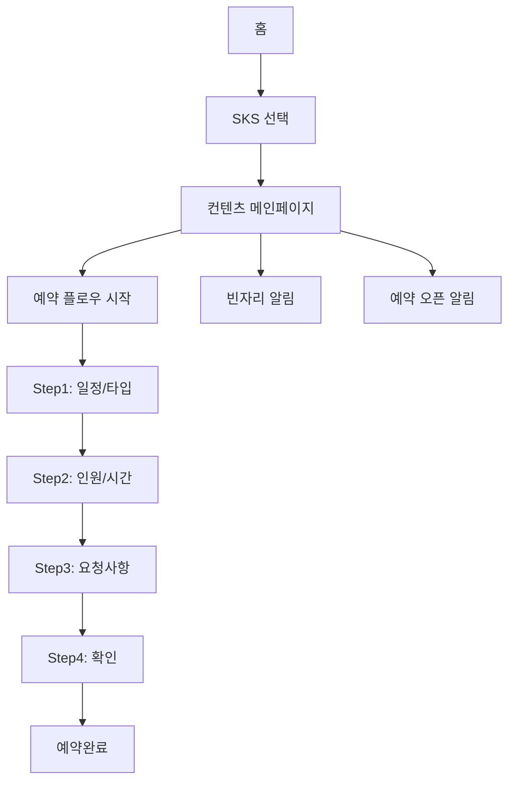

## 1. 진입 구조

### 1.1 홈 화면

<Card title="메인 홈" icon="house">
  **주요 구성**
  - 앱의 메인 화면에 독립된 컴포넌트로 진입 구좌가 존재. 해당 영역은 하모니의 API를 통해 보여진다(커스텀 블록 컴포넌트)
  - 해당 영역에서 SKS 칩메뉴 안의 이미지 클릭
  - SKS 호스트 메인 화면으로 진입(해당 칩 메뉴 안의 어느 이미지를 클릭하더라도 SKS 호스트 메인으로 진입)
</Card>

### 1.2 원클릭 예약 / API 통해 진입

<CardGroup cols={2}>
  <Card title="원클릭 예약" icon="mouse-pointer">
    - 홈에서 원클릭 예약 아이콘 메뉴 클릭
    - 원클릭 예약 페이지 내에 SKS 호스트 메뉴 클릭
    - SKS 호스트 메인 화면으로 진입
  </Card>

  <Card title="API 통해 진입" icon="link">
    - 없음
  </Card>
</CardGroup>

## 2. SKS 메인 페이지 (호스트)

### 2.1 설명 영역

<Card title="SKS 메인 페이지" icon="store">
  **호스트 홍보 영역**
  - 호스트 홍보하는 영상/이미지 배너. 영상일 경우 자동재생. 소리 on/off 필요(디폴트는 off)

  **컨텐츠 선택 영역**
  - 컨텐츠 1: 다이닝
    - 컨텐츠 메인 이미지
    - 컨텐츠 이름
  
  - 컨텐츠 2: 카페  
    - 컨텐츠 메인 이미지
    - 컨텐츠 이름
</Card>

## 3. 컨텐츠 메인페이지 (플로우 시작)

### 3.1 헤더영역

- 제목
- 뒤로가기 버튼

### 3.2 컨텐츠 배너 영역

<Note>
  **배너 이미지**
  - 메인 이미지는 여기서 노출 대상 아님. SKS 메인페이지(호스트) 에서 컨텐츠 영역에 노출됨.
  - 서브 이미지 슬라이드
</Note>

### 3.3 컨텐츠 요약정보 영역

<Card title="요약 정보" icon="info-circle">
  **표시 항목**
  - 컨텐츠명
  - 컨텐츠 설명
  - 운영 시간
  - 컨텐츠 요금
  - 위치 정보
  - 매장정보 버튼
  - 메뉴보기 버튼
</Card>

### 3.4 쿠폰 영역

<Card title="쿠폰 영역" icon="info-circle">
  **사용가능한 쿠폰만 표시**
  - 보유중인 쿠폰 중 레스토랑 관련 쿠폰만 보여줘야 함. 카테고리 개념 필요
  - 사용가능한 쿠폰만 보여줘야함.
사용완료, 유효기간 만료 등은 안보여 줌
</Card>

### 3.5 예약 일자 선택 영역

<Card title="달력 영역" icon="calendar">
  **예약가능일자 표시**
  - 캘린더 뷰 아님. 내일부터 2주를 보여줌.
  - 날짜별 예약 가능 여부
  - 만석/가능 상태 표시
  - 빈자리 알림 받기 버튼
</Card>

### 3.6 소식영역

<Card title="소식 리스트" icon="newspaper">
  **소식 항목**
  - 공지사항, 이벤트, 메뉴 업데이트 등의 백오피스에 등록한 소식을 리스팅
  - 여러개일 경우 스와이프
</Card>

### 3.7 예약 오픈 일정 영역

<Card title="오픈 일정" icon="clock">
  **예약 오픈 정보**
  - 다음 오픈 일시
  - 예약 가능 기간 안내
</Card>

### 3.7 플로팅 버튼 영역

- 예약하기 버튼 (활성/비활성 아님. 무조건 활성이다.)

## 4. 예약 신청 FLOW (바텀 모달)

### Step 1: 일정/타입 선택

<Card title="일정 선택 모달" icon="calendar-days">
  **선택 영역**
  - 달력 뷰
  - 날짜 선택
  - 컨텐츠 타입 선택 (다이닝/카페) 은 여기 존재하지 않는다. 이미 컨텐츠는 선택하고 들어온 컨텐츠의 페이지임.
  - 좌석 타입 선택 (룸/홀)
  
  **버튼**
  - 다음 버튼
  - 이전 버튼
</Card>

### Step 2: 인원/시간 가격

<Card title="인원/시간 선택" icon="users">
  **방문시간 영역**
  - 시간 선택 슬롯
  - 30분 단위 선택
  
  **인원 선택**
  - +/- 버튼으로 조정 아니다. 정해진 인원을 칩으로 선택하는 UI 임.
  - 최소/최대 인원 제한
  
  **예약 가격**
  - 선택한 인원별로 달라짐
  - 선택한 좌석 타입별로 달라짐. 룸차지 5만원 추가.
</Card>

### Step 3: 요청사항 등 입력

<Card title="상세 정보 입력" icon="edit">
  **입력**
  - 요청사항
  - 쇼룸투어 체크
  - 제품상담 체크
  - 차량여부 및 번호
</Card>

### Step 4: 확인

<Card title="예약 확인" icon="check">
  **예약 정보 요약**
  - 선택 일정
  - 선택 인원
  - 방문 시간
  - 요청사항
  - 선택 좌석 타입
  - 차량 여부
  - 예상 결제금액
  
  **동의 항목**
  - 개인정보 제3자 제공
  - 예약 정책 동의
  
  **버튼**
  - 이전
  - 예약하기
</Card>

## 5. 예약 완료/실패 모달

### 5.1 예약완료 모달

<Card title="예약 성공" icon="check-circle">
  **표시 내용**
  - 예약번호
  - 예약일시
  - 인원
  - 안내 메시지
  
  **버튼**
  - 예약 상세 보기
  - 홈으로
</Card>

### 5.2 예약실패 모달

<Card title="예약 실패" icon="times-circle">
  **에러 메시지**
  - 실패 사유
  - 안내 문구
  
  **버튼**
  - 다시 시도
  - 홈으로
</Card>

## 6. 빈자리 알림

### 6.1 빈자리 알림 신청 모달

<Card title="알림 신청" icon="bell">
  **입력 정보**
  - 희망 날짜 (자동)
  - 좌석 타입
  - 연락처 확인
  
  **안내 문구**
  - 취소 발생 시 알림
  - 선착순 예약 안내
  
  **버튼**
  - 신청하기
  - 취소
</Card>

### 6.2 예약 오픈 일정 받기 모달

<Card title="오픈 알림" icon="bell-on">
  **알림 설정**
  - 예약 오픈일 알림
  - 푸시 알림 동의. 여기서 동의되는거 아니다. 버튼 누른 순간 동의된거고 여기서는 정보성 알림에 동의되었다고 알려주는 것이고, 추가적으로 마수동을 유도하는 것.
  
  **버튼**
  - 알림 받기
  - 닫기
</Card>

## 7. 예약 변경/취소

### 7.1 예약 변경 플로우

<Note>
  **변경 가능 항목**
  - 날짜/시간 (배정 전)
  - 인원 (제한적)
  - 요청사항
  - 차량정보
</Note>

### 7.2 예약 취소 모달

<Warning>
  **취소 정책**
  - D-2까지 가능
  - 취소 사유 선택
  - 쿠폰 복구 안내. 쿠폰은 아직 사용된 것이 아니므로 여기서 복구되지 않는다.
</Warning>

## 8. 기타 모달

### 8.1 노출 시 예약 불가 모달

<Card title="예약 불가 안내" icon="ban">
  **표시 상황**
  - 당일 예약 시도
  - 예약 마감
  - 시스템 점검
  
  **안내 메시지**
  - 불가 사유
  - 대안 제시
</Card>

### 8.2 메뉴보기 모달

<Card title="메뉴 정보" icon="utensils">
  **내용**
  - 백오피스에 등록된 이미지 노출
</Card>

## 9. 네비게이션 흐름

```mermaid
graph TD
    A[홈] --> B[SKS 선택]
    B --> C[컨텐츠 메인페이지]
    C --> D[예약 플로우 시작]
    D --> E[Step1: 일정/타입]
    E --> F[Step2: 인원/시간]
    F --> G[Step3: 요청사항]
    G --> H[Step4: 확인]
    H --> I[예약완료]
    
    C --> J[빈자리 알림]
    C --> K[예약 오픈 알림]
```
