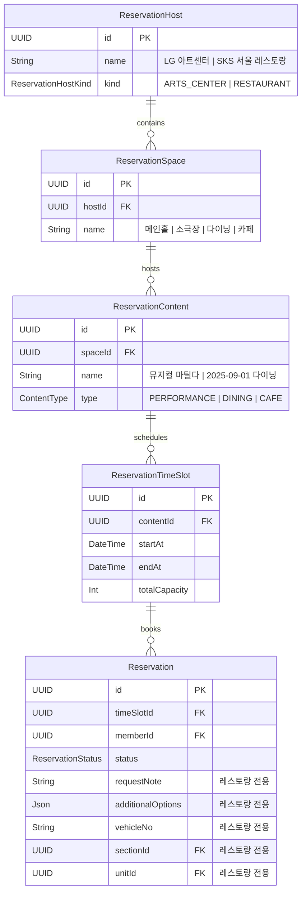
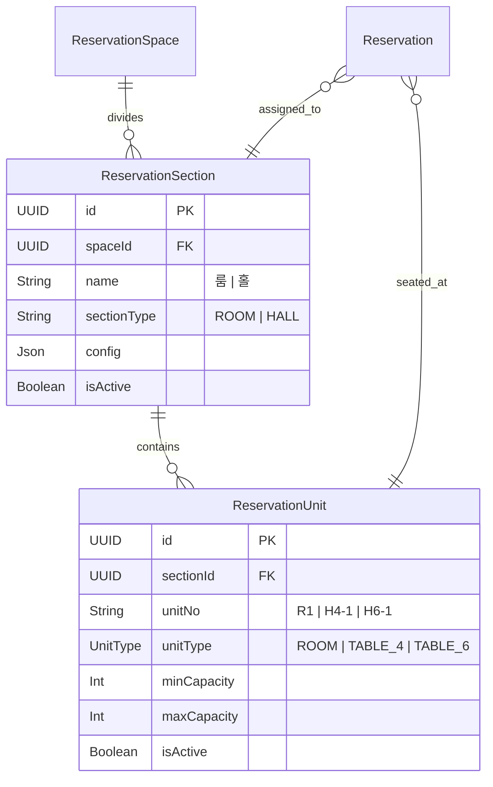

## 1. 개요

<Card title="통합 전략" icon="strategy">
  기존 LG 아트센터 예약 시스템의 구조를 최대한 활용하여 SKS 서울 레스토랑 예약을 통합합니다.
  기존 FSM, API 구조, 화면 컴포넌트를 재사용하면서 레스토랑 특화 기능만 확장합니다.
</Card>

### 통합 원칙

<CardGroup cols={3}>
  <Card title="구조 재사용" icon="recycle">
    - 기존 ERD 구조 유지
    - FSM 그대로 활용
    - API 패턴 동일
  </Card>

  <Card title="최소 확장" icon="puzzle-piece">
    - 필수 테이블만 추가
    - 레스토랑 전용 필드 추가
    - 기존 화면 활용
  </Card>

  <Card title="독립 운영" icon="shield">
    - 호스트별 독립 정책
    - 컨텐츠별 예약 방식
    - 통합 관리 인터페이스
  </Card>
</CardGroup>

## 2. 데이터 구조 통합

### 2.1 기존 구조 활용



### 2.2 레스토랑 전용 테이블 추가



### 2.3 필드 확장

#### Reservation 테이블 추가 필드

```typescript
interface ReservationExtension {
  // 레스토랑 전용 필드
  requestNote?: string;        // 요청사항 및 알러지 정보
  additionalOptions?: {
    showroomTour: boolean;     // 쇼룸투어
    productConsultation: boolean; // 제품상담
  };
  vehicleNo?: string;          // 차량번호
  sectionId?: UUID;            // 좌석 섹션 (룸/홀)
  unitId?: UUID;               // 좌석 유닛 (테이블)
}
```

## 3. 예약 방식 차별화

### 3.1 타임슬롯 운영 방식

| 구분 | 아트센터 | SKS 레스토랑 |
|------|----------|--------------|
| **운영 단위** | 공연 시간별 슬롯 | 일 단위 통합 슬롯 |
| **시간 선택** | 정해진 공연 시간 | 30분 단위 방문 시간 |
| **정원 관리** | 슬롯별 좌석 수 | 일별 테이블 수 |
| **예약 단위** | 좌석 개수 | 테이블 + 인원 |

### 3.2 레스토랑 타임슬롯 구조

```typescript
// 레스토랑은 일 단위로 하나의 타임슬롯 생성
{
  contentId: "2025-09-01-dining",
  startAt: "2025-09-01 11:00:00",
  endAt: "2025-09-01 14:00:00",
  totalCapacity: 50, // 전체 수용 인원
  config: {
    operatingHours: ["11:00", "11:30", "12:00", "12:30", "13:00", "13:30"],
    tableConfig: {
      room: { count: 1, capacity: 8 },
      hall_4: { count: 6, capacity: 4 },
      hall_6: { count: 2, capacity: 6 }
    }
  }
}
```

## 4. FSM 활용 방안

### 4.1 상태 매핑

<Card title="기존 FSM 100% 활용" icon="diagram-project">
  SKS 레스토랑의 모든 상태는 기존 FSM으로 완벽하게 표현 가능합니다.
</Card>

| SKS 상태 | 기존 FSM | 구분 방법 |
|----------|----------|-----------|
| 예약대기 | PENDING | status = 'PENDING' |
| 예약확정 | CONFIRMED | status = 'CONFIRMED' & sectionId = null |
| 예약확정_좌석배정 | CONFIRMED | status = 'CONFIRMED' & sectionId != null |
| 예약취소_유저 | CANCELLED | reasonCode = 'USER_CANCEL' |
| 예약취소_관리자 | CANCELLED | reasonCode = 'ADMIN_CANCEL' |
| 이용완료 | USED | status = 'USED' |
| 노쇼 | NOSHOW | status = 'NOSHOW' |

### 4.2 상태 전환 규칙

```typescript
// 레스토랑 예약 생성 (즉시 확정)
USER_CREATE_CONFIRMED → CONFIRMED

// 좌석 배정 (상태 변경 없음, 필드만 업데이트)
CONFIRMED + updateSectionId/unitId

// 체크인 처리
ADMIN_MARK_USED → USED

// 취소 (D-2까지)
USER_CANCEL → CANCELLED
```

### 4.3 예약 상태 세부 매핑

<Note>
  **레스토랑 관점에서의 상태 표현**
  
  | 레스토랑 관점 | 실제 FSM 상태 | 구분 방법 |
  |--------------|--------------|------------|
  | 예약대기 | PENDING | status = 'PENDING' |
  | 예약확정 | CONFIRMED | sectionId = null |
  | 예약확정_좌석배정 | CONFIRMED | sectionId != null |
  | 예약취소_유저 | CANCELLED | reasonCode = 'USER_CANCEL' |
  | 예약취소_관리자 | CANCELLED | reasonCode = 'ADMIN_CANCEL' |
  | 이용완료 | USED | status = 'USED' |
  | 노쇼 | NOSHOW | status = 'NOSHOW' |
  
  - 좌석 배정은 CONFIRMED 상태 내에서 sectionId/unitId 필드로 관리
  - 모든 상태 전환 규칙은 기존 FSM 그대로 적용
</Note>

## 5. API 통합 전략

### 5.1 기존 API 재사용

```typescript
// 기존 API 그대로 사용
trpc.reservation.app.list()      // 예약 목록
trpc.reservation.app.create()    // 예약 생성
trpc.reservation.app.update()    // 예약 수정
trpc.reservation.app.cancel()    // 예약 취소

// 레스토랑 전용 API 추가
trpc.reservation.restaurant.assignTable()  // 테이블 배정
trpc.reservation.restaurant.checkIn()      // 체크인 처리
```

### 5.2 필터링 전략

```typescript
// 호스트별 필터링
const restaurants = await trpc.reservation.host.list({
  kind: 'RESTAURANT'
});

// 컨텐츠 타입별 필터링
const diningReservations = await trpc.reservation.app.list({
  contentType: 'DINING'
});
```

## 6. 화면 통합 방안

### 6.1 어드민 화면 통합

<Tabs>
  <Tab title="예약 내역 관리">
    **기존 화면 활용**
    - 기간별 조회: 날짜 범위 필터
    - 일별 조회: 달력 뷰 + 시간대별 표시
    - 예약 상세: 레스토랑 필드 추가 표시
    
    **레스토랑 전용 추가**
    - 좌석 배정 버튼
    - 체크인 처리 버튼
    - 테이블 현황 뷰
  </Tab>

  <Tab title="예약 생성">
    **공통 필드**
    - 고객 정보
    - 예약 날짜
    - 인원
    
    **레스토랑 전용**
    - 방문 시간 (30분 단위)
    - 요청사항
    - 추가 옵션
    - 차량번호
  </Tab>
</Tabs>

### 6.2 앱 화면 통합

<CardGroup cols={2}>
  <Card title="예약 플로우" icon="flow">
    - Step 1: 호스트 선택 (아트센터/레스토랑)
    - Step 2: 컨텐츠 선택 (공연/다이닝/카페)
    - Step 3: 날짜/시간 선택
    - Step 4: 상세 정보 입력
  </Card>

  <Card title="예약 관리" icon="list">
    - 통합 예약 목록
    - 호스트별 필터
    - 상태별 필터
    - 예약 상세 (타입별 UI)
  </Card>
</CardGroup>

## 7. 제한 사항 관리

### 7.1 레스토랑 전용 제한

```typescript
interface RestaurantRestriction {
  // 예약 제한
  maxReservationPerDay: 1;        // 1일 1건
  maxGroupSize_5_6: 2;            // 홀 5-6인 하루 2건
  cancelDeadline: 'D-2 23:59';    // 취소 마감
  
  // 인원 제한
  roomCapacity: { min: 4, max: 8 };
  hallCapacity: { min: 2, max: 6 };
  
  // 시간 제한
  diningHours: ['11:00', '14:00'];
  cafeHours: ['15:00', '18:00'];
}
```

### 7.2 검증 로직

```typescript
// 예약 생성 시 검증
async function validateRestaurantReservation(input) {
  // 1. 당일 예약 불가
  if (isToday(input.date)) throw new Error('당일 예약 불가');
  
  // 2. 1일 1건 제한
  const existing = await checkExistingReservation(input.memberId, input.date);
  if (existing) throw new Error('이미 예약 존재');
  
  // 3. 홀 5-6인 제한
  if (input.section === 'HALL' && input.guests >= 5) {
    const count = await countLargeGroupReservations(input.date);
    if (count >= 2) throw new Error('5-6인 예약 마감');
  }
}
```

## 8. 에러 처리 및 검증

### 8.1 주요 에러 시나리오

<Warning>
  **예약 시스템 에러 처리**
  
  1. **중복 예약 방지**
     - 동일 날짜에 이미 예약 존재 시
     - 에러 메시지: "이미 해당 날짜에 예약이 존재합니다"
  
  2. **예약 가능 시간 초과**
     - 블랙: D+60일 초과
     - 일반: D+30일 초과
     - 에러 메시지: "예약 가능 기간을 초과했습니다"
  
  3. **쿠폰 유효성 검증 실패**
     - 만료된 쿠폰 사용 시
     - 이미 사용된 쿠폰 중복 사용 시
  
  4. **테이블 배정 오류**
     - 5-6인 그룹 일일 2팀 제한 초과
     - 해당 테이블 모두 예약 완료
  
  5. **네트워크 오류**
     - API 호출 실패 시 재시도 로직
     - 사용자 친화적 에러 메시지
</Warning>

### 8.2 검증 로직 구현

```typescript
// 예약 생성 시 검증
async function validateRestaurantReservation(input) {
  // 1. 당일 예약 불가
  if (isToday(input.date)) {
    throw new Error('당일 예약은 불가능합니다');
  }
  
  // 2. 1일 1건 제한
  const existing = await checkExistingReservation(
    input.memberId, 
    input.date
  );
  if (existing) {
    throw new Error('이미 해당 날짜에 예약이 존재합니다');
  }
  
  // 3. 홀 5-6인 제한
  if (input.section === 'HALL' && input.guests >= 5) {
    const count = await countLargeGroupReservations(input.date);
    if (count >= 2) {
      throw new Error('5-6인 예약이 마감되었습니다');
    }
  }
  
  // 4. 멤버십 등급별 예약 기간 검증
  const memberGrade = await getMemberGrade(input.memberId);
  const maxDays = memberGrade === 'BLACK' ? 60 : 30;
  const daysDiff = differenceInDays(input.date, new Date());
  
  if (daysDiff > maxDays) {
    throw new Error(`예약 가능 기간(D+${maxDays})을 초과했습니다`);
  }
}
```

## 9. 마이그레이션 전략

### 9.1 단계별 적용

<Steps>
  <Step title="Phase 1: 데이터 구조 확장">
    - ReservationSection, ReservationUnit 테이블 생성
    - Reservation 테이블 필드 추가
    - 초기 데이터 설정
  </Step>

  <Step title="Phase 2: API 확장">
    - 레스토랑 전용 API 추가
    - 기존 API 필터 적용
    - 검증 로직 구현
  </Step>

  <Step title="Phase 3: 화면 통합">
    - 어드민 화면 수정
    - 앱 화면 수정
    - 테스트 및 검증
  </Step>

  <Step title="Phase 4: 운영 전환">
    - 베타 테스트
    - 단계적 오픈
    - 모니터링
  </Step>
</Steps>

### 9.2 호환성 유지

<Warning>
  **중요 고려사항**
  - 기존 아트센터 예약에 영향 없도록 구현
  - 호스트/컨텐츠 타입별 분기 처리
  - 공통 컴포넌트는 props로 커스터마이징
  - 레스토랑 전용 로직은 별도 모듈화
</Warning>

## 10. 기대 효과

<CardGroup cols={3}>
  <Card title="개발 효율성" icon="rocket">
    - 기존 코드 70% 재사용
    - 개발 기간 단축
    - 유지보수 통합
  </Card>

  <Card title="운영 효율성" icon="gear">
    - 통합 관리 인터페이스
    - 일관된 프로세스
    - 통합 리포팅
  </Card>

  <Card title="확장성" icon="expand">
    - 다른 예약 서비스 추가 용이
    - 유연한 구조
    - 모듈식 아키텍처
  </Card>
</CardGroup>

## 11. ERD/FSM 커버리지 분석

### 11.1 완벽히 커버되는 부분 (90%)

#### 기존 ERD로 커버
- ✅ **ReservationHost**: 호스트 구분 (아트센터/레스토랑)
- ✅ **ReservationSpace**: 공간 구분 (다이닝/카페)
- ✅ **ReservationContent**: 날짜별 컨텐츠 관리
- ✅ **ReservationTimeSlot**: 예약 시간 슬롯
- ✅ **Reservation**: 기본 예약 정보
- ✅ **Member**: 회원 정보 및 인증
- ✅ **Admin**: 관리자 권한
- ✅ **CouponPool**: 쿠폰 관리

#### 레스토랑 확장 테이블로 커버
- ✅ **ReservationSection**: 룸/홀 섹션 구분
- ✅ **ReservationUnit**: 개별 테이블 관리
- ✅ **Reservation 추가 필드**:
  - `requestNote`: 알러지 정보 및 요청사항
  - `additionalOptions`: 쇼룸투어, 제품상담
  - `vehicleNo`: 차량번호
  - `sectionId/unitId`: 테이블 배정 정보

#### FSM으로 완벽 커버
- ✅ 모든 예약 상태: PENDING → CONFIRMED → USED/NOSHOW/CANCELLED
- ✅ 상태 전환 규칙 100% 활용
- ✅ 취소/변경 로직 그대로 적용

### 11.2 부분적 커버 또는 추가 필요 (10%)

<Warning>
  **추가 구현 필요 사항**
  
  1. **정책 관련 (Config/JSON으로 처리 가능)**
     - 예약 가능 기간 (D+30/D+60) → `ReservationContent.config`
     - 1일 1건 제한 → 비즈니스 로직
     - 홀 5-6인 일일 2건 제한 → 비즈니스 로직
     - 노쇼 패널티 규칙 → 추가 테이블 또는 config
  
  2. **누락된 엔티티**
     - ❌ 메뉴 정보 → `RestaurantMenu` 테이블 필요
     - ❌ 소식/공지 → `Notice` 테이블 필요
     - ❌ 빈자리 알림 신청 → `WaitingList` 테이블 필요
     - ❌ 이미지 관리 → `Image` 테이블 또는 CDN URL
  
  3. **통계/리포트 (쿼리로 처리)**
     - 예약 통계 → 집계 쿼리
     - 운영 리포트 → 집계 쿼리
</Warning>

### 11.3 권장 테이블 추가

```typescript
// 1. 메뉴 테이블
model RestaurantMenu {
  id            String   @id @default(dbgenerated("gen_random_uuid()")) @db.Uuid
  contentId     String   @db.Uuid
  type          String   // DINING | CAFE
  name          String
  description   String?
  price         Int
  imageUrl      String?
  displayOrder  Int
  isActive      Boolean  @default(true)
  createdAt     DateTime @default(now())
  updatedAt     DateTime @updatedAt
  
  content ReservationContent @relation(fields: [contentId], references: [id])
}

// 2. 소식 테이블  
model Notice {
  id            String   @id @default(dbgenerated("gen_random_uuid()")) @db.Uuid
  hostId        String   @db.Uuid
  title         String
  content       String   @db.Text
  startDate     DateTime
  endDate       DateTime
  displayOrder  Int
  isActive      Boolean  @default(true)
  createdAt     DateTime @default(now())
  updatedAt     DateTime @updatedAt
  
  host ReservationHost @relation(fields: [hostId], references: [id])
}

// 3. 대기자 테이블
model WaitingList {
  id            String   @id @default(dbgenerated("gen_random_uuid()")) @db.Uuid
  memberId      String   @db.Uuid
  contentId     String   @db.Uuid
  requestDate   DateTime
  notified      Boolean  @default(false)
  notifiedAt    DateTime?
  createdAt     DateTime @default(now())
  
  member  Member              @relation(fields: [memberId], references: [id])
  content ReservationContent  @relation(fields: [contentId], references: [id])
}
```

### 11.4 Config로 처리 가능한 정책

```typescript
// ReservationContent.config JSON 필드에 저장
{
  "policies": {
    "reservationDays": {
      "BLACK": 60,
      "GENERAL": 30
    },
    "cancelDeadline": 2,  // D-2
    "dailyLimit": 1,
    "largeGroupLimit": {
      "size": [5, 6],
      "maxPerDay": 2
    }
  },
  "operatingHours": {
    "dining": ["11:00", "14:00"],
    "cafe": ["15:00", "18:00"]
  }
}

// Member 테이블에 추가 고려
// penaltyCount: Int @default(0)
// penaltyExpiredAt: DateTime?
```

### 11.5 구현 우선순위

<Steps>
  <Step title="Phase 1: 즉시 활용 (완료)">
    - 기존 ERD 구조 활용
    - ReservationSection/Unit 테이블 추가
    - Reservation 필드 확장
  </Step>
  
  <Step title="Phase 2: 필수 추가 (진행 필요)">
    - RestaurantMenu 테이블
    - Notice 테이블
    - WaitingList 테이블
  </Step>
  
  <Step title="Phase 3: 선택적 개선">
    - 이미지 관리 체계
    - 노쇼 패널티 시스템
    - 통계 집계 최적화
  </Step>
</Steps>

<Note>
  **결론**: 현재 ERD/FSM으로 약 90% 커버 가능하며, 
  메뉴/소식/대기자 테이블만 추가하면 100% 구현 가능합니다.
</Note>